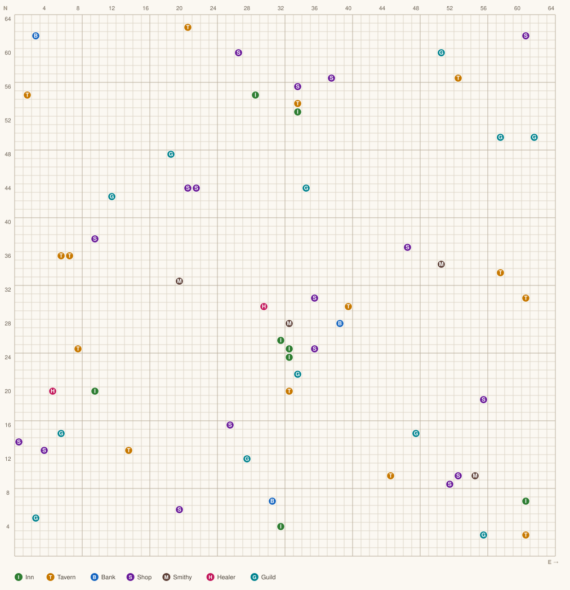

# Alternate Reality: The City — Play & Strategy Guide

*Datasoft / Intellicreations, IBM PC conversion © 1987, 1988. Original concept and program by
Philip Price.*

You were abducted from Earth by an alien ship and dumped through a shimmering portal into the city
of **Xebec's Demise**. There is no way home that you can see. The City is the first of six planned
scenarios; only it and *The Dungeon* were ever finished.

Everything in the **Controls**, **Encounters** and **The screen** sections below was read directly
out of `CITY.EXE`'s own display templates, so it matches this build rather than a different
platform's manual. See `ReverseEngineering.md` for how.

---

## 1. Starting the game

Run `AR.EXE` and answer the two prompts (graphics adapter, joystick), or skip the launcher:

```
CITY 0      CGA
CITY 1      EGA   ← use this
```

If you have no joystick the game shows `NO JOYSTICK CONNECTED / HIT ESC KEY TO CANCEL` — press
**Esc** and play on the keyboard, which is better anyway (turning is far more precise).

At the opening screen you get three choices:

| Key | Meaning |
| --- | --- |
| **N** | Start a **new** character — you walk out of the spaceship, through the Floating Gate, and your stats are rolled at the Portal. |
| **E** | **Resume** an existing character from the roster (`1.` … `8.`). |
| **T** | Create a **temporary** character. A temporary character can never be transferred to another scenario — the game says so out loud (`YOU CAN NOT TAKE A TEMPORARY CHARACTER TO ANOTHER SCENARIO.`). Use it only to practise. |

Characters live in this directory as `ARCCD00`–`ARCCD07` / `ARCSP00`–`ARCSP07`, with the roster
menu in `ARCNAME`. **Copy those files somewhere safe before every risky session.** That is the
game's only undo: death is permanent, and there is no "restore from checkpoint".

### Rolling a good character

Your seven attributes are randomised when you first step through the Portal. Re-entering and
re-rolling until you like the numbers is the accepted way to play, and it matters a lot — a weak
roll makes the first few in-game days brutal. Aim for a high **Stamina** (hit points and how long
you can stay out) and a decent **Strength**.

---

## 2. Controls

### Movement

| Key | Action |
| --- | --- |
| **↑** | Walk forward one square |
| **↓** | Walk backward one square |
| **←** / **→** | Turn 90° left / right |

The compass rose in the bottom-left shows your facing; the arrow cluster on the right mirrors the
movement keys.

### Commands (available at any time, including during an encounter)

Straight from the game's own help panel — `The commands are: ⟨G⟩et, ⟨U⟩se, ⟨D⟩rop, ⟨C⟩ast Spell,
⟨S⟩ave Game, ⟨P⟩ause, Switch ⟨W⟩eapons`:

| Key | Action |
| --- | --- |
| **G** | **Get** an item you can see on the ground |
| **U** | **Use** an item from your inventory — this is how you equip a weapon or armour, and how you drink a saved potion |
| **D** | **Drop** an item (`Drop how many?` for stackables) |
| **C** | **Cast** a spell — *nothing to cast in The City*; spells only exist in The Dungeon |
| **S** | **Save** the game (`You have been saved!`) |
| **P** | **Pause** — shows `(Paused)`. Use it while mapping; the clock stops and nothing can jump you |
| **W** | Switch **primary** and **secondary** weapons (`WEAPONS SWITCHED!`) |
| **Esc** | Cancel / back out of a prompt |

Menus are numeric — press the digit shown next to the option.

### Using and buying items

`U` opens `Use which item?` with a numbered list, paged with the arrow keys
(`↓ Next, ↑ Previous, Esc`). Equipping a **newly found** weapon as your *secondary* first is the
standard safety drill: if it turns out to be cursed you are not stuck wielding it.

Shops and smithies haggle. You are asked `Make me an offer! (in coppers)`; the merchant answers
`I demand ⟨n⟩ coppers!`, `Would you consider ⟨n⟩ coppers?` or `AGREED!`. Lowballing repeatedly
sours the relationship and a merchant will eventually refuse to deal with you at all.

---

## 3. The screen

```
                       Neuro                     ← character name
 Stats  STA   CHR   STR   INT   WIS   SKL        ← the six visible attributes
         22    17     9    12    16    11
              Experience 818                     ← total experience
 Level :2                 Hit Points :10         ← level and current hit points
 You are at the City Square.                     ← what you are standing on
 ────────────────────────────────────────
  compass          3-D view          arrows
 Food Packets                    Water Flasks
      3                               4
              You are in the city
                of Xebec's Demise
                     Warm                        ← weather
 Famished                            Thirsty     ← condition banners
```

* **Speed** is a seventh, hidden attribute — it exists in the character record but the status bar
  has no column for it.
* The **condition banners** along the bottom are the ones to watch: `Famished`, `Starving`,
  `Thirsty`, `Very Thirsty`, `Parched`, `Weary`, `Tired`, `Very Tired`, `Drunk`, `Very Drunk`,
  `Poisoned!`, `Diseased!`, `Burdened`, `Encumbered`, `Immobilized!`, `Bloated`, `Cursed!`.
* The status bar is only repainted when the game has a reason to; a value can change a beat before
  the display catches up.

### Time

The City runs on its own calendar: **minutes → hours → days → eleven months → years since
abduction**. The months are *Rebirth, Awakening, Winds, Rains, Sowings, First Fruits, Harvest,
Final Reaping, Darkness, Cold Winds, Lights.* Roughly **1 game hour ≈ 4 real minutes**.

Time is the real enemy. Every step costs it; hunger, thirst and weariness all track it; shops,
taverns, banks and healers keep hours and *close*, and being caught outside at night or in the rain
multiplies your encounter rate.

---

## 4. Encounters and combat

Something appears with one of: `You are surprised by a ⟨x⟩` (bad — it acts first),
`You have surprised a ⟨x⟩` (good), `You have noticed a ⟨x⟩`, `You are noticed by a ⟨x⟩`,
`You have encountered a ⟨x⟩`.

The option menu is exactly this:

```
1) Attack     2) Trick     3) Charm
4) Offer      5) Leave     6) Lunge
```

`***NO OPTIONS***` means the creature has you and you must ride it out.

| Option | What it does |
| --- | --- |
| **Attack** | Straight fight. |
| **Trick** | Distract it and strike while it is not looking (`You tricked it!` / `Your trick failed!`). |
| **Charm** | Pretend to be its friend, then stab it (`You charmed it!` / `You failed to charm it!`). |
| **Offer** | Buy your way out with coin or goods. |
| **Leave** | Disengage (`You didn't escape!` if it fails). |
| **Lunge** | An all-in attack — more damage, more exposure. |

### Moral alignment

You start **Good**, and alignment is far easier to lose than to regain. Two rules cover it:

* **Never strike first** unless you are certain the creature is evil.
* **Never Trick or Charm anything that is not evil** — both are evil acts in themselves, and are
  only free of penalty when used against evil creatures.

The evil creatures — the ones you may safely open on — are: **Assassin, Orc, Giant Rat, Black
Slime, Spectre, Imp, Gnoll, Troll, Wolf, Ghost, Zombie, Ghoul, Goblin, Nightstalker, Brown Mold,
Wraith, Gremlin, Skeleton.** Thieves and Cutthroats are *neutral*; Hobbits, Dwarves and Giants are
*good*; **dragons are not evil**; the Arch-Mage and his people are lawful and killing them hurts
badly.

### Creatures to avoid early

| Creature | Why |
| --- | --- |
| **Giant Rat**, **Brown Mold**, **Black Slime** | Disease carriers — symptoms appear 2–3 days later and only a Healer can cure them. Black Slime can also "slime" you for 10 hit points a tick. |
| **Ghost** | Its bone-chilling touch permanently drains **Strength**. |
| **Assassin** | One critical blow can kill you outright at any level. |
| **Mugger / Thief** | **Never Leave** — disengaging is exactly when they rob you. |

### Weapons and armour

Weapons in ascending order: Dagger, Stiletto, Shortsword, Flail, Battle Axe, Sword, Battle Hammer,
Longsword — and at the top the **Magical Flamesword**, the single most powerful weapon in The City.

Armour materials in ascending order: Padded, Leather, Studded, Ringmail, Scalemail, Splintmail,
Elfinmail, Chainmail, Banded, Crystal, Plated — each available as Helmet, Breastplate/Coat,
Gauntlets and Greaves/Leggings. **Shields do not add armour**; they add parry chance
(Small Shield, Shield, Spiked Shield, Tower Shield).

Gear wears out and breaks. If something that used to work stops working, replace it. Cursed items
cannot be dropped — only a Guild can remove a curse, for 2,000–11,000 coppers.

---

## 5. The city

64 × 64 squares. Square **1N, 1E is the south-west corner**; coordinates below are written
`⟨north⟩, ⟨east⟩`. You start at the **City Square**, facing the Floating Gate.

### 5.1 Location map



| | | | | | | |
| --- | --- | --- | --- | --- | --- | --- |
| **I** Inn | **T** Tavern | **B** Bank | **S** Shop | **M** Smithy | **H** Healer | **G** Guild |

The image above shows **where the doors are, not where the walls are** — the street layout is the
game's own data, so it is not shipped here.

**You can have the walls too.** The trainer's **City map** tab draws the real thing: every street,
building block and stretch of city wall, straight out of the game. Attach to the running game and
they appear automatically, or press **Load walls…** and point it at your own `CITY.EXE`. Then
**Save map…** writes the complete map — walls and all — as an SVG you can keep beside this guide.
The same tab lets you hover any marker for its prices, hours and the direction you have to approach
from, highlight one kind of building at a time, and zoom from the whole city down to single squares.

Until then: The City is a maze. Buy a **compass** (5 silver at any shop) and map as you go, with
**P** holding the clock while you draw.

### 5.2 Inns — sleep and heal

| Coord | Price |
| --- | --- |
| 26,32 / 25,33 | High (one inn, two doors) |
| 24,33 | Reasonable |
| 20,10 | Reasonable |
| 4,32 | Very expensive |
| 7,61 | Cheap |
| 53,34 | Reasonable |
| 55,29 | Cheap |

Rooms run `the common area floor` → `a bed with common bath` → `a room with common bath` →
`a room with bath` → `a Premium Room` → `a Small Suite` → `Our BEST Suite`. A room *with a bath*
usually restores more, but not always — let your purse decide. Inns also let you check the time.

### 5.3 Taverns — food, water, work and songs

| Coord | Notes |
| --- | --- |
| 30,40 | Expensive |
| 20,33 | Reasonable, limited hours |
| 25,8 | Reasonable, limited hours, **enter from the south** |
| 13,14 | Reasonable, special song at midnight |
| 10,45 | Reasonable |
| 3,61 | Cheap |
| 31,61 | Reasonable — **enter from the east**: 32,59 → 32,60 → south to 31,60 |
| 34,58 | Dues to join, expensive, **enter from the north** |
| 36,6 / 36,7 | Reasonable |
| 55,2 | Dues to join, limited hours |
| **63,21** | **Cheapest** — go north at 63,2, then east to 64,21, then south. Free water |
| 54,34 | Dues to join, limited hours |
| 57,53 | Reasonable — enter from the south or the west |

Menus rotate hourly and **food and water are never offered at the same time**: food tends to appear
on even hours, water on odd, and almost every tavern sells food at midnight. You can sit down
without ordering and eat your own packets. Taverns also offer work — `Bouncer`, `Dish Washer` —
which pays coppers per hour and can nudge Strength, Charm or Skill.

> **The single most expensive mistake in the game:** never still be inside a Tavern (or a Bank) when
> it closes. Get locked in and that class of building is barred to you *forever*.

### 5.4 Banks

| Coord | Policy |
| --- | --- |
| 28,39 | Low interest, safe |
| 7,31 | Higher interest, more likely to fail |
| 62,3 | Highest interest, most risky — **enter from the south at 61,2** |

Banks hold your money (so a thief cannot take it), buy gems and jewellery — prices vary, so shop
around — and pay interest. Higher interest means a higher chance of a **bank failure** wiping the
account. Failures get worse after Year Two. Visit in the morning so a closure cannot trap you.

### 5.5 Shops

25,36 · 31,36 · 14,1 (enter going west from 15,6) · 13,4 (enter going west from 15,6) · 6,20 ·
16,26 · 9,52 · 10,53 · 19,56 · 37,47 · 56,34 · 57,38 (enter from the north) · 62,61 · 60,27 ·
44,21–22 · 38,10

Shops sell clothing — **cosmetic in The City, but it matters in The Dungeon** — and, at every shop,
a **compass for 5 silver**. Buy one immediately.

### 5.6 Smithies

28,33 · 10,55 · 35,51 · 33,20 (enter from the north)

Weapons and armour. Stock, hours and prices all vary and almost nothing is cheap. Browsing without
buying annoys the smith (no alignment penalty, but he gets less friendly).

### 5.7 Healers

**20,5** and **30,30**. Open mostly on *odd* hours. They cure disease and poison, remove alcohol and
heal wounds. Repeat visits inside one day cost more each time — the price resets after 24 hours
away.

### 5.8 Guilds

Your **first** visit to each guild permanently raises one stat, free of the membership you cannot
yet buy. Twelve guilds means twelve free upgrades — this is the best value in the game, and the core
of any sensible early plan. Guilds also lift curses (2,000–11,000 coppers).

| Guild | Raises | Coord | Entry |
| --- | --- | --- | --- |
| Light Wizards | Wisdom | 5,3 | from the west |
| Physicians | Hit Points | 15,6 | from the west |
| Green Wizards Academy | Stamina | 43,12 | from the north |
| Star Wizards | Hit Points + Strength | 12,28 | |
| Dark Wizards | Charm | 22,34 | |
| Thieves | Skill | 44,35 † | from the west |
| Red Wizards | Strength | 15,48 | north from 13,47, east to 14,48, north |
| Blue Wizards | Speed | 48,19 | from the west |
| Guild of the Order | Intelligence | 50,58 | |
| Wizards of Law | Wisdom | 50,62 | |
| Wizards of Chaos | Charm | 60,51 | from the east |
| Assassins | Stealth / hiding | 3,56 | north from 2,57, then south from 4,56 |

† `alternate.txt` gives the Thieves Guild as 44N, 35E; the published cluebook gives 35N, 44E. Every
other guild agrees between the two sources, so treat this one as "check both squares".

**Guild membership and spellcasting are not available in The City.** They open up in The Dungeon.

---

## 6. Potions

44 potions exist. What a sealed potion *is* is decided randomly the moment you unseal it, so the
colour/taste table below is a probability guide, not a lookup table. High **Wisdom** and
**Intelligence** make identification easier.

Test in order: **Examine → Taste → Sip → Quaff**. Only Quaffing gives the full effect, but you can
already be poisoned, drunk or deluded from a single Sip. The practical advice from the shipped
`alternate.txt` is blunter: *don't bother examining or tasting, just sip.*

| Colour | Taste | Sip | Effect |
| --- | --- | --- | --- |
| Amber | Plain | C | Cure Poison |
| Amber | Plain | DD | Poison |
| Amber | Sour | S | Spirits / Beer |
| Black | Acidic | C | Invulnerability Fire |
| Black | Alkaline | C | Invulnerability Water |
| Black | Bitter | C | Invulnerability Mental |
| Black | Bitter | U | Delusion |
| Black | Dry | C | Invulnerability Power |
| Black | Plain | C | Invulnerability Sharp / Blunt / **Fleetness** |
| Black | Salty | C | Invulnerability Air |
| Black | Sour | S | Beer |
| Black | Sour | DD | Strong Poison |
| Black | Sour | C | Invulnerability Earth |
| Black | Sweet | C | Invulnerability Cleric |
| Clear | Acidic | S/C/DD | Cure / Water / **Acid** / Cleanse |
| Clear | Bitter | C | Unnoticeability |
| Clear | Dry | C | Mineral Water / Invisibility |
| Clear | Plain | C | Water / Invisibility |
| Clear | Salty | S | Salt Water |
| Green | Sour | C | Heal Minor Wounds |
| Green | Sweet | DD | Ugliness (−1 Charm) |
| Orange | Bitter | S | Inebriation |
| Orange | Sour | C | **Protection +2** |
| Orange | Sweet | C | **Protection +1** |
| Orange | Sweet | DD | Dumbness (−1 Int) |
| Red | Acidic | S | Vinegar |
| Red | Bitter | C | Strength |
| Red | Dry | S | Wine |
| Red | Sweet | C | **Treasure Finding** / Fruit Juice |
| Red | Sweet | DD | Deadly Poison |
| Silver | Bitter | D | Weak Poison |
| Silver | Bitter | C | Intelligence |
| Silver | Plain | C | Cure Major Wounds |
| Silver | Sweet | C | Charisma |
| White | Alkaline | C | Milk / Healing |
| White | Alkaline | DD | Poison |
| White | Bitter | DD | Slowness |
| White | Salty | C | Heal All |
| Yellow | Bitter | C | Noticeability |
| Yellow | Dry | DD | Weakness (−1 Str) |
| Yellow | Plain | C | Cure Wounds |

*Sip codes: S = safe, C = caution, D = danger, DD = dangerous, U = unsure.*

**Fleetness**, **Protection +1/+2** and **Treasure Finding** are the ones worth hoarding.
Treasure Finding in particular hugely increases how much money, potions and gear you find. Do not
stack too many Protection potions — the shipped hint file warns that it can crash the character.

---

## 7. How to win

The City has **no boss and no ending of its own.** It is character-building for the rest of the
series, and the game says as much: your goal is to become familiar with Xebec's Demise, raise your
stats, and develop a character that can survive anywhere.

There are three real "win" conditions, in ascending order of ambition:

1. **Survive and grow.** Reach a level and hit-point total where night, rain and the nastier
   creatures stop being lethal.
2. **Take everything The City gives away.** All twelve free guild stat boosts, a Magical
   Flamesword, a full Crystal or Plated armour set, and a healthy bank balance.
3. **Leave through a Portal.** Portals offer `Dungeon`, `Arena`, `Wilderness`, `Palace`,
   `Revelation`, `Destiny` and `Character`. Choosing one asks for that scenario's disk. Only
   *The Dungeon* was ever released — the other four were cancelled — so in practice completing The
   City means walking into a Portal with a character strong enough for `DUNGEON.EXE`. A **temporary**
   character is refused at this point.

### A workable plan

1. **Roll well.** Re-enter the Portal until Stamina and Strength are respectable.
2. **Arm yourself at once.** From the City Square, turn **west** to the smithy and offer slightly
   under your starting money for a **dagger**; if he refuses, try a **stiletto**. Never walk the
   streets unarmed.
3. **Buy a compass** (5 silver, any shop).
4. **Move off the City Square.** It is safe but expensive — find the cheap inn at 7,61 or 55,29 and
   the cheap tavern at 63,21.
5. **Tour the guilds.** Twelve free stat raises, and they cost only travel time. Do the near ones
   first: Dark Wizards (22,34), Star Wizards (12,28), Thieves (44,35 / 35,44).
6. **Fight only evil creatures**, and only when you are healthy. Sleep at an inn before you have to.
7. **Bank your money** so muggers cannot take it; keep the interest low and the risk lower.
8. **Travel by day, in good weather**, until you are strong. Rain and night multiply encounters.
9. **Carry only what you need.** Excess coin and gear makes you `Burdened` → `Encumbered` →
   `Immobilized!` and burns your stamina.
10. **Save often, and to a copy.** The one thing you cannot buy back is a dead character.

### Habits that will save you

* Equip any newly found weapon as your **secondary** first, in case it is cursed.
* Never Leave an encounter with a Thief or a Mugger.
* Never be inside a Tavern or Bank at closing time.
* Get a Healer to look at a disease early — Giant Rats, Brown Mold and Black Slime plant one that
  surfaces two or three days later.
* Make friends in a tavern; they help when you are broke and hungry.

---

## 8. Sources

* `alternate.txt` shipped with the game (coordinates, potion table, hints).
* The game binary itself — controls, encounter menu, condition banners, item and creature
  vocabulary, and the calendar were all read out of `CITY.EXE` (see `ReverseEngineering.md`).
* [Alternate Reality — The City cluebook](http://eobet.com/alternate-reality/docs/city_cluebook.html)
* [Guidebook to Alternate Reality: The City](http://www.eobet.com/alternate-reality/docs/city_guidebook.html)
* [Alternate Reality: The City — Wikipedia](https://en.wikipedia.org/wiki/Alternate_Reality:_The_City)
* [Alternate Reality — The City, C64-Wiki](https://www.c64-wiki.com/wiki/Alternate_Reality_-_The_City)
* [Alternate Reality: The City — GameFAQs guide](https://gamefaqs.gamespot.com/pc/215876-alternate-reality-the-city/faqs/1531)
