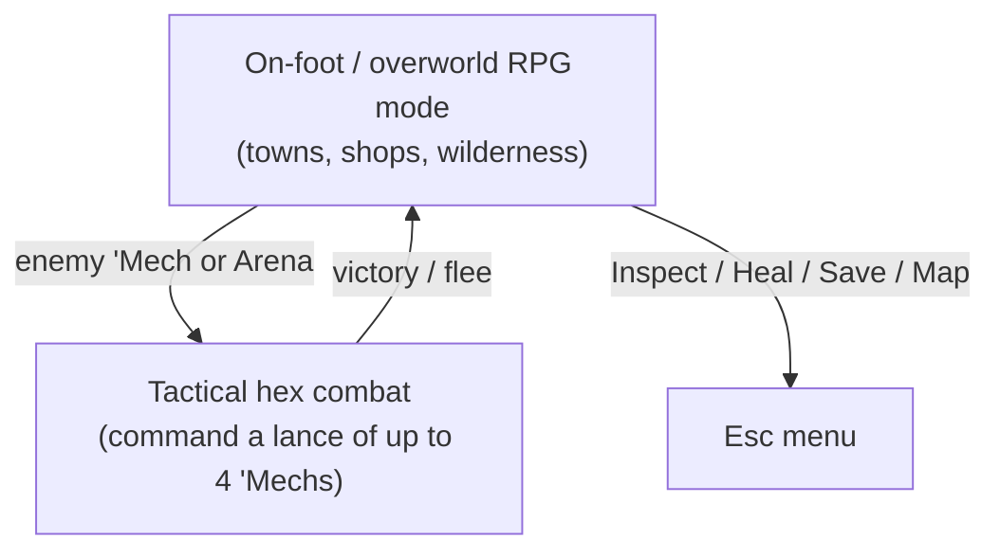
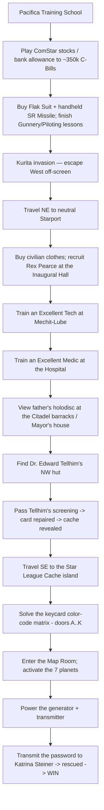
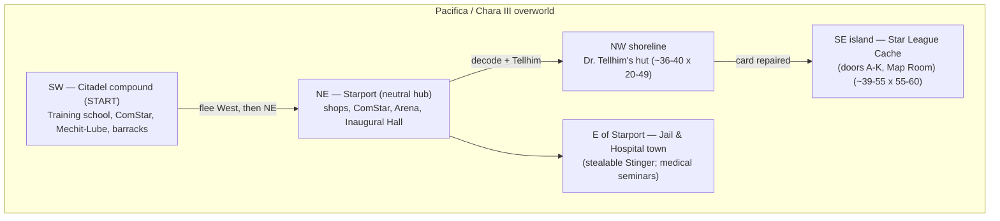

# BattleTech: The Crescent Hawk's Inception — Strategy Guide

A player's guide to the 1988 Westwood/Infocom DOS RPG: the story, the controls, how the two
gameplay modes work, a full path to victory, the economy (including the classic money exploits),
and maps. Item/skill/'Mech names and menu wording are taken verbatim from `BTECH.EXE`
(see `ReverseEngineering.md`); tactics and the late-game puzzle solutions are corroborated from
community sources and are marked where they are advice rather than confirmed data.

---

## 1. Story & goal

The year is **3028**. You are **Jason Youngblood**, an 18-year-old cadet at the **Pacifica
Training School** inside the Steiner Citadel. Your father **Jeremiah Youngblood** founded the
**Crescent Hawks**, an elite covert unit working with Archon Katrina Steiner.

During a training exercise the **Draconis Combine (House Kurita)** launches a surprise invasion,
destroys the Citadel, and your father vanishes — leaving only a damaged holodisc. Your mission:
survive, escape the occupied zone, regroup the scattered Crescent Hawks, decode your father's
message, find a hidden **Star League technology cache**, and signal the Archon for rescue.

**You win** when you reach the cache's Map Room, solve the planetary security puzzle, power up
the transmitter, and send the escape password to Katrina Steiner.

---

## 2. Controls

The DOS version is **entirely keyboard-driven**. (Confirmed: the game exposes an 8-way compass
and W/X highlight; §3.5 of `ReverseEngineering.md`.)

### Movement & menus
| Key | Action |
| :-- | :-- |
| Numpad `8 / 2 / 4 / 6` | Move / face North / South / West / East |
| Numpad `7 / 9 / 1 / 3` | Move diagonally NW / NE / SW / SE |
| `W` / `X` | Move a menu highlight up / down (alt to arrows) |
| `Space` or `Enter` | Select / confirm |
| `Esc` | Open the in-game menu (see below) / cancel |

### In-game menu (`Esc`)
`Return to game` · `Change game settings` · `Allocate men in 'Mechs` · `Inspect Character` ·
`Heal Characters` · `Load Game` · `Save Game` · `Show Overhead Map`. Six save slots (`One`–`Six`).

### Tactical combat menu
`Move` (then choose **Walk**, **Run**, or **Jump**) · `Use Weapons` · `Kick` · `Computer`
(autopilot the unit) · `Scan Unit` · `Next Unit` · `Flee` · `Begin Fight`.

- **Walk** — moderate speed, low heat.
- **Run** — fast, more heat, harder to hit but your own fire is less accurate.
- **Jump** — needs jump jets; clears terrain; high heat.
- **Kick** — adjacent physical attack, deals damage with **no** heat.
- Passing / standing by lets heat dissipate; overheating shuts the 'Mech down.

---

## 3. How to play

### 3.1 Two modes

- **Overworld / RPG mode** — a top-down tile view. Walk Jason (later a party) through towns and
  wilderness, talk to NPCs, buy weapons/armor, train skills, heal, and trade stocks.
- **Tactical combat** — triggered by wilderness encounters or the Arena. Turn-based hex grid;
  manage movement, heat, weapon targeting, and physical attacks for a lance of up to four 'Mechs.

### 3.2 Characters, skills & training

Each character has **Armor**, **Health**, and **seven skills**, each rated
`Unskilled → Amateur → Adequate → Good → Excellent`:

`Bow & Blade` · `Pistol` · `Rifle` · `Gunnery` · `Piloting` · `Tech` · `Medical`.

Raise them by paying C-Bills at facilities:
- **Citadel / weapon courses** → small-arms skills (Pistol, Rifle, Bow & Blade).
- **'Mech Training Center** (simulator missions) → **Gunnery** and **Piloting**; finishing fast
  and clean speeds gains.
- **Hospital seminars** → **Medical**.
- **Mechit-Lube apprenticeship** → **Tech** (needed later to salvage and repair).

> **Traitor check.** New recruits can be Kurita double-agents. Use **Inspect Character** on them
> repeatedly; wording like *"You don't like the way he's acting. He makes you uneasy."* flags a
> spy. Don't let a spy pilot a key 'Mech — expose them in combat.

### 3.3 Personal gear (on foot)

Weapon names are verbatim from the EXE's 17-byte weapon table (`ReverseEngineering.md` §3.1):
`Cudgel, Knife, Sword, VibroBlade, Shortbow, Longbow, Crossbow, Pistol, Rifle, MachineGun,
SR Missile, Inferno`.

- The **handheld SR Missile launcher** is the standout — it one-shots foot soldiers and can even
  hurt light 'Mechs. Pair it with a **Flak Suit** for near-trivial on-foot fights. *(advice)*
- **Inferno** does no physical damage but spikes a 'Mech's heat — situationally strong. *(advice)*

### 3.4 'Mechs & combat

Pilotable/encountered 'Mechs (names Confirmed; stats corroborated — see `ReverseEngineering.md`
§4): **Locust, Wasp, Stinger, Commando, Chameleon** (training), **Jenner** (Kurita), **UrbanMech**.

'Mech weapons (verbatim): `LaserPistl, LaserRifle, Flamer, SmallLaser, Med Laser, LargeLaser,
PPC, AutoCann/2, AutoCann/5, AutoCann10, AutoCann20, MachineGun, LRMissile5/10/15/20,
SRMissile2/4/6`, plus `Kick`, `Armor Plating`, and `Heat Sink`.

- **Lasers don't use ammo** and never run dry — the safest long-run loadout. Autocannons, MGs,
  and missiles track physical ammo counts. *(advice)*
- At **Mechit-Lube Speed Shops** you can strip jump jets/launchers off your Locust/Wasp/Stinger/
  Commando and add Medium Lasers and max **Armor Plating**. The Chameleon **cannot** be modified.
- With an **Excellent Tech** in the lance you can **salvage** weapons/scrap from destroyed enemy
  'Mechs for large C-Bill payouts.

---

## 4. Economy — earning C-Bills

The currency is the **C-Bill**. You will need a lot of it for gear, retrofits, and training.

1. **Periodic allowance.** The game drips a small allowance into your account over real time.
   Idling in a safe spot slowly accumulates cash. *(advice)*
2. **ComStar stock market (the big one).** ComStar terminals (retinal-scanned to Jason) let you
   invest in three stocks:
   - **Nashan Diversified** (NasDiv) — stable, slow.
   - **Defiance Industries of Hesperus** (DefHes) — steady riser.
   - **Baker Pharmaceuticals** (BakPhar) — volatile; swings wildly.
   **Arbitrage exploit:** *Save*, buy **BakPhar** in bulk, wait. If it drops, reload; if it
   spikes, sell and save. Repeat to snowball toward the ~350,000 C-Bills the late game wants.
   *(advice; the stock system itself is Confirmed in `COMSTAR.BLD`.)*
3. **Arena battles** at Starport pay per win (repairs can eat the winnings).
4. **Salvage** with an Excellent Tech (see §3.4).

---

## 5. How to win — walkthrough

### Step notes
1. **Training compound.** Bank money (stocks/allowance). Buy a **Flak Suit** and a **handheld SR
   Missile**. Complete the required Gunnery/Piloting simulator lessons.
2. **The escape.** On the 6th/7th mission Kurita attacks. Either take the **Locust** and run
   **West** off-screen the moment the forcefields fail, or take the **Chameleon**, fall back into
   the building, and flee West when it collapses.
3. **Regroup at Starport (NE).** Buy **civilian clothes** (cuts random encounters). Recruit
   **Rex Pearce** at the Inaugural Hall (he brings the holocard and a Commando). Train an
   **Excellent Tech** (Mechit-Lube) and an **Excellent Medic** (Hospital). Inspect recruits for
   traitors (§3.2).
4. **Decode the message.** View the holocard at the ruined Citadel barracks, or by picking the
   lock on the Mayor's house SW of Starport.
5. **Dr. Tellhim.** Head to his hut on the **NW shoreline** (~grid 36–40 × 20–49). With Rex + an
   Excellent Tech + an Excellent Medic present, the party auto-answers his mechanics/biochemistry/
   "Battle of Mallory's World" screening. He repairs the card and reveals the cache.
6. **Star League Cache.** Travel to the **SE island** (~grid 39–55 × 55–60).
7. **Keycard color-code matrix.** Inside, swipe terminals to imprint your keycard with one **Red**,
   one **Blue**, and one **Yellow** value to open doors **A → K** in order. Swiping a terminal
   overwrites the existing imprint of that color.

   | Door | Red | Blue | Yellow |
   | :--: | --: | --: | --: |
   | A | 1 | 3 | 5 |
   | B | 2 | 7 | 18 |
   | C | 15 | 14 | 11 |
   | D | 13 | 31 | 4 |
   | E | 25 | 33 | 10 |
   | F | 28 | 24 | 16 |
   | G | 29 | 12 | 6 |
   | H | 20 | 27 | 22 |
   | I | 17 | 19 | 26 |
   | J | 8 | 9 | 21 |
   | K | 30 | 23 | 32 |

   *(Door E can be opened any time before J. Deep in the cache sits the non-pilotable
   **Phoenix Hawk LAM** prize.)*
8. **Map Room.** Touch these **seven planets** (any order): `PESHT`, `BENJAMIN`, `SKYE`,
   `SUMMER`, `RYERSON`, `KATHIL`, `ACHERNAR`. Then use the control panel on the **west wall** to
   receive the escape password. *(You cannot save inside the Map Room.)*
9. **Transmit.** Go to the power room, switch on the generator, step into the transmitter, and
   send the password to Katrina Steiner. Cutscene → **victory**.

---

## 6. Maps & geography

The overworld is a grid of sectors; fixed locations use the `MAP1`–`MAP15` tile files
(`.MTP`). Key landmarks:

- **Citadel compound (SW, start):** training facility, simulator halls, ComStar branch,
  Mechit-Lube, barracks.
- **Starport (NE):** neutral metropolis — civilian shops, ComStar, the Arena, Inaugural Hall.
- **Jail & Hospital town (E/NE of Starport):** high-security lockup (a Stinger can be stolen) and
  a medical facility for Medic seminars.
- **Dr. Tellhim's hut (NW shoreline).**
- **Star League Cache (SE island):** the endgame — keycard doors and the Map Room.

> Map coordinates are approximate/community-sourced; the `.MTP` tile format is not yet decoded
> here (an open lead in `ReverseEngineering.md` §6). A `Mapper` inventory item reveals local
> coordinates in-game.

---

## 7. Quick tips

- **Save before every stock trade, cache door, and the Map Room** (you can't save in the Map Room).
- **Lasers over ammo weapons** for anything you keep long-term.
- **On foot: Flak Suit + SR Missile** trivializes most fights.
- **Keep an Excellent Tech** for salvage income and field repairs.
- **Re-inspect recruits** to catch Kurita double-agents before they sabotage you.
- **UrbanMech / Arena wall trick:** rent a 'Mech in the Starport Arena and blast the weak western
  grandstand wall to escape with the rented 'Mech (Starport bans you afterward); with luck you can
  bag the AC/10-toting **UrbanMech**. *(advice; use at your own risk of a permanent ban.)*
