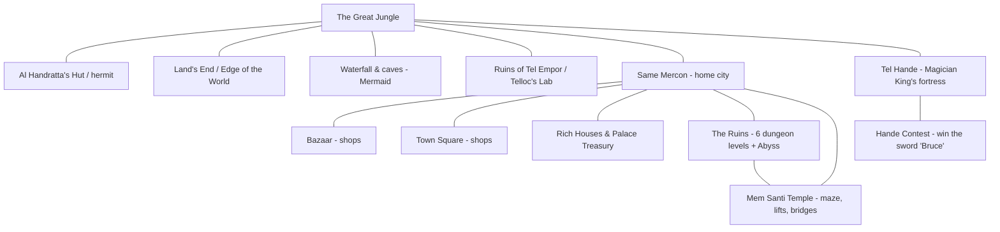

# Keef the Thief — Reverse-Engineering Findings

*A structural and mechanical analysis of the DOS game in `.\Game`, produced with
Ghidra (`C:\ghidra\ghidra_12.1.2_PUBLIC\`) plus binary/asset inspection.*

---

## 1. Executive Summary

**Keef the Thief: A Boy and His Lockpick** is a comedic, first-person fantasy
**RPG / dungeon-crawler** released by **Electronic Arts in 1989**. The build in
`.\Game` is the **IBM PC (DOS) version 1.0**.

The game combines four pillars:

- **Exploration** of a connected overworld (town, jungle, ruins, fortress).
- **Thievery** — lockpicking, trap disarming, stealing, and searching rooms.
- **Turn-based combat** against parties of tiered monsters, granting XP and levels.
- **A deep "reagent-mixing" magic system** built around 12 reagents, 12 conceptual
  "elements", and four escalating spell "orders".

The whole engine is a single ~323 KB, 16-bit real-mode DOS executable
(`.\Game\KF.EXE`) compiled with **Borland Turbo-C (1988)** and packed with
**overlays**. Almost all game text, item/monster tables, and map data are baked
directly into the executable; graphics, music and the readable in-game books live
in external data files.

> **Historical note.** The credit strings inside `.\Game\KF.EXE` read
> *"Program: Andy Gavin / Graphics: Jason Rubin / Design: Andy & Jason /
> Copyright (c) 1989"*. This is an **early Andy Gavin & Jason Rubin title**,
> made under their studio **J.A.M. Software** — the pair who went on to found
> **Naughty Dog** (*Crash Bandicoot*, *Jak & Daxter*, *Uncharted*). The engine
> even references *"The Naughty Dog, Inc. (formerly J.A.M. Software) store"* as an
> in-game easter egg, and the sound driver is branded **"NDI"** (Naughty Dog).

---

## 2. How This Analysis Was Performed

1. **Ghidra headless import & auto-analysis** of `.\Game\KF.EXE` into a project at
   `C:\Temp\KeefGhidra` (the workspace-relative `.`-prefixed path was rejected by
   Ghidra, hence the temp location). The MZ loader auto-selected the
   `x86:LE:16 Real Mode` language.
2. **Ghidra post-scripts** (in `.\.ghidra_scripts`) exported:
   - a **function list** (`.\.analysis\functions.txt`, **390 functions**),
   - **defined strings with cross-references** (`.\.analysis\strings_xref.txt`, **1480 strings**),
   - **all interrupt calls** (`.\.analysis\interrupts.txt`, **53 `INT`s**),
   - and a **decompilation dump** of every function ≥ 250 bytes
     (`.\.analysis\decomp.c`, 94 functions).
3. **Direct asset inspection** with Python (`.\.analysis\analyze.py`) to recover
   raw strings, decode the `.\Game\BOOKS` file (the in-game manual), and map the
   `.\Game\NNG` / `.\Game\SG` **save-game structure**.

All intermediate artifacts are preserved under `.\.analysis` and `.\.ghidra_scripts`
for reproducibility.

---

## 3. File Inventory

### 3.1 Actual game files

| File | Size | Role |
|------|------|------|
| `.\Game\KF.EXE` | 323 KB | The entire game engine + all text/tables (Turbo-C, overlaid MZ EXE) |
| `.\Game\KEEF.BAT` | 26 B | Launcher: `kf vga mouse adlib single` |
| `.\Game\BOOKS` | 14.7 KB | In-game readable books: lore **and the spell recipes** |
| `.\Game\TITLE.VG2`, `.\Game\NAUGHTY.VG2` | — | Title / Naughty-Dog logo pictures (VGA) |
| `.\Game\P01.VG2` … `.\Game\P50.VG2` | — | Room / scene pictures (VGA), one per view |
| `.\Game\SONG0.BCC` … `.\Game\SONG9.BCC` | 1–3 KB | Music tracks (AdLib/MT-32 song data) |
| `.\Game\AKEEF.SMB` | 2 KB | Sprite/bitmap bank asset |
| `.\Game\SG` | 2000 B | A **saved game** |
| `.\Game\NNG` | 2000 B | The **New-Game template** (initial character state) |

`.\Game\SG` and `.\Game\NNG` are **byte-for-byte identical** here — i.e. this save
is a freshly-started game. See [§8](#8-save-game-format).

### 3.2 Non-game files (warez-scene packaging)

`.\Game\8088.APP`, `.\Game\8088.NFO`, `.\Game\8088KEEF.NFO`, `.\Game\FILE_ID.DIZ`,
`.\Game\NNG`-adjacent `.NFO`s, etc. are **release/packaging text from an "8088
State" scene re-release** (dated 1996), not part of the original game. They confirm
the identification ("keef the thief — ea / naughty dog — rpg") but have no bearing
on mechanics.

### 3.3 Graphics & sound driver support

The engine references graphics sets for multiple cards — extensions `.VG2` (VGA),
`.EG2` (EGA), `.CG2` (CGA), `.KF2` — and a `pal.dat` palette. Picture files begin
with the signature bytes `00 FD 00 00` and are **RLE-compressed** indexed images.
Art is split across two disks (`/KEEF1/`, `/KEEF2/`), and the engine prompts
*"Please insert Keef 1/A disk …"* for floppy play.

Supported sound/hardware options (from the card-selection code): `vga`, `tandy`,
`adlib`, `mt32`, `ibmpc` (PC speaker), `mouse`, and `single` (single-drive mode).

---

## 4. Engine / Technical Structure

- **Format:** MS-DOS `MZ` executable, **16-bit real mode**, medium/large memory
  model, **Borland overlays** (the ~18 KB appended past the MZ image is overlay
  code; Ghidra's unresolved `2000:`/`3000:` constructors are the overlay-manager
  frames). Code is spread across **many far segments** (`104f`, `1442`, `169b`,
  `19be`, `229f`, `25b4`, …) with `__cdecl16far` calling conventions.
- **Compiler banner in the binary:** `Turbo-C - Copyright (c) 1988 Borland Intl.`
- **Interrupt usage** (from `.\.analysis\interrupts.txt`):

| INT | Count | Purpose |
|-----|-------|---------|
| `INT 21h` | 46 | DOS services — file open/read/write (saves, art, music, books) and memory allocation |
| `INT 33h` | 4 | **Mouse** driver (menus / point-and-click UI) |
| `INT 1Ah` | 2 | BIOS timer / clock — RNG seeding and timing |
| `INT 16h` | 1 | BIOS keyboard input |

  Notably **no `INT 10h`** appears in the analyzed code paths — screen output is
  done by writing the VGA framebuffer directly rather than via BIOS.

- **Startup errors the engine can emit** confirm its resource model: multiple
  memory buffers are allocated up front (*"Could not allocate memory for 1st/2nd/3rd/4th
  buffer"*), then it loads the book file, picture files, and song files
  (*"Could not load book file"*, *"Error in loading picture file"*,
  *"Could not find song file '%s'"*).

---

## 5. The World & Story

### 5.1 Backstory (reconstructed from `.\Game\BOOKS`)

- Ages ago the **God-King Emperor Telloc** — third son of a peasant — rose through
  magic and immense **charisma** to strike down the lord of Mercon, rename the city
  **Tel Mercon**, and rule for **666 years** from his palace at **Tel Empor**.
- The books argue Telloc's true power came not from spells but from a **forged
  artifact/idol** in which he *"forged the elements of power into one single
  object."* His power is repeatedly described as **six-fold** (the Mermaid: *"love
  was one sixth of his power"*).
- The **famine of 666 T.R.** triggered unrest; Telloc died and the land fragmented.
  His generals and mages withdrew to the northern fortress **Tel Hande**.
- In the present, **the Magician King** of Tel Hande covets his mentor's title and
  is **reassembling Telloc's idol** to seize ultimate power. He admits: *"I had
  Telloc killed to get them. Give me my idol!"*
- Meanwhile a cult worships **Mem**, whose relic (*"the gift of Mem"*) fell from
  heaven the day Telloc died.

### 5.2 The player's arc

You are **Keef**, a wisecracking thief in the city of **Same Mercon**. The quest is
to gather the **six pieces of Telloc's power** and perform the final ritual — after
which *"You have built a huge new palace for yourself … life as the God-King."*

The **six artifacts** (found in the inventory/quest tables) embody the six aspects
of Telloc's power:

- **Gem of Wisdom**
- **Globe of Power** (held by the Magician King)
- **Plate of Strength**
- **Arm of Wealth**
- **Arm of Love** (obtained via the Mermaid quest — Telloc's lover)
- **Artifact of Mem** (guarded in the Mem temple)

The endgame is *"the gathering"*: channel all six in the **Pentagram** so *"the six
are one"* (cast the **Elmus Pastus** spell). Casting incorrectly is fatal — the
Emperor's skull laughs *"Chump!"* as you die.

### 5.3 Overworld map

Locations are stored as named views (e.g. *"In the Great Jungle"*, *"Ruins, level
1..6"*, *"Ruins, by Abyss"*, *"Tel Hande, Floor 1"*, *"Mem Santi Maze"*,
*"Marble Street"*, *"Mem Drive"*, *"Tel Road"*), each paired with a `.VG2` picture
and a descriptive text blob.

---

## 6. Character System

The status/abilities screens read a fixed table of **16 labelled stats** (contiguous
in data segment `36ed`, in this exact order):

| # | Stat | Group | Meaning |
|---|------|-------|---------|
| 1 | **Strength** | Attribute | Melee damage / carry |
| 2 | **Speed** | Attribute | Turn order / attack speed |
| 3 | **Constitution** | Attribute | Toughness / hit points |
| 4 | **Wisdom** | Attribute | Magic aptitude |
| 5 | **Luck** | Attribute | Random-check modifier |
| 6 | **Charisma** | Attribute | Prices / NPC reactions (raised by `Usus Carus`) |
| 7 | **Disarming** | Thief skill | Trap-removal success |
| 8 | **Stealing** | Thief skill | Pickpocket/steal success |
| 9 | **Unlocking** | Thief skill | Lockpicking success |
| 10 | **Nutrition** | Meter (0–100) | Depletes; **0 = starve to death** |
| 11 | **Sobriety** | Meter (0–100) | Alcohol; drunk = *"stay away from open flames"* |
| 12 | **Sleep** | Meter (0–100) | Fatigue; exhaustion forces the `Sleep` command |
| 13 | **Gold** | Resource | Currency |
| 14 | **Magic Points** | Resource | Spell fuel |
| 15 | **Hit Points** | Resource | Health; **0 = death** |
| 16 | **Level** | Progression | Raised by winning fights (XP) |

The **three survival meters** (Nutrition, Sobriety, Sleep) are a distinctive
mechanic: each has its own failure state and matching death/warning text, so the
player must periodically **eat, drink, and sleep** in addition to fighting.

**Inventory categories** (from the inventory UI): `Weapons`, `Armor`, `Spells`,
`Reagents`, `Artifacts`, `Items`, and `books`. **Score categories**: `Treasure`,
`Magic`, `Thieving`, `Quest`, `Experience`, `Total`.

---

## 7. Game Mechanics

### 7.1 Command set

The mouse/menu UI exposes a **File** menu (`About Keef`, `About Sound`, `About NDI`,
`Load`, `Save`, `New Game`, `Music` toggle, `Fewer` toggle, `Easier` toggle, `Quit`)
plus status panels (`Status`, `Abilities`, `Inventory`, `Score`, `Sleep`).

In-world **verbs** (each with its own prompt string): `Get What?`, `Enter Where?`,
`Talk to Who?`, `Ask … about what?`, `Cast What?`, `Do What?`, `Fight Who?`,
`Mixing:` (mix spells), `Disarm a trap Where?`, `Steal What from …`, `Buy What
from …`, `Show What?`, `Use What?`, `Drop What?`.

Two difficulty toggles exist: **`_Fewer`** (fewer monsters) and **`_Easier`**
(easier checks), plus **`_Music`** on/off.

### 7.2 Thievery (the game's namesake)

- **Unlocking:** *"You slip the lock pick in the lock and … it opens."* Lock picks
  have **durability** — repeated failures degrade them, escalating through three
  outcomes: fouled attempt → *"Your pick is in bad shape, go buy a new one"* →
  *"your pick is in such bad shape that you hurt yourself."* The `Abilities` screen
  tracks **Lock Picks** and **Flints** counts as consumable thief items.
- **Disarming traps:** you pick a **method** from a large menu of physical actions
  (e.g. *"Putting lots of Oil on the trap"*, *"Sticking your knife in the hole"*,
  *"Pushing Buttons 1, 2 and 3"*, *"Using grappling hook"*). Success spares you;
  failure *"injured yourself"*; a bad failure kills you outright.
- **Stealing:** *"Your stealth and guile allow you to pilfer the prize unharmed and
  undetected"* on success; failure = *"You fumble and sustain a rather nasty owie"*
  or a lethal trap. City guards patrol and punish theft.
- **Searching rooms:** *"You find nothing of interest"* vs. *"After searching
  carefully you find a secret door hidden in the wall"* — searching reveals hidden
  doors, weapons, scrolls, and gold caches at named spots (`Walls`, `Ceiling`,
  `Floor`, `Pedestal`, `Tapestry`, …).

Thief gear is bought from the **Black Market** ("brother thief") and used with
`Rope`, `Grappling Hook`, `Lock Pick Set`, `Knife`, and `Flint & Steel`.

### 7.3 Combat

- Fights are against **groups of foes** (*"vanquished all of your foes"*). Monsters
  come in **long escalating tiers** — each base creature has ~6 progressively
  stronger renames (e.g. `Goblin Bowman → Gremlin Bowman → … `, `Minotaur → Minotaur
  Titan → Minotaur Prince → Minotaur King`, `Bear Cub → … → Huge Bear`). Weaker
  variants also exist for the `_Easier` mode (`Baby Ogre`, `Idiot Swordsman`, …).
- **Weapons** have three stats shown on the status panel — **Weapon Strength**,
  **Weapon Speed**, **Weapon Range**. **Ranged** weapons (`Long Bow`, `Crossbow`,
  `Holy Bow`, `Bola`, `Throwing Dagger`, `Magic Sling`) enable *"Shoot Guard with
  distance weapon"* — snipe crossbow guards before they close.
- **Armor** has **Armor Strength** and **Armor Speed** (heavier armor slows you).
- Winning yields **booty + experience**; accumulating enough XP triggers a
  **level-up**: *"You have successfully slaughtered all of your foes … and have
  risen a level!"*

Weapon roster spans mundane→legendary: `Hands`, `Tree Branch`, `Spiked Club`,
`Sickle`, `Scythe`, `Dirk`, `Blessed Axe`, `Whirling Death`, `Halberd`,
`Short Sword`, `Blood Blade`, up to the **13 legendary blades** described in
*BOOKS* (`Bruce`, `Bahb el Buhd`, `Yang`/`Yin Yang`, `Charles`, `St. George`,
`David`, `Neptune`, `Nischtarr`, `The Hare`). **`Bruce`** — *"the world's butchest
weapon"* — is the prize for winning the **Contest at Tel Hande**.

### 7.4 Survival stats

Three timers drain as you play, each with a unique death/warning message:

- **Nutrition → 0:** *"you're starving to death"* (eat a `Good meal` at a bar).
- **Sobriety:** get too drunk on `Wine`/`Beer`/cocktails and you're impaired.
- **Sleep → exhaustion:** *"You are really, really tired…"* — use the `Sleep`
  command / rent a `Room for night`.

### 7.5 Economy & NPCs

Shops in Same Mercon: **Book Store** & **Herb Shop** (Nick), **Black Cross** (healer
— `Partial heal`, `Full heal`, `Magic Recharge`), **Black Market** (thief tools),
**Weapons R Us** (smith), **Drunk'n Dragon** & **Pink Dragon** (bars — drinks, food,
lodging), **Barbarian Horse Works** (horses), **Starving Artists** (paintings).

NPCs are handled with `Talk to` / `Ask about <topic>` (topics like *Wisdom, What to
fear, Telloc, Rare Reagents, His plan for takeover*). Several quests advance by
**giving gifts**: e.g. the **Princess** accepts the `Flower of Mem`, the **Mermaid**
trades her love-token for the `Mermaid's Ring` + a `Clydesdale`, and the **Magician
King**/**Curator** demand specific artifacts.

---

## 8. The Magic System (Spell Mixing)

This is the standout mechanic. Magic is cast inside one of **four geometric
"Orders"** of increasing power, and each spell is **mixed from reagents** that
embody abstract **elements**. The in-game books (`.\Game\BOOKS`) are literally the
spellbook: they name each spell and give **riddles** identifying its reagents.
Casting shows **`Success!`** or **`Fizzle!`**; big spells are **location-dependent**
(*"the location is wrong for a spell of this magnitude"*) and consume Magic Points.

### 8.1 The four Orders (cast locations)

1. **Circle of Perfect Unity** — basic self-magnification.
2. **Pyramid of Directed Power** — stronger; *"create matter using only psychic energy."*
3. **Cube of Irresistible Force** — heavy "solid force" spells.
4. **Pentagram of Infinite Conveyance** — ultimate power; teleport & the endgame ritual.

### 8.2 Reagents → Elements (all 12 solved from the book riddles)

| Reagent | Element | Riddle clue in `.\Game\BOOKS` |
|---------|---------|-------------------------------|
| **Narcissus Root** | SELF | *"flower named for a greek boy"* |
| **Peppermint Sprigs** | HEALING | *"garden plant whose flavor masks unpleasant taste"* |
| **Glow Grass** | LIGHT | *"plants that pierce the darkness"* |
| **Dragon's Drool** | FIRE | *"beasts of fire and flame"* |
| **Scorpion Tail** | HATRED | *"weapon of that most deadly desert beast"* |
| **Eye of Owl** | SIGHT | *"the bird which sees best at night"* |
| **Black Pearl** | FOCUS | *"especially dark and dense"* |
| **Wart Weed** | POWER | *"an invasion of the body"* (warts) |
| **Kiki Root** | MAGNIFICATION | *"the reagent which grows underground"* |
| **Skunk Juice** | PROTECTION | *"which animal all run from … for another compelling reason"* |
| **Rhino Horn** | OPENING | *"animal that can plough through any door; body summons demons"* |
| **Phoenix Egg** | INFINITE | *"immortal creature reborn eternally from the ashes"* |

### 8.3 Documented spell recipes

*(element set → the reagents you must burn)*

| Order | Spell | Elements | Reagents | Effect |
|-------|-------|----------|----------|--------|
| Circle | **Bandus Aidus** | SELF + HEALING | Narcissus Root + Peppermint Sprigs | Partial heal |
| Circle | **Flickus Bickus** | LIGHT + FIRE | Glow Grass + Dragon's Drool | Light source |
| Circle | **Emmus Exesus** | HATRED | Scorpion Tail | Damage one foe |
| Pyramid | **Generus Elektus** | FIRE + LIGHT + SIGHT | Dragon's Drool + Glow Grass + Eye of Owl | Bright light |
| Pyramid | **Huvius Vacuumus** | SIGHT + FOCUS | Eye of Owl + Black Pearl | Detect/find in a narrow area |
| Pyramid | **Cynus Arcenus** | HATRED + FOCUS | Scorpion Tail + Black Pearl | Kill one foe |
| Pyramid | **Agenus Oranus** | HATRED + MAGNIFICATION | Scorpion Tail + Kiki Root | Damage all foes |
| Pyramid | **Riteus Gardus** | SELF + PROTECTION | Narcissus Root + Skunk Juice | Armor / protection |
| Cube | **Takus Tylenus** | SELF + HEALING + POWER | Narcissus + Peppermint + Wart Weed | Great heal |
| Cube | **Dranus Liqus** | FOCUS + OPENING | Black Pearl + Rhino Horn | Open any door / reveal hidden |
| Cube | **Qnus Arudes** | FOCUS + POWER + HATRED | Black Pearl + Wart Weed + Scorpion Tail | Crush one foe |
| Cube | **Napus Almus** | MAGNIFICATION + POWER + HATRED | Kiki Root + Wart Weed + Scorpion Tail | Devastate all foes |
| Cube | **Mutus Omahaus** | POWER + PROTECTION + SELF | Wart Weed + Skunk Juice + Narcissus | Wall of force (defense) |
| Pentagram | **Usus Carus** | INFINITE + LIGHT + SIGHT | Phoenix Egg + Glow Grass + Eye of Owl | Temporarily raise Charisma |
| Pentagram | **Pizaus Coldus** | INFINITE + FOCUS + HATRED | Phoenix Egg + Black Pearl + Scorpion Tail | Psychic storm — kill a tough foe |
| Pentagram | **Olus Gayus** | INFINITE + MAGNIFICATION + HATRED | Phoenix Egg + Kiki Root + Scorpion Tail | Banshee — hit an entire party |
| Pentagram | **Lyodus Londus** | INFINITE + SELF + PROTECTION | Phoenix Egg + Narcissus + Skunk Juice | Near-total damage immunity |
| Pentagram | **Barbus Rubinus** | INFINITE + SELF + HATRED | Phoenix Egg + Narcissus + Scorpion Tail | Empower melee blows |
| Pentagram | **Elmus Pastus** | *(endgame — "see everything in darkness")* | *Unknown — "never correctly cast"* | The final "gathering" ritual |

### 8.4 Hidden / experimental spells

The books stress that **unrecorded spells can be discovered by experimenting** with
reagent combinations in each Order. Several such joke-named spells exist in the
engine's spell table and are hinted at in the lore, e.g.: **Makus Foodus**
(create food — *"create matter using psychic energy"*), **Goodas Newus** (*"heal the
wounded completely"*), **Bigus Litus** (*"light all but the biggest dungeons with a
single spell"*), **Phonus Homus** (*"teleport home from anywhere"*), plus
`Nudus Bunsus`, `Killus Deadus`, `Wastus Em!`, etc.

The complete internal spell name/abbreviation table (26 entries) is:
`Bandus Aidus`(BdAi), `Flickus Bickus`(FlBi), `Emmus Exesus`(EmEx), `Nudus Bunsus`
(NuBu), `Generus Elektus`(GeEl), `Huvius Vacuumus`(HuVa), `Cynus Arcenus`(CyAr),
`Agenus Oranus`(AgOr), `Riteus Gardus`(RiGa), `Makus Foodus`(MaFo), `Takus Tylenus`
(TkTy), `Dranus Liqus`(DrLi), `Qnus Arudes`(QnAr), `Napus Almus`(NaAl), `Mutus
Omahaus`(MuOm), `Bigus Litus`(BiLi), `Goodas Newus`(GoNe), `Usus Carus`(UsCa),
`Pizaus Coldus`(PiCo), `Olus Gayus`(OlGa), `Lyodus Londus`(LyLo), `Barbus Rubinus`
(UsRu), `Killus Deadus`(KiDe), `Wastus Em!`(WaEm), `Phonus Homus`(PhHo), `Elmus
Pastus`(ElPa).

---

## 9. Save-Game Format

Save files (`.\Game\SG`, `.\Game\NNG`) are **exactly 2000 bytes = 1000 × 16-bit
little-endian words** — a flat dump of the in-memory game-state structure. There is
no header, checksum, or compression. The **New-Game** template `.\Game\NNG`
decodes as follows.

### 9.1 Character block (words 0–16 / offsets `0x000`–`0x020`)

| Word | Offset | Value | Interpretation |
|------|--------|-------|----------------|
| 0 | `0x000` | 15 | Strength |
| 1 | `0x002` | 18 | Speed |
| 2 | `0x004` | 16 | Constitution |
| 3 | `0x006` | 16 | Wisdom |
| 4 | `0x008` | 19 | Luck |
| 5 | `0x00A` | 19 | Charisma |
| 6 | `0x00C` | 16 | Disarming |
| 7 | `0x00E` | 17 | Stealing |
| 8 | `0x010` | 16 | Unlocking |
| 9 | `0x012` | 17 | *(internal/derived — unconfirmed)* |
| 10 | `0x014` | 100 | Nutrition |
| 11 | `0x016` | 100 | Sobriety |
| 12 | `0x018` | 99 | Sleep |
| 13 | `0x01A` | 101 | Gold |
| 14 | `0x01C` | 19 | Magic Points |
| 15 | `0x01E` | 16 | Hit Points |
| 16 | `0x020` | 1 | Level |

Words 0–8 map cleanly to the six attributes and three thief skills (all in the
15–19 roll range). Words 10–16 map to the three survival meters, the three
resources, and Level = 1. Word 9 sits between the two blocks and did not
correspond to a visible label — most likely a derived/internal counter; a trainer
author should verify it empirically.

### 9.2 Remainder (words 17–999)

The rest of the 2000 bytes holds the mutable world state:

- **Long runs of `0x0001`** (e.g. words ~167–192, ~376–441, ~646–971) — these read
  as **boolean/quantity arrays**: inventory-owned flags, per-room "visited/looted"
  flags, and quest/monster-population state.
- **`0xFFFF` (-1) sentinels** scattered throughout — list terminators / "empty
  slot" markers.
- **Embedded ASCII fragments** (e.g. the bytes at words ~115–116, ~194–199) — short
  packed name/label strings stored inline in the state.

This is enough to build a save editor / trainer: the **character block at offsets
`0x000`–`0x020`** is the high-value target (edit Gold at `0x01A`, HP at `0x01E`,
attributes at `0x000`+), and it is stored as plain little-endian 16-bit integers
with no protection.

---

## 10. Tone & Trivia

Keef the Thief is played for **comedy**. Nearly every description is a joke:
walking into walls (*"Do you have some kind of sick, twisted thing for walking into
walls?"*), anachronisms (*"good cable TV system"*, *"Rand MemNally map"*,
*"MemDonalds"*, *"Praise The Mem Club with his wife, Tammemy Faye"*), and running
gags (*"the bitter lemur of death"*). The developers wrote themselves into NPC
dialogue: one character brags about *"slav[ing] long hours on my fast 386 in
Princeton for my friend Andy … making the IBM version"* and dares the player to
explore **Tel Empor** faster than *"it took Andy 20 hours to enter the data for it."*

Credits embedded in `.\Game\KF.EXE`:

- **Program:** Andy Gavin · **Graphics:** Jason Rubin · **Design:** Andy & Jason
- **IBM & Amiga versions:** Vijay Pande & Alex Hinds
- **Published by:** Electronic Arts · **Producer:** Chris Wilson
- **Soundtrack:** Russ Turner — tracks include *"Lost in the Jungle"*,
  *"Claws-Traphobia"*, *"Keef the Thief"*, *"Winner's Circle"*, *"Blood Haze"*,
  *"Same Mercon Shuffle"*, *"March of the Guard"*, *"Reaper's Dirge"*.

---

## 11. Reproducing / Extending This Analysis

- **Ghidra project:** `C:\Temp\KeefGhidra` (program `KF.EXE`) — reopen in the Ghidra
  GUI for interactive study.
- **Scripts:** `.\.ghidra_scripts\ExportInfo.java` (functions/strings/interrupts)
  and `.\.ghidra_scripts\DecompileFuncs.java` (bulk decompile).
- **Extracted data:** `.\.analysis\exe_strings.txt`, `.\.analysis\strings_xref.txt`,
  `.\.analysis\functions.txt`, `.\.analysis\interrupts.txt`, `.\.analysis\decomp.c`,
  `.\.analysis\books_text.txt`, and the helper `.\.analysis\analyze.py`.

### Open items for deeper RE

The narrative and data-table layer is fully mapped; the remaining work is purely
**numeric formula recovery** from the messy 16-bit overlay code:

1. Exact **skill-check formula** (how Unlocking/Stealing/Disarming + Luck + item
   condition combine against the RNG).
2. Exact **combat damage** model (Weapon Strength/Speed/Range vs. Armor, monster tier).
3. ~~Confirm the semantics of **save word 9** and decode the inventory/flag arrays in
   words 17–999 by diffing before/after saves from a running instance (DOSBox).~~
   **Resolved (2026-07-01)** — see `KeefTrainer-MemoryMap.md`: the §9.1 table is
   off by one. Save word **0** is a *hidden 10th rolled stat* (labelled `"none"`
   in the engine's stat table) and words 1–16 are Strength…Level, so "word 9" is
   simply Unlocking. The live, authoritative stats are a `{int16 value;
   char[15] label}` table at `36ed:0000` (the 2000-byte block is only a save
   staging buffer, pointer at `3c9a:242f`); Experience is 32-bit at `3c9a:064c`,
   Lock Picks `3c9a:23e5`, Flints `3c9a:01cd`, equipped weapon/armor stats at
   `36ed:5a6f`–`36ed:5a77`. Max HP ≡ Constitution, Max MP ≡ Wisdom.
