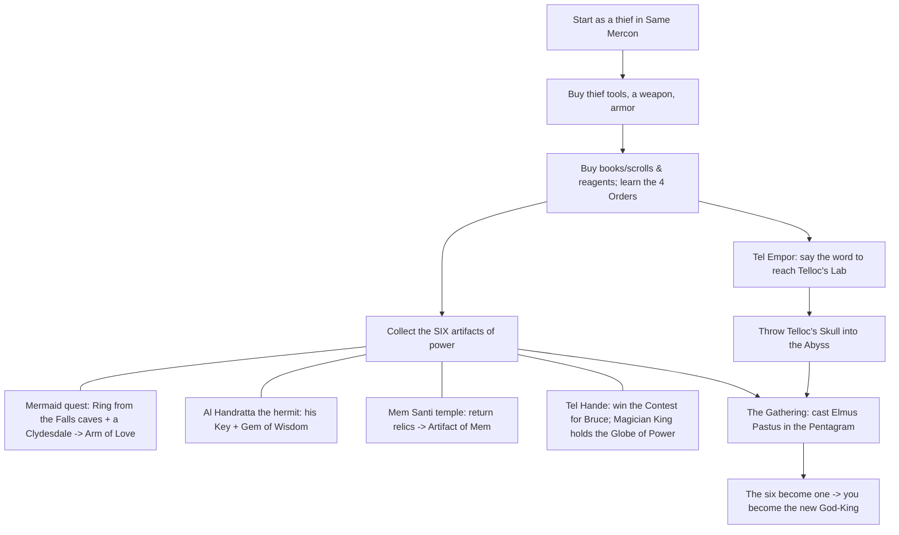

# Keef the Thief — Strategy Guide

*A player's guide to **Keef the Thief: A Boy and His Lockpick** (Electronic Arts,
1989), reconstructed from the game's own data. Companion to the technical write-up
in `.\.docs\KeefTheThief-ReverseEngineering.md`.*

> Everything below is drawn from text, tables, and lore extracted directly from
> `.\Game\KF.EXE` and `.\Game\BOOKS`. Where the game is deliberately cryptic, this
> guide points you at the clue rather than spoiling the exact room — the fun of
> Keef is figuring out the *how*.

---

## 1. Getting Started

- **Launch** with `.\Game\KEEF.BAT`, which runs `kf vga mouse adlib single`
  (VGA graphics, mouse, AdLib music, single-drive mode). You can swap arguments for
  your hardware: `tandy`, `mt32`, `ibmpc` (PC speaker), or drop `mouse`.
- The game is **mouse-and-menu driven**. A **File** menu holds `Load`, `Save`,
  `New Game`, and three toggles — **`Music`**, **`Fewer`** (fewer monsters), and
  **`Easier`** (gentler checks). Turn `Fewer` and `Easier` on while you learn.
- Four status panels are always a click away: **`Status`** (stats), **`Abilities`**
  (thief gear & skills), **`Inventory`**, and **`Score`**.

**Golden rule:** *"You should try to avoid [death] … especially if you haven't
saved your game for awhile."* The game warns you itself — **save constantly**,
because traps, bad spells, and starvation can kill you instantly.

---

## 2. Understanding Your Character

You have **six attributes**, **three thief skills**, **three survival meters**, and
your core resources. Starting values (from a fresh game) are shown for reference.

| Stat | Start | Why it matters |
|------|-------|----------------|
| **Strength** | 15 | Melee damage and carrying capacity |
| **Speed** | 18 | Who strikes first; heavy armor lowers effective speed |
| **Constitution** | 16 | Underpins Hit Points |
| **Wisdom** | 16 | Magical aptitude |
| **Luck** | 19 | Fudge factor on every random check |
| **Charisma** | 19 | Shop prices and NPC reactions |
| **Disarming** | 16 | Trap-removal success |
| **Stealing** | 17 | Pickpocket/steal success |
| **Unlocking** | 16 | Lockpicking success |
| **Nutrition** | 100 | Hunger meter — hits 0 and you **starve** |
| **Sobriety** | 100 | Drunkenness — impairs you, and *"stay away from open flames"* |
| **Sleep** | 99 | Fatigue — exhaustion forces you to `Sleep` |
| **Gold** | ~100 | Currency |
| **Magic Points** | ~19 | Spell fuel |
| **Hit Points** | ~16 | Health — 0 = dead |
| **Level** | 1 | Rises when you win fights |

**How to grow stronger:**

- **Fight** to gain experience and **rise a level** (*"…and have risen a level!"*).
- **Study books and scrolls.** Nick the shopkeeper spells it out: *"Get youse some
  books and scrolls and study them, loin about da power of da univoise."* Reading
  builds your power base.
- **Cast `Usus Carus`** to temporarily boost **Charisma** before big purchases or
  persuasion.

---

## 3. Staying Alive (the survival loop)

Keef isn't just about combat — three meters constantly drain and each has its own
lethal failure state:

- **Hunger (Nutrition):** eat a **`Good meal`** at a bar (Drunk'n Dragon / Pink
  Dragon). Ignore it and *"you're starving to death."*
- **Fatigue (Sleep):** use the **`Sleep`** command or rent a **`Room for night`**.
- **Drink (Sobriety):** `Wine`, `Beer`, and cocktails (`Mai Tai`, `L.I. Iced Tea`,
  `Screw Driver`, `Kuhula & Creme`) are fun but get you drunk — and never touch the
  **`Death Drink`** casually.

For **Hit Points** and **Magic Points**, visit the **Black Cross** healer for
`Partial heal`, `Full heal`, and `Magic Recharge`, or learn the healing spells
(`Bandus Aidus`, `Takus Tylenus`) so you're self-sufficient in the dungeon.

---

## 4. The Thief's Trade

Your namesake skills. Buy the tools first from the **Black Market** (the *"brother
thief"*): **`Lock Pick Set`**, **`Knife`**, **`Rope`**, **`Grappling Hook`**, and
**`Flint & Steel`**.

### Lockpicking (Unlocking)
Locked doors block progress (*"That door is locked. Got any picks?"*). **Lock picks
wear out.** Failures escalate:
1. *"Your hand slips and the attempt is fouled."*
2. *"…Your pick is in bad shape, go buy a new one."*
3. *"…your pick is in such bad shape that you hurt yourself."*

Check the **`Abilities`** panel for your **Lock Picks** count and **carry spares**.
The **`Dranus Liqus`** spell opens *any* door with **no chance of failure** — save
it for locks that matter.

### Disarming traps
When you `Disarm a trap`, you choose a **method** from a big menu — e.g. *"Putting
lots of Oil on the trap,"* *"Sticking your knife in the hole,"* *"Using grappling
hook,"* or button combinations. Pick correctly and *"You deftly disarm the trap."*
Pick wrong and you're injured — or killed (*"I hope you will forgive this trap for
killing you"*). The game hints when you're on the wrong track: *"you're doing it
totally wrong! Try something different."* **Match the method to the trap's
description**, and disarm **before** you try to grab the loot.

### Stealing
`Steal … from …` a person or display. Success: *"Your stealth and guile allow you
to pilfer the prize unharmed and undetected."* Failure: *"You fumble and sustain a
rather nasty owie,"* or a guard/trap gets you. **Watch for patrols** — cities are
*"constantly patrolled,"* and getting caught can be fatal. Steal when the guard has
just left (*"grab some booty before the guard comes back"*).

### Searching
Use the search actions on room features (`Walls`, `Ceiling`, `Floor`, `Pedestal`,
`Tapestry`, …). *"After searching carefully you find a secret door hidden in the
wall"* / *"You find a door hidden behind the thick tapestry."* **Search everywhere**
— hidden doors, weapons, scrolls, and gold caches are the reward for thoroughness.
The **`Huvius Vacuumus`** spell auto-finds things in a narrow area when your own
detection fails.

---

## 5. Combat

You fight **parties of enemies** and must beat them all (*"vanquished all of your
foes"*). Victory grants **booty + experience**.

### Weapons — progression
Weapons carry three stats on the `Status` panel: **Strength**, **Speed**, and
**Range**. Rough shopping progression at **Weapons R Us**:

`Hands` → `Tree Branch` → `Spiked Club` → `Spiked Gloves` → `Sickle` → `Scythe` →
`Dirk` → `Throwing Dagger` → `Blessed Axe` → `Whirling Death` → `Halberd` → `Bola` →
`Long Bow` → `Crossbow` → `Holy Bow` → `Short Sword` → `Blood Blade`.

### Ranged weapons win fights
`Long Bow`, `Crossbow`, `Holy Bow`, `Bola`, `Throwing Dagger`, and the `Magic Sling`
have **Range** — letting you *"Shoot Guard with distance weapon"* before enemies
close. Gruk's advice on the Tel Hande crossbow guards is the whole tactic:
*"Peg 'em from the bushes. Otherwise they'll turn ya into a porcupine decoy."*

### Armor
Armor has **Strength** (protection) and **Speed** (heavier = slower). Progression:
`Bare Skin` → `Cloth Robe` → `Leather Tunic` → `Light Mail` → `Silver Ring` →
`Serpent Skin` → `Dragon Hide`, plus shields (`Small`/`Large Shield`), head
(`Leather Cap`, `Ogre Skull`), and `Gauntlets`. Balance protection against the speed
penalty.

### Monster tiers
Enemies come in **escalating families** — the same creature with tougher renames as
you go deeper. For example:
- **Minotaur** → Minotaur Titan → Minotaur Prince → Minotaur King
- **Goblin Bowman** → Gremlin Bowman → … up to **Goblin King** era variants
- **Bear Cub** → Black Bear → Grizzly → **Huge Bear**

If a name sounds nastier, it **hits harder** — flee or out-range fights you can't
win, and come back stronger. The **`Fewer`**/**`Easier`** toggles spawn weakling
variants (`Baby Ogre`, `Idiot Swordsman`) while you level up.

### Combat magic ladder
When steel isn't enough, escalate through the attack spells (see §6):
- One foe: `Emmus Exesus` → `Cynus Arcenus` → `Qnus Arudes` → `Pizaus Coldus`
- Whole party: `Agenus Oranus` → `Napus Almus` → `Olus Gayus`
- Defense: `Riteus Gardus` → `Mutus Omahaus` → `Lyodus Londus`
- Melee buff: `Barbus Rubinus`

---

## 6. Magic Mastery (the heart of the game)

Magic is a **mixing puzzle**. You cast inside one of **four "Orders"** (unlocked by
the four **Scrolls**), and each spell is **built from reagents** that embody abstract
**elements**. Casting shows **`Success!`** or **`Fizzle!`**; powerful spells only
work in the **right location** and cost Magic Points.

### The four Orders (and their Scrolls)

| Order (cast site) | Scroll | Power |
|-------------------|--------|-------|
| **Circle of Perfect Unity** | Scroll of Unity | Basic self-magnification |
| **Pyramid of Directed Power** | Scroll of Power | Stronger; can *create matter* |
| **Cube of Irresistible Force** | Scroll of Force | Heavy "solid force" spells |
| **Pentagram of Infinite Conveyance** | Scroll of Infinity | Ultimate; teleport & the endgame ritual |

### Reagents → Elements (buy reagents at the Herb Shop)

Learn what each reagent *means*, then you can invent spells:

| Reagent | Element |
|---------|---------|
| Narcissus Root | **SELF** |
| Peppermint Sprigs | **HEALING** |
| Glow Grass | **LIGHT** |
| Dragon's Drool | **FIRE** |
| Scorpion Tail | **HATRED** |
| Eye of Owl | **SIGHT** |
| Black Pearl | **FOCUS** |
| Wart Weed | **POWER** |
| Kiki Root | **MAGNIFICATION** |
| Skunk Juice | **PROTECTION** |
| Rhino Horn | **OPENING** |
| Phoenix Egg | **INFINITE** |

> **Phoenix Eggs** are special — Nick got his *"huge magical boid eggs … from dis
> old guy … from near Land's End,"* who said *"Go climb a tree!"* Look in the **tree
> tops / the One Tree** for more. You need eggs for every Pentagram spell.

### Spell recipe book

*(Cast in the listed Order; burn the listed reagents.)*

| Order | Spell | Reagents | Effect |
|-------|-------|----------|--------|
| Circle | **Bandus Aidus** | Narcissus Root + Peppermint Sprigs | Partial heal |
| Circle | **Flickus Bickus** | Glow Grass + Dragon's Drool | Light |
| Circle | **Emmus Exesus** | Scorpion Tail | Hurt one foe |
| Pyramid | **Generus Elektus** | Dragon's Drool + Glow Grass + Eye of Owl | Bright light |
| Pyramid | **Huvius Vacuumus** | Eye of Owl + Black Pearl | Find hidden things nearby |
| Pyramid | **Cynus Arcenus** | Scorpion Tail + Black Pearl | Kill one foe |
| Pyramid | **Agenus Oranus** | Scorpion Tail + Kiki Root | Damage all foes |
| Pyramid | **Riteus Gardus** | Narcissus Root + Skunk Juice | Protection/armor |
| Cube | **Takus Tylenus** | Narcissus + Peppermint + Wart Weed | Great heal |
| Cube | **Dranus Liqus** | Black Pearl + Rhino Horn | Open any door / reveal hidden |
| Cube | **Qnus Arudes** | Black Pearl + Wart Weed + Scorpion Tail | Crush one foe |
| Cube | **Napus Almus** | Kiki Root + Wart Weed + Scorpion Tail | Devastate all foes |
| Cube | **Mutus Omahaus** | Wart Weed + Skunk Juice + Narcissus | Wall of force (defense) |
| Pentagram | **Usus Carus** | Phoenix Egg + Glow Grass + Eye of Owl | Raise Charisma (temp) |
| Pentagram | **Pizaus Coldus** | Phoenix Egg + Black Pearl + Scorpion Tail | Psychic storm — kill tough foe |
| Pentagram | **Olus Gayus** | Phoenix Egg + Kiki Root + Scorpion Tail | Banshee — hit a whole party |
| Pentagram | **Lyodus Londus** | Phoenix Egg + Narcissus + Skunk Juice | Near-total damage immunity |
| Pentagram | **Barbus Rubinus** | Phoenix Egg + Narcissus + Scorpion Tail | Empower melee blows |
| Pentagram | **Elmus Pastus** | *(endgame — see §7)* | The final "gathering" ritual |

### Experiment for hidden spells
The books encourage it: *"look for new spells … If thy find the correct combination
then new spells are thine."* Reported discoveries you can recreate by reasoning from
the element table:
- **Create food** (Pyramid — *"create matter"*): a `Makus Foodus`-type mix.
- **Full party heal** (Cube — *"heal the wounded completely"*): `Goodas Newus`.
- **Light a whole dungeon** (Cube): `Bigus Litus`.
- **Teleport home** (Pentagram): `Phonus Homus`.

The in-game **"Fool's Cant"** poem is a tutorial in disguise — e.g. *"Mixed Heal,
Self, and Weed"* (= `Takus Tylenus`) and *"this Minty Self / Cubed, death did
receed"* (a Cube heal). Read it when stuck.

### Casting tips
- **Wrong place = disaster.** *"the location is wrong for a spell of this magnitude,
  it goes drastically wrong."* Match the spell's Order to the geometric chamber.
- **Missing a reagent = death.** *"you do not possess everything you need … The
  bitter lemur of death awaits!"* Stock up before a ritual.
- **"Magic searches in these magic places"** — cast detection/search magic inside
  the shaped chambers for special results.

---

## 7. The Main Quest — Critical Path

Keef stumbles into a world-scale plot. Long ago the God-King **Telloc** forged an
**idol of six-fold power** and ruled 666 years. Now the **Magician King** of Tel
Hande is reassembling that power to crown himself Emperor. Your goal: **gather the
six artifacts yourself** and perform the final ritual.

### The six artifacts (the six-fold power)
Telloc's own diary lists the essences he forged — *"Strength of the Body, Wisdom of
the Mind, Power of Charisma, Healing of the Hands, Luck of Man, and Speed of the
Legs, with weed, pearl, & egg."* In play, the six collectible pieces are:

1. **Gem of Wisdom** — Al Handratta's *"huge ancient gem the size of a casaba
   melon"* in his hut.
2. **Globe of Power** — held by the **Magician King** at Tel Hande.
3. **Plate of Strength**
4. **Arm of Wealth**
5. **Arm of Love** — the **Mermaid quest** (Telloc's lover); *"love was one sixth of
   his power."*
6. **Artifact of Mem** — in the **Mem Santi** temple, guarded by Mem's First.

### Key sub-quests

- **The Mermaid (Arm of Love):** She lost two keepsakes from her dead love Telloc —
  *"Both are in the caves behind the falls. Bring me the ring and the other is
  yours."* Retrieve the **Mermaid's Ring** from the falls caves — but *"if you decide
  to use the key you must face the three-headed **Hydra**."* Give her the ring →
  **Arm of Love**. Separately, gift her a **Clydesdale** (from the **Barbarian Horse
  Works**) and she hands over **her Key**.
- **Al Handratta (hermit):** the jungle prophet. Talk with him and *"Want a key?"* —
  he gives the **Hermit's Key**. His hut holds the **Gem of Wisdom** and the oldest
  magic **library**.
- **The Abyss & the Key of Koran:** a sign warns *"Abandon hope all ye who enter here
  without the Key of Koran!"* Use the **Key of Koran** to open the sealed door
  (*"CLICK! The door can now be opened freely!"*). The great door to **Telloc's
  library** *"may need to be opened from two sides, the second tunnel starting in the
  west."*
- **Telloc's Lab (the magic word):** *"a magic lab that could only be reached by way
  of a magic word said while near his house."* The word is **"Tuna!"** — speak it at
  Telloc's house in Tel Empor and *"a staircase of suspended stones materializes."*
  (Clue found in his sealed library / his Log.)
- **The Mem temple:** return Mem's relics — *"the guards at the stairs hold robes
  blessed by Mem himself."* The **Artifact of Mem** sits atop a pillar down a ladder
  that **Mem's First** blocks *"unless it is over his dead body."*
- **The Contest at Tel Hande:** win it for **Bruce**, *"the world's butchest weapon."*
  Gruk brags he'll win it — beat him to it.

### The endgame ("the gathering")
Location/owner-bound spells *"must be cast in a specific local with no interference
from the designer of the spell, be he alive or dead. **All his body must descend
into the abyss.**"* So you must **hurl Telloc's Skull into the Abyss** first
(*"It bursts into flames … shrieking 'Son of a biiii..'"*). Then, with all six
artifacts, **cast `Elmus Pastus` in the Pentagram** — *"the six are one"* — and claim
the God-King's throne. Cast it wrong (missing a piece, or with Telloc still
interfering) and *"you hear the Emperor's dry laugh and the single word 'Chump!'"*

---

## 8. Money & Shopping

| Shop | Run by | Buy here |
|------|--------|----------|
| **Weapons R Us** | The Smith | Weapons & armor |
| **Black Market** | *"brother thief"* | Lock picks, knife, rope, grappling hook, flints |
| **Herb Shop** | Nick | **Reagents** (and Phoenix Eggs when in stock) |
| **Book Store** | Nick | Books & scrolls (study for power; scrolls unlock Orders) |
| **Black Cross** | Healer | Partial/Full heal, Magic Recharge |
| **Drunk'n Dragon / Pink Dragon** | Barkeeps | Food, drink, lodging |
| **Barbarian Horse Works** | The Barbarian | Horses (incl. the **Clydesdale**) |
| **Starving Artists** | The Artist | Paintings (incl. a **Porche**) |

**Making money as a thief:** loot the **rich houses to the west** of Same Mercon
(*"The houses to the west are loaded"*), rob the **Palace Treasury** of King Mooche,
and **fence antiques**. The **Collector** buys *"almost anything … in the antique
book I wrote"* — hunt Telloc's **toothbrush**, a pre-Empire **tea pot**, ancient
weapons, gems, jewelry, and that **Porche** painting. The **Merchant** and **Merchant
King** also trade rare items — but *"keep your meathooks off my buckaroonies."*

---

## 9. Quest-Item & Key Checklist

- **Keys:** Hermit's Key (Al Handratta), Mermaid's Key (gift a Clydesdale), **Key of
  Koran** (opens the Abyss/Telloc's-library door).
- **Books:** Book of Lore (history + antiques), Book of Swords (the 13 blades),
  Antique Book (fencing catalog), **Telloc's Log** (idol recipe + the "Tuna!" clue),
  Fool's Cant (hint poem), Jungle Map (navigation).
- **Scrolls:** Unity, Power, Force, Infinity → the four magic Orders.
- **Quest tokens:** Flower of Mem (woo the Princess), Shard of Mem (return to the
  temple), **Telloc's Skull** (throw into the Abyss), Mermaid's Ring, Passport.
- **Artifacts (win condition):** Gem of Wisdom, Globe of Power, Plate of Strength,
  Arm of Wealth, Arm of Love, Artifact of Mem.

---

## 10. Tips, Tricks & Secrets

- **Save before every lock, trap, theft, and spell.** The game kills you fast and is
  proud of it.
- **Read everything.** The books literally contain the spell recipes, the endgame
  ritual, the "Tuna!" word, and the locations of the three libraries.
- **The magic word is `Tuna!`** — say it at Telloc's house in Tel Empor.
- **Buy spare lock picks and flints**; picks break and leave you stuck.
- **Range beats melee** against guards — snipe crossbowmen from cover.
- **`Dranus Liqus`** (Cube) trivializes locked doors; **`Huvius Vacuumus`** (Pyramid)
  and searching find every secret.
- **Charisma controls prices** — cast `Usus Carus`, then shop.
- **Don't over-loot sacred/guarded hoards:** *"Remember not to get too greedy"* —
  greed triggers guards and traps.
- **Easter egg:** find *"The Naughty Dog, Inc. (formerly J.A.M. Software) store, run
  by Cookie."* The devs (Andy Gavin & Jason Rubin, future founders of Naughty Dog)
  hid themselves and their friends all over the dialogue — even daring you to explore
  **Tel Empor** faster than *"it took Andy 20 hours to enter the data for it."*

---

## 11. Quick-Reference Cheat Sheet

- **Survive:** eat (Nutrition), sleep (Sleep), stay sober-ish (Sobriety), heal (HP).
- **Thief loop:** search → disarm trap → pick lock / steal → grab loot → save.
- **Combat loop:** out-range if possible → open with an area spell if outnumbered →
  buff/defend → melee finish → level up.
- **Magic loop:** own the Scroll for the Order → carry the right reagents → cast in
  the matching chamber.
- **Win:** learn all four Orders → gather the six artifacts → throw Telloc's Skull
  into the Abyss → cast `Elmus Pastus` in the Pentagram → **become the God-King.**

*Good luck, Stickyfingers.*
