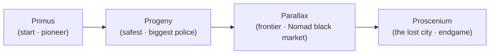
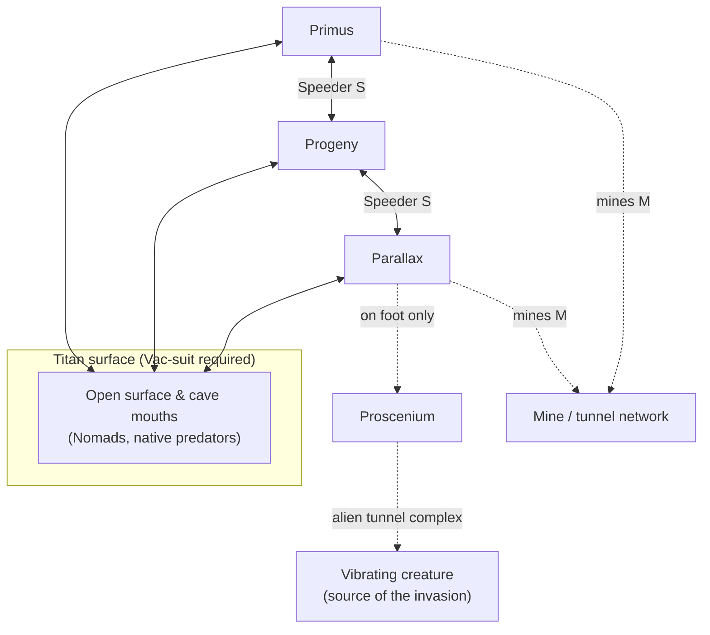

# Mines of Titan — Strategy Guide

A player's guide to Westwood/Infocom's 1989 RPG *Mines of Titan*: how it plays, how to
build a winning party, and how to reach the ending. Compiled from the game's bundled
manuals (`.game/docs/`), the disassembly, and community walkthroughs.

> **Spoiler warning.** The "How to win" and "Endgame" sections give away the plot the
> game asks you to discover for yourself, and reproduce material from the sealed *Secret
> Dossier*. Skip them for a blind first play.

---

## 1. The setup

You are **Tom Jetland**, a bankrupt supply-ship pilot stranded on Saturn's moon **Titan**,
a Paramount Mining colony. Controller **Cornellius Wrak** of Primus offers a large reward —
enough to reclaim your impounded ship — to the first party that discovers why all contact
with the frontier city of **Proscenium** was cut off. You recruit a party, cross Titan's
four cities and its mine/tunnel network, and uncover the truth.

Titan's four cities, in the order you can reach them:

All four are built inside worked-out mine shafts, so their internal layouts feel maze-like.
The speeder line to Proscenium is "not yet operational" — reaching it is the whole quest.

---

## 2. How to play

### Controls (from the reference card)

- **Menus:** move the highlight with the joystick / arrow keys, or **W** = up, **Z** = down
  (also **I**/**M**). Confirm with the joystick button, **SPACE**, or **RETURN**.
- **Yes/No prompts:** **Y**/**N**, or highlight with **A** = left, **S** = right
  (also **J**/**K**), then confirm.
- **General Options Menu:** out of combat, with nothing else on screen, press
  **SPACE**/**RETURN**/button.
- **The initial highlighted menu item is not a hint** — it is just where the bar starts.

### Movement

Movement differs by location:

| Key (Arrow / Letter) | In cities & on the surface | In caves & tunnels |
|---|---|---|
| **W / I / Up** | Move ahead | Turn/move **north** |
| **A / J / Left** | Turn left | Turn/move **west** |
| **S / K / Right** | Turn right | Turn/move **east** |
| **Z / M / Down** | — | Turn/move **south** |

### The auto-map

`VIEW MAP` in the General Options Menu draws an auto-map of where you've been. City maps
use letters for establishments. The legend (also callable from any computer terminal):

| | | | |
|---|---|---|---|
| **A** Armory | **B** Bar/Lounge/Restaurant/Barracks | **C** Computer Center | **D** Personal Development Center |
| **G** Gambling Casino | **H** Hospital | **M** Mine Elevator | **O** Controller's Office |
| **P** Police Station | **R** Repair Shop | **S** Speeder Transport Center | **T** Combat Training Center |
| **U** University | **W** War Game Room | **X** Exit to Surface | **!** Munition Store |
| **?** Computer Terminal | | | |

Use these as your city map: **B**ars/**B**arracks recruit party members and drop off the
dead; **A**rmories sell Vac-suits and armor; **!** Munition Stores sell weapons;
**H**ospitals heal; **D**/**U**/**T**/**C** train attributes and skills; **G** casinos and
**P** police-station bounties make money; **S**peeder centers travel between cities; **M**
and **X** lead down into mines and out to the surface.

---

## 3. Building a party

You begin alone in a **bar on Primus**, recruiting from **bars, barracks, restaurants and
lounges**. Early on few people will join; as your reputation grows (missions, bounties),
better recruits appear. Before recruiting, **examine each candidate's background, skills
and attributes** — you want a broad spread, not four clones.

### Attributes (0–15 each)

| Attribute | Why it matters | Priority |
|---|---|---|
| **Agility** | Sets combat moves per round *and* ranged accuracy — the single best stat | ★★★★★ |
| **Might** | Gates which (heavier) weapons a character can carry | ★★★★ |
| **Stamina** | Damage soaked before Might/Agility start dropping | ★★★★ |
| **Health** (derived) | Average of Might/Agility/Stamina; hits 0 = **permanent death** | — |
| **Education** | Caps how high academic skills (esp. Medical) can be trained | ★★★ |
| **Wisdom** | Situational perception edge | ★★ |
| **Charisma** | Helps talk your way out of fights | ★★ |

Raise attributes at **Personal Development Centers (D)** and **Universities (U)** — they
cost credits *and* require accumulated experience. Because **Health = avg(Might, Agility,
Stamina)**, pumping the three physicals is how you get durable characters.

### Skills

Sixteen trainable skills; combat ones are learned at **Combat Training Centers (T)**,
academic ones at **Universities (U)** / **Computer Centers (C)**, and a few (Gambling) only
rise through use:

- **Combat:** Melee (fists), Cudgel (bats/pipes), Blade (knives→swords), Handgun, Rifle,
  Automatic Weapons, Throwing (knives/grenades/bows/launchers), Arc Gun, Battle Armor, Golum.
- **Non-combat:** Medical, Programming, Mining, Administration, Street, Gambling.

**Priority skills:**
- **Medical** — buy a dedicated medic up to a high level so you can carry **Med Kit C**
  (top-tier field healing) when no Hospital is near. Its ceiling is limited by **Education**.
- **Programming** — needed to hack computer terminals for clues, credits and to operate
  **Golum** systems; push one character deep here.
- A ranged pairing (**Rifle** + **Automatic Weapons**) with high **Agility** wins most fights.
- **Street** / **Administration** — talk thugs and authorities down, avoiding needless combat.

> A **large party** is more capable (room for specialists) but is more noticeable and draws
> more — and nastier — foes. A big party of *green* recruits is worse than a lean veteran one.

### Items & gear

Each character carries up to **nine** kinds of items (stackable, e.g. 10 grenades = one
slot). Essentials:
- **Vac-suit** — required to survive the **surface**; buy at an **Armory (A)** before going out.
- **Weapons** scale with skill: better Rifle/Handgun/Auto skill unlocks heavier arms at
  **Munition Stores (!)**. The in-game item list runs from `Fists`/`Model 10` up through
  laser and energy weapons (`Pulse lzr`, `Blaster`, `Reaver rfl`, `Mind blast`).
- **Armor** ladder: `Lt armor → Mesh → Hydro → Bttl armor` (and police-only `Golum armr`).
- **Med kits A/B/C** — carry the best your Medical skill allows.
- **Repair Shops (R)** pawn found items for credits and hand out gossip/clues.

**Legal note in-world:** possessing **Golum armor** without police authorization is a
felony, and each suit is molded to one user.

---

## 4. Making money

Credits pay for training, weapons, armor and healing — you will always want more.

1. **Casino Keno (G).** The casino games — Keno in particular — can be milked: bet, and
   reload/repeat favorable outcomes to build a bankroll fast. Raising **Gambling** improves
   your odds knowledge.
2. **Police bounties (P).** Bounty lists at police stations pay for hunting named criminals
   (Nomads, Hitmen). Good early income that also builds reputation.
3. **Loot & pawn.** Strip credits and gear from dead foes; sell surplus weapons/items at
   **Munition Stores (!)** and **Repair Shops (R)**.

---

## 5. Enemies

Human threats in the cities and surface: **Citizens, Muggers, Thugs, Hitmen, Hunters,
Officers**, and **Nomads** (surface outlaws). Deeper in the quest you meet the **Titanian
"mutants and monsters"** — native predators whose natural attacks appear in the data as
`Tentacal, Mandible, Fangs, Pincers, Spine, Gas bomb, Death dust, Spittle, Magma, Shock,
Slime, Mucus`. These are far tougher than any street thug and are the real obstacle to
Proscenium.

---

## 6. Combat

You choose the complexity:
- **Computer-run** — let the AI resolve the fight (good for learning; press **SPACE** to
  seize control on the next turn if you dislike its choices).
- **Tactical** — you set each character's movement and target every round.

Both sides act **simultaneously**, giving fights a real-time feel. Core tactics:
- Lead with **high-Agility** shooters — they act more often and hit more reliably.
- **Focus fire**: drop one enemy at a time to cut incoming damage fast, especially against
  healing/regenerating Titanian creatures.
- Keep a **medic** topped up on **Med Kit C** and out of the front line.
- Match **weapon to skill and Might** — an unskilled heavy weapon misses; a skilled light
  one lands.

---

## 7. How to win (spoilers)

The mystery: Proscenium wasn't lost to a "satellite cable breakdown" (Paramount's cover
story). Miners near Proscenium cut into a **smooth, artificial tunnel complex** and found a
huge, ~4-metre, **vibrating creature** that gave everyone splitting headaches. Days later,
never-before-seen **Titanian predators** poured out and overran the city. The natives — the
seemingly mindless **"jelly balloons"** turn out to be **sapient** (a Shoenfeld test put it
at 73%) — are defending their homeland after the colonists dissected one of their own.
Paramount's president orders the evidence buried, the mines shut, and a reward dangled to
misdirect suspicion. **That reward is your quest.**

Broad path to the ending:

1. **Establish in Primus:** recruit a balanced party, buy Vac-suits and starting arms, and
   grind casino/bounty credits to fund early training.
2. **Work the city chain Primus → Progeny → Parallax**, training attributes/skills, hacking
   **Computer Centers** for clues about Proscenium, and following leads through
   Repair-Shop/bar gossip. Build a **medic** (Medical + Education for Med Kit C) and a
   **hacker** (Programming) as you go.
3. **Gear up for Titanians:** by Parallax you should be on mid/high-tier weapons
   (laser/energy rifles), the best armor you can legally wear, and stocked on **Med Kit C**.
   Parallax is also the Nomad black market for illegal food and arms.
4. **Reach Proscenium** (on foot from Parallax, since the speeder line never opened) and push
   through its mines/tunnels into the **artificial alien tunnel complex** to confront the
   source of the invasion.

### The final fight

The climactic battle pits your party against a cluster of **healing Titanian aliens** (they
regenerate each round). Win it by:
- **Concentrating all fire on one target** so its damage outpaces its self-heal and it dies
  before the others — never spread damage across the group.
- Keeping your own party **fully healed** with dedicated **Med Kit C** medics each round.
- Fielding **maximum Agility** so you get the most attacks in before they act.

Clear the complex and you resolve the fate of Proscenium — and claim Wrak's reward.

> **How the trainer helps.** Maxing **Agility/Might/Stamina** (and thus Health), maxing
> **Medical** and **Programming**, and topping up **credits** turns the two grind walls —
> training money and the regenerating-alien endgame — into non-issues. See the trainer
> `README.md`.

---

## 8. Quick-reference maps

### Titan travel network

### City establishment legend (letters on the auto-map)

Recruit & rest at **B**; heal at **H**; gear at **A**/**!**; train at **D**/**U**/**T**/**C**;
earn at **G**/**P**; travel at **S**; descend/exit at **M**/**X**; read terminals at **?**;
Controller quests at **O**; police/bounties at **P**; pawn at **R**.

> The original box maps covered every city, mine and cave *except* the lower levels of the
> Proscenium mine — and the game's own auto-map (`VIEW MAP`) is the reliable, self-updating
> reference as you explore. Rely on it plus the legend above rather than static level maps.
