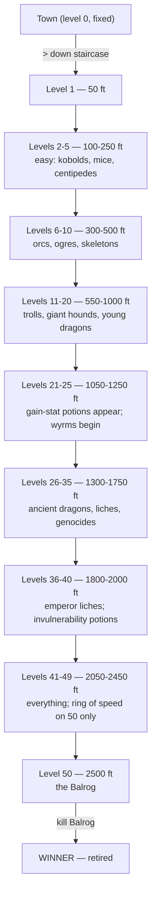

# UMoria 5.5.2 — Strategy Guide

A practical guide to playing **The Dungeons of Moria (UMoria 5.5.2)**, the single-character roguelike
by Robert Alan Koeneke and James E. Wilson. Covers controls, character creation, the town, the dungeon,
combat, items, magic, and the endgame. Compiled from the shipped manual (`.game/doc/moria1.txt` and
`moria2.txt`), the spoiler files (`.game/doc/faq`, `FEATURES.NEW`), and the help screens
(`origcmds.hlp`, `roglcmds.hlp`).

> **Spoiler policy:** sections marked **[Spoiler]** reveal monster stats, item locations, and endgame
> technique. Skip them on a first playthrough.

---

## 1. The game in one paragraph

You are a single adventurer in the town of Moria. Buy supplies, descend 50 procedurally-generated
dungeon levels (each 50 feet deeper than the last), and on level 50 (2,500 feet) **kill the Balrog of
Moria** to win. Death is permanent. The dungeon rebuilds itself every time you change levels, so there
are no fixed maps — only your knowledge of how the game works survives.

### Win condition

- Reach dungeon level 50 and **kill the Balrog** (it spawns on most levels from 49 onward).
- The Balrog cannot be polymorphed, slept, confused, genocided, or destroyed by `Word of Destruction`
  (it teleports to another level instead). Only weapons and direct-damage spells (frost ball, fire
  ball, lightning ball, etc.) actually kill it. **[Spoiler]**
- On a win the character is retired (cannot be saved) and added to the scoreboard with a bonus.

### Death

- At 0 HP the character is gone for good. A tombstone is shown, and you may dump the (identified)
  equipment list to screen or file. A reduced save file survives with only the **monster memory** and
  your option settings, so your next character starts with all the recall knowledge of past lives.

---

## 2. Controls

UMoria ships **two** command sets, toggled in `MORIA.CNF` with `KEYBOARD ROGUE` or `KEYBOARD ORIGINAL`.
The `KEYBOARD ROGUE` set is the default in this distribution (`.game/MORIA.CNF`).

### Movement (the eight directions)

```
Original (keypad):        Rogue (letters):        Meaning:
      7  8  9                  y  k  u              up-left / up / up-right
      4  5  6                  h  .  l              left / stay / right
      1  2  3                  b  j  n              down-left / down / down-right
```

Move **into** a monster to attack it in melee. Move **into** a wall to try to tunnel (you must be
wielding a pick/shovel to make progress). `5` / `.` stays put for a turn.

### Common commands (both sets)

| Action | Original | Rogue | Notes |
|--------|----------|-------|-------|
| Move without picking up | `#<count> - <dir>` | `<count> - <dir>` | Walk over items without auto-pickup |
| Run in a direction | `.<dir>` | `SHIFT-<dir>` | Auto-move until something interesting happens |
| Rest | `R<count>` or `R*` | `R<count>` or `R*` | `*` rests until HP & mana both full |
| Search (one turn) | `s` | `s` | Finds hidden traps/doors; can be counted |
| Search Mode (repeat) | `S` | `#` | Toggle continuous searching |
| Inventory | `i` | `i` | The 22-slot backpack |
| Equipment | `e` | `e` | Worn/wielded items |
| Wear/wield | `w` | `w` | |
| Take off | `t` | `T` | |
| Drop | `d` | `d` | |
| Throw/fire | `f<dir>` | `t<dir>` | Use the wielded bow + appropriate ammo for bonus damage |
| Aim a wand | `a<dir>` | `z<dir>` | |
| Use a staff | `u` | `Z` | |
| Quaff a potion | `q` | `q` | |
| Read a scroll | `r` | `r` | |
| Eat food | `E` | `E` | |
| Fill lamp with oil | `F` | `F` | Lamp must be wielded; oil in inventory |
| Browse a book | `b` | `P` | Lists spells in a held book |
| Cast a mage spell | `m` | `m` | Must know the spell and carry the book |
| Pray (priest spell) | `p` | `p` | |
| Gain new spells | `G` | `G` | Only when `Study` shows on the status line |
| Open door/chest | `o<dir>` | `o<dir>` | Picks locks; can be counted |
| Close a door | `c<dir>` | `c<dir>` | |
| Jam a door with a spike | `j<dir>` | `S<dir>` | More spikes = stronger jam (diminishing returns) |
| Disarm a trap/chest | `D<dir>` | `D<dir>` | Can be counted; gives XP on success |
| Bash | `B<dir>` | `f<dir>` | Doors, chests, or monsters; risky |
| Tunnel in a direction | `T<dir>` | `CTRL-<dir>` | Needs pick/shovel |
| Exchange primary/secondary weapon | `x` | `X` | |
| Look in a direction | `l<dir>` | `x<dir>` | `5`/`.` looks in all directions |
| Identify a screen character | `/` | `/` | `/` + monster letter shows monster-memory recall |
| Inscribe an object | `{` | `{` | A single-digit inscription lets you refer to that item by digit |
| Character description | `C` | `C` | |
| Locate self on map | `L` | `W` | Recentres on the player |
| Reduced map | `M` | `M` | Full level at half size |
| View scoreboard | `V` | `V` | Press `V` again for just your scores |
| Set options | `=` | `=` | See §3 |
| Version | `v` | `v` | |
| Previous message | `^P` | `^P` | `^P<count>` shows N previous messages |
| Refresh screen | `^R` | `^R` | |
| Save & quit | `^X` | `^X` | |
| Quit (no save) | `^K` | `Q` | |
| Wizard mode | `^W` | `^W` | Marks the character permanently off the scoreboard; `^H` lists wizard commands |
| Shell to OS | `!` | `!` | Type `exit` to return |
| Help | `?` | `?` | |
| Go up staircase | `<` | `<` | Must be standing on `<` |
| Go down staircase | `>` | `>` | Must be standing on `>` |

### Counts

- **Rogue set:** type the digits first, then the command (`99s` = search 99 times).
- **Original set:** type `#` first, then digits, then the command.
- A count of `0` defaults to 99. Counted searches/tunnels abort on success or on being attacked.
- Any keystroke aborts a run or a counted command.

### Direction notes

- `5` (original) or `.` (rogue) is the "stay" direction; useful for waiting one turn.
- Looking with the stay direction (`l5` / `x.`) looks in **every** direction at once.

---

## 3. Options (the `=` command)

Toggled in-game; saved with your character:

1. **Cut known corners when running** (on) — diagonal through known corners; faster.
2. **Examine potential corners when running** (on) — step into unknown corners to reveal them; safer
   for following new passages.
3. **Print self during a run** (off) — slightly faster redraw.
4. **Stop when map sector changes** (off) — stop running when a new screen loads.
5. **Treat open doors as empty space** (off) — keep running through open doors.
6. **Prompt to pick up objects** (off) — auto-pickup unless overridden.
7. **Highlight mineral seams** — quartz/magma shown differently from granite.
8. **Show weights in inventory** — essential for picking light weapons (more blows).
9. **Sound** / **repeat-count display** — both on by default; disable for slow terminals.

---

## 4. Character creation

### 4.1 The six stats

Each ranges **3 to 18/100** (18/100 ≈ 19, 18/00 ≈ 18). Adjusted by race and class; can rise later via
gain-stat potions, and can be drained by some monsters (restored with restore-stat potions).

| Stat | Affects |
|------|---------|
| **STR** | Hit & damage in melee, carry weight, tunneling, bashing |
| **INT** | Mage's spell-learn chance and mana; disarm; magic-device use |
| **WIS** | Priest's spell-learn chance and mana; saving throw |
| **DEX** | Extra blows with light weapons, to-hit, dodging, disarming, anti-pickpocket |
| **CON** | Hit points per level; resistance to poison |
| **CHR** | Store prices; starting money |

> **Cheat-sheet:** warriors want STR/DEX/CON; mages want INT/DEX/CON; priests want WIS/DEX/CON; rogues
> want DEX/INT/CON; rangers want DEX/INT/CON; paladins want STR/WIS/CON.

### 4.2 The eight races

| Race | Best classes | Key adjustments |
|------|--------------|-----------------|
| Human | any | no adjustments; **levels fastest** |
| Half-Elf | any | +INT/DEX, −STR; +search/disarm/stealth/magic |
| Elf | any except Paladin | +INT/WIS/DEX, −STR/CON; better magic than Half-Elf |
| Halfling | Warrior, Mage, Rogue | +DEX, big −STR; great saving throw, search, stealth; infravision |
| Gnome | Warrior, Mage, Priest, Rogue | +INT, −STR; great saving throw; infravision |
| Dwarf | Warrior, Priest | +CON/STR, −DEX/CHR; great fighting; infravision; **resists poison** |
| Half-Orc | Warrior, Priest, Rogue | +STR/CON, −CHR; great fighting |
| Half-Troll | Warrior | +STR/CON huge, −INT/WIS/CHR; very strong, very dumb |

> **Cheat-sheet for beginners:** Dwarf Warrior or Half-Troll Warrior is the most forgiving combination
> in the game — high HP, fast kills, no spells to fumble.

### 4.3 The six classes

| Class | Prime | Hit die | Mana | Notes |
|-------|-------|---------|------|-------|
| Warrior | STR | d10 | none | Best melee; fastest fighting-skill gain |
| Mage | INT | d4 | INT-based | Best magic; slowest melee-skill gain |
| Priest | WIS | d4 | WIS-based | Blunt weapons only; strong vs undead |
| Rogue | DEX | d6 | INT-based | Best disarm/search/stealth; cheap spells |
| Ranger | DEX | d8 | INT-based | Good bows + dual-class magic |
| Paladin | STR | d8 | WIS-based | Holy weapons + priest prayers |

Class skill-gain rates (from `FEATURES.NEW`, higher is faster):

```
              Fighting  Bows  Magic-Device  Disarm  Bows/Throw
Warrior           4      4        2           2        3
Mage              2      2        4           3        3
Priest            2      2        4           3        3
Rogue             3      4        3           4        3
Ranger            3      4        3           3        3
Paladin           3      3        3           2        3
```

(3 = the old baseline; 4 = twice as fast; 2 = half as fast.)

### 4.4 Sex

Only affects height/weight (females are smaller and lighter — minor carry-capacity penalty offset by
slightly more starting gold). No stat differences.

### 4.5 Rerolling

In 5.x you can reroll the initial stats/history/gold as many times as you like at character creation.
Take your time — a strong start saves hours.

---

## 5. The town (level 0)

A fixed, walled town with six stores (entrances numbered `1`–`6`), townspeople wandering the streets,
and a single down-staircase. Day/night cycle: at night the town is dark and infravision/light matter.

### 5.1 The six stores

| # | Store | Sells | Buys |
|---|-------|-------|------|
| 1 | General Store | food, torches, lamps, oil, shovels, picks, spikes, clothing | most non-magical gear |
| 2 | Armory | all armor (soft/hard/cloak/boots/helm/gloves/shield) | armor |
| 3 | Weaponsmith | hand & missile weapons, arrows, bolts, shots | weapons & ammo |
| 4 | Temple | healing & restoration potions, bless & word-of-recall scrolls, priestly weapons | holy items |
| 5 | Alchemy Shop | all potions & scrolls (offensive/defensive/identify) | potions & scrolls |
| 6 | Magic-User's Shop | rings, wands, amulets, staves | magical devices (most expensive) |

### 5.2 Haggle tips

- Storekeepers have a hidden final price. Each haggle round you offer a price; they counter. If you
  consistently reach their final offer (i.e. bargain well), they'll eventually skip the dance and
  quote the final price directly.
- You can use **`+10`** / **`-10`** to increment/decrement your last offer by 10, and **RETURN** to
  reuse the last increment. This speeds up haggling enormously.
- Items under 10 gold don't count toward your haggling reputation.
- Insulting a shopkeeper too often gets you thrown out for a while.
- Stores restock over time; check back periodically. Selling a good item to a store may make it
  disappear (sold to another customer) before you can buy it back.

### 5.3 Townspeople

Mostly harmless but annoying: urchins beg, blubbering idiots block, drunks sing, sneaky rogues pick
pockets, drunken warriors pick fights. **No XP for killing in town** — avoid them, or bash through if
blocked. Pickpockets can steal from your inventory, so keep your good stuff identified and insured
with a `*`-inscribed slot if you care.

---

## 6. The dungeon (levels 1–50)

### 6.1 Descent

- Step on `>` and press `>` to go down. Every dungeon level has **at least one `<`** and **at least two
  `>`** — the stairs are always there, even if a secret door hides them.
- Going down **always** produces a new, procedurally-generated level. Going up from level 1 returns to
  the fixed town.
- A **Word-of-Recall** scroll (or priest prayer) teleports you back to town from the dungeon, or back
  to your deepest prior level from town. There's a delay before it fires — not a panic button.

### 6.2 Light

- Rooms are permanently lit; corridors are dark unless you carry a light source.
- Wield a **torch** (cheap, burns out) or a **lamp/lantern** (refillable with the `F` command). At
  ≤50 turns of fuel the game warns *"Your light is growing faint"*.
- Without light you cannot map, see attackers, search, pick locks, or disarm. Always carry spare oil
  deep in the dungeon.

### 6.3 Terrain

| Symbol | Meaning |
|--------|---------|
| `.` | floor |
| `#` | granite wall (hard to dig) |
| `%` | permanent rock (undiggable) |
| `'` | open door |
| `+` | closed door |
| `<` | up staircase |
| `>` | down staircase |
| `^` | trap (only after detected) |
| `$` / `*` | metal/gem embedded in a vein |
| `:` | quartz vein (richest) |
| `;` | magma vein (some treasure) |

### 6.4 Mining

- Wield a pick or shovel. Dig along the vein (quartz/magma), not through granite — granite is far
  harder. A **scroll/staff of treasure location** reveals all `$`/`*` on the current screen.
- Magical digging tools (`(+d)`) dig faster; high STR helps.
- Always carry a digging tool deep in the dungeon — you can trap yourself with spells/items and need
  to dig out.

### 6.5 Searching & secret doors

- `s` searches one turn; `S`/`#` toggles continuous search. Secret doors and floor traps are only
  revealed by searching. Most races/classes have a passive perception too (you'll sometimes notice
  things without searching).
- Once a secret door is found, it's drawn as a normal door forever.
- Always search a chest before opening (`o`) — most chests are trapped.

---

## 7. Combat

### 7.1 Melee

- Move **into** the monster to attack. To-hit vs. AC determines a hit; the weapon's damage dice
  determine damage.
- More **blows per round** with light weapons if STR & DEX are high (see blows table below). A dagger
  in the hands of an 18/90-STR, 18/90-DEX warrior is deadly.
- Wield the right weapon for the right fight: Slay Dragon ×4 vs. dragons, Slay Undead ×3 vs. undead,
  Slay Evil ×2 vs. evil, Slay Animal ×2 vs. animals, Flame Tongue ×1.5 vs. fire-vulnerable, Frost
  Brand ×1.5 vs. cold-vulnerable.

### 7.2 Blows per round **[Spoiler]**

```
STR / weight:    <2    <3    <4    <5    <7    <9    >9     (DEX bucket)
                                       9     18    67   107  117  118
<2 lb            1     1     1     1     1     1     2
<3 lb            1     1     1     1     2     2     2
<4 lb            1     1     1     2     2     3     3
<5 lb            1     1     2     2     3     3     3
<7 lb            1     2     2     3     3     4     4
<9 lb            1     2     2     3     4     4     4
>9 lb            2     2     3     3     4     4     4
```

Read: at 18/90 STR and 18/90 DEX, a <2 lb weapon (main gauche, dagger) gets **4 blows**; a 9 lb
weapon (two-handed sword) gets **3**; a 12 lb katana needs 18/90 STR for **3 blows**. Light weapons
win when you have the stats.

### 7.3 Missiles

- Wield the bow; throw (fire) the ammo. **Multipliers** (Confirmed from `FEATURES.NEW`):
  - Sling + rounded pebble / iron shot: **×2**
  - Short bow + arrow: **×2**; long bow: **×3**; composite bow: **×4**
  - Light crossbow + bolt: **×3**; heavy crossbow: **×4**
- Oil flasks are lit before thrown — they do **fire** damage.
- Thrown items have a range based on weight and your STR/DEX.

### 7.4 Bashing

- `B<dir>` / `f<dir>` bashes a door, chest, or monster. A **shield bash** (with a shield worn) does
  more damage. Bashing can stun a monster (free hits) but can also throw **you** off-balance (free
  hits for the monster). Risky against big monsters.
- Bashed doors are permanently broken (cannot be closed). Bashed chests may destroy contents but do
  **not** disarm traps.
- You **cannot bash the Balrog**. (`FEATURES.NEW`)

### 7.5 Armor Class (AC)

- AC is the `[#,+#]` shown on each armor piece: `#` is base AC, `+#` is magical bonus. Total AC ≈ sum
  over all worn pieces. Heavy body armor may show `(-#)`: a to-hit penalty for being bulky.
- AC helps three ways: (1) reduces the chance a hit does damage, (2) absorbs a fraction of the damage
  that lands (AC 30 ≈ 15% absorption), (3) reduces acid damage (body armor soaks acid).
- AC **above 60** or **below 0** is possible with strong enchantments; both are good (a negative AC
  makes you harder to hit, oddly).

### 7.6 Monster memories

When you see or fight a creature, the game **automatically** records what you observed (attacks,
spells, breaths, resistances, movement quirks). Read it back any time with `l<dir>` on a seen
creature, or `/<monster-letter>` and follow the prompts. The trainer's **Paragraphs** tab surfaces
the same memory for all 279 creatures.

### 7.7 Status effects on you

| Effect | Caused by | Cure |
|--------|-----------|------|
| Blind | blinding monster, potion | cure blindness (potions/spell), wait |
| Confusion | confusion monster, gas | cure confusion, wait |
| Fear | fear monster | cure fear, wait (you can't melee while afraid) |
| Hallucination | mushrooms, chaos | cure confusion; `^R` does **not** help |
| Poison | poisonous bite/sting | cure poison; slowly drains HP otherwise |
| Paralysis | paralyzing monster | free-action item prevents; otherwise helpless |
| Slowed | slowing monster, own weight | haste self (spell/potion/staff), drop weight |
| Hunger (weak) | food counter low | eat food (`E`) |
| Starvation | food counter 0 | eat food immediately or die |

**Free action** (an item flag) prevents slow/paralyze from monsters — get one before going deep.

---

## 8. Items

### 8.1 Item slots (the `inventory[34]` array)

```
0..21  = backpack (22 slots, weight-limited)
22     = INVEN_WIELD   primary weapon
23     = INVEN_HEAD    helmet
24     = INVEN_NECK    amulet
25     = INVEN_BODY    body armor
26     = INVEN_ARM     shield
27     = INVEN_HANDS   gauntlets/gloves
28     = INVEN_HAND    ring (left hand)
29     = INVEN_AUX     ring (right hand)
30     = INVEN_FEET    boots
31..33 = spare
```

Two rings may be worn at once. Cursed items (`damned` inscription) cannot be removed until a
`Remove Curse` is cast.

### 8.2 Ego and special weapons **[Spoiler]**

| Code | Weapon | Effect |
|------|--------|--------|
| HA | Holy Avenger | +(1-4) STR, +(1-4) AC, slay evil/undead, sustain, see invisible |
| DF | Defender | stealth, regen, free action, see invis, feather fall, RF/RC/RL/RA, +(6-10) AC |
| SA | Slay Animal | ×2 damage vs. animals |
| SD | Slay Dragon | **×4 damage vs. dragons** |
| SE | Slay Evil | ×2 vs. evil |
| SU | Slay Undead | ×3 vs. undead, see invisible |
| FT | Flame Tongue | ×1.5 vs. fire-vulnerable |
| FB | Frost Brand | ×1.5 vs. cold-vulnerable |

A HA that's +1 STR sustains STR; +2 sustains INT; +3 WIS; +4 CON. (No dexterity sustain from HA.)

### 8.3 Crowns **[Spoiler]**

| Crown | Effect |
|-------|--------|
| of the Magi | +(1-3) INT, RF/RC/RA/RL |
| of Lordliness | +(1-3) WIS, CHR |
| of Might | +(1-3) STR/DEX/CON, free action |
| of Seeing | see invisible, +(10-25) searching |
| of Regeneration | 1.5× HP/mana regen (eats food faster) |
| of Beauty | +(1-3) CHR (otherwise useless) |

### 8.4 Other notable items

- **Amulet of the Magi** — free action, see invisible, +searching, +3 AC. One of the best neck slots.
- **Cloak of Protection** — large AC bonus, nothing else.
- **Ring of Speed** — permanent +speed; stacks with other permanent speed items. Found on level 50.
- **Boots of Speed** — same idea, slot-different.

### 8.5 Resistance **[Spoiler]**

- Resist heat/cold from a **potion or spell** is **temporary**; from an item is **permanent**.
- Two permanent resistances do **not** stack. Two temporary resistances stack only in duration.
- Fire/Cold: 1/3 damage with one resist, 1/9 with both.
- Acid: 1/2 with armor, 1/3 with resist but no armor, 1/4 with both.
- Lightning: 1/3 with resist.
- **No resistance to poison gas.** Carry cure-poison.

### 8.6 Speed

- "Very Fast" is the highest displayed speed, but you can go faster (each permanent speed item adds
  +1; temporary haste adds +1 more, stacking in duration only).
- At speed ≥ 2 you act more than once per monster turn. At speed 3 you can hit-and-run an emperor
  lich. At speed 3 you can pillar-dance an ancient multi-hued dragon. **[Spoiler]**

### 8.7 Where items appear **[Spoiler]**

```
Item                            First found on level
Healing potion                  12
Amulets of wisdom/charisma      20
Gain-stat potions               25
Restore-mana potion             25
Genocide scroll                 35
Invulnerability potion          40
Destruction scroll              40
Staff of speed                  40
Staff of mass polymorph         46
Gain-experience potion          50
Rune of Protection scroll       50
Mass Genocide scroll            50
Amulet of the Magi              50
Ring of Speed                   50
Wand of Drain Life              50
Staff of dispel evil            49
Staff of destruction            50
Wand of clone monster           15
Ego weapons/special armor       progressively deeper, peak ~55
```

1/12 of items deep in the dungeon are chosen as if from level 50, so even mid-depths can yield big
finds. Deeper levels have more treasure per level, partially offsetting the lower base-item odds.

---

## 9. Magic

### 9.1 Learning spells

- You **no longer** auto-learn spells on level gain (5.x change). When you're eligible, the status
  line shows **`Study`**; press `G` to learn a new spell from a book you carry.
- You must carry the right book realm: **magic books** for mage spells, **holy books** for priest
  prayers. Warriors cannot read either.
- Each spell has a fixed letter that **never changes** — even if you don't yet know spell `a`, the
  second spell in a book is still `b`.
- Casting without enough mana greatly increases failure chance and risks losing a point of
  **constitution**. The game prompts for confirmation first.

### 9.2 Mage spells (31 spells, 4 books)

Damage table (5.x, **[Spoiler]**):

| Spell | Damage |
|-------|--------|
| Magic Missile | 2d6 |
| Stinking Cloud | 12 |
| Lightning Bolt | 4d8 |
| Lightning Ball | 32 |
| Frost Bolt | 6d8 |
| Frost/Cold Ball | 48 |
| Acid Ball | 60 |
| Fire Bolt | 9d8 |
| Fire Ball | 72 |
| Wand of Drain Life (mage spell equivalent) | 75 |

Notable utility:
- **Phase Door** — short-range teleport.
- **Find Hidden Traps/Doors** — also detects stairs.
- **Sleep I/II/III** — sleep one / adjacent / line-of-sight monster(s).
- **Recharge Item I/II** — recharge a wand/staff; higher failure on high-level or already-many-charges
  wands. Recharge II is more reliable.
- **Word of Destruction** — obliterates everything within 15 spaces; the **Balrog teleports away
  instead of dying**, so don't rely on it for the win.

### 9.3 Priest prayers (31 prayers, 4 books)

Notable utility:
- **Bless** — +2 AC, +5 to-hit for a short time.
- **Blind Creature** — monster wanders confused.
- **Portal** — medium-range teleport.
- **Chant** — double-duration Bless.
- **Sanctuary** — sleep adjacent creatures.
- **Protection from Evil** — evil creatures ≤ your level cannot attack you.
- **Earthquake** — random wall collapses, possibly injuring nearby creatures.
- **Turn Undead** — undead ≤ your level flee.
- **Prayer** — quadruple-duration Bless.
- **Dispel Undead/Evil** — 1..(3× your level) damage to all undead/evil in line of sight.
- **Glyph of Warding** — draws a glyph monsters cannot enter (small break chance). Useful to set up a
  safe firing position; do **not** stand on the glyph expecting perfect safety.
- **Holy Word** — full heal, cures poison & fear, dispels evil for 1..(4× your level); in 5.5.1+ also
  restores all stats and grants 3 turns of invulnerability.

---

## 10. Winning — the Balrog **[Spoiler]**

The Balrog spawns on most levels from **49 onward**. Prepare before descending past 49:

1. **Speed ≥ 3**: one permanent speed item + either a second permanent or a haste-self spell/staff.
2. **Free action** item (avoid paralysis).
3. **See invisible** (HA, SU, amulet of the magi, crown of seeing) — the Balrog can be invisible-ish.
4. **Resist fire** (it breathes fire).
5. **AC as high as possible** — aim for ≥ 100 with full enchanted gear.
6. **Healing**: 10+ cure critical wounds potions, more if you're a warrior.
7. **Ranged attack**: frost/fire/lightning ball wands or spells; or a Slay Evil/Undead weapon for melee.

Tactics:
- Do **not** cast `Word of Destruction` on the Balrog — it teleports to another level and heals.
- Do **not** try to polymorph, sleep, confuse, or genocide it. None work.
- Do **not** try to bash it (impossible).
- **Pillar-dance** like the AMHD technique: find/make a single wall tile with four open neighbours,
  stand on one side, hit the Balrog once when it steps adjacent, then step behind the pillar so it
  can't see you to cast/breathe. Repeat. This works because the Balrog can't cast without line of
  sight.
- A priest can draw a **glyph corridor** (see the FAQ's emperor-lich technique) and fire `Orb of
  Draining` down it; if the Balrog breaks the glyph, teleport out and try again elsewhere.

On the kill: the character is retired, gets a bonus score, and cannot be saved. You can still dump
the final character sheet.

---

## 11. Maps

UMoria's dungeon levels are **procedurally generated** — there are no fixed maps to print. What is
fixed is the **structure** of the descent:



### 11.1 Per-level guarantees

- **≥ 1 up staircase (`<`)** — always present, even on level 50.
- **≥ 2 down staircases (`>`)** — always present (except town: 1 down).
- **Procedurally generated** each descent — going down `>` from level N always builds a fresh level
  N+1. Re-walking the same level (going down then back up) yields the level you left, not a new one.
- **One-way door**: the passage from the town to level 1 is one-way — you can't walk back to town
  from level 1 without a `<` staircase or a Word-of-Recall.

### 11.2 Special rooms (procedurally placed)

- **Room** — lit interior, dark corridors leading out.
- **Vault** — a special walled-off room with a single guarded door; packed with treasure and tough
  monsters. Worth clearing if you're strong enough.
- **Pit** — a room full of one monster type (e.g. an orc pit, a dragon pit).
- **Nest** — a room full of one breeding monster (jellies, insects).

### 11.3 The town layout (fixed)

```
   ########  ########  ########  ########  ########  ########
   #1     #  #2     #  #3     #  #4     #  #5     #  #6     #     1 = General Store
   #1     #  #2     #  #3     #  #4     #  #5     #  #6     #     2 = Armory
   #1     1  #2     2  #3     3  #4     4  #5     5  #6     6     3 = Weaponsmith
   #1     #  #2     #  #3     #  #4     #  #5     #  #6     #     4 = Temple
   ########  ########  ########  ########  ########  ########     5 = Alchemy Shop
                                                                  6 = Magic-User's Shop
                       (town wall surrounds the lot;
                        one down-staircase `>` somewhere inside)
```

(Store **positions** are fixed; the staircase position varies slightly run to run but is always
inside the town walls.)

---

## 12. Beginner's checklist

- [ ] Pick Dwarf or Half-Troll Warrior if it's your first game.
- [ ] Reroll at character creation until STR/CON/DEX are all ≥ 16.
- [ ] In town: buy **food** (several rations), a **torch**, a **shovel**, **spikes**, leather armor,
  a short sword, and a couple of **cure light wounds** potions.
- [ ] Wield the sword; wield the torch; wear the armor.
- [ ] Save (`^X`) before descending.
- [ ] Descend to level 1 (`>`), fight weak monsters, retreat to town when low on HP or light.
- [ ] Identify unknown items with scrolls/stores before using them (some are cursed).
- [ ] Always search before opening chests.
- [ ] When you can comfortably clear level 5, descend to 5–10 for mid-tier gear and gold.
- [ ] Around level 12, healing potions become available — stock up.
- [ ] Around level 25, gain-stat potions appear — farm them.
- [ ] Get **free action** and **see invisible** before going deeper than 25.
- [ ] Farm level 50 for a **Ring of Speed** before tackling the Balrog.
- [ ] Save often; the dungeon is unforgiving.

---

## 13. Wizard mode (debug, no scoreboard)

Press **`^W`** to toggle wizard mode. `^H` / DELETE lists wizard commands. Wizard characters are
**permanently barred from the scoreboard**. Use it to:

- Test item/monster behaviour safely.
- Create arbitrary objects (needs the source's `constant.h` `TV_*` values and `treasure.c` flag bits —
  see `.game/doc/faq` Q17).
- Teleport, identify, cure all, edit stats — for sandbox learning.
- Resurrect a dead character with `moria -w <file>` (also bars the scoreboard).

The trainer is **not** wizard mode — it edits live memory from outside the process, so it does not
mark the character. (Whether you consider that cheating is up to you; for scoreboard fairness, treat
trainer-edited characters the same as wizard-mode ones.)
