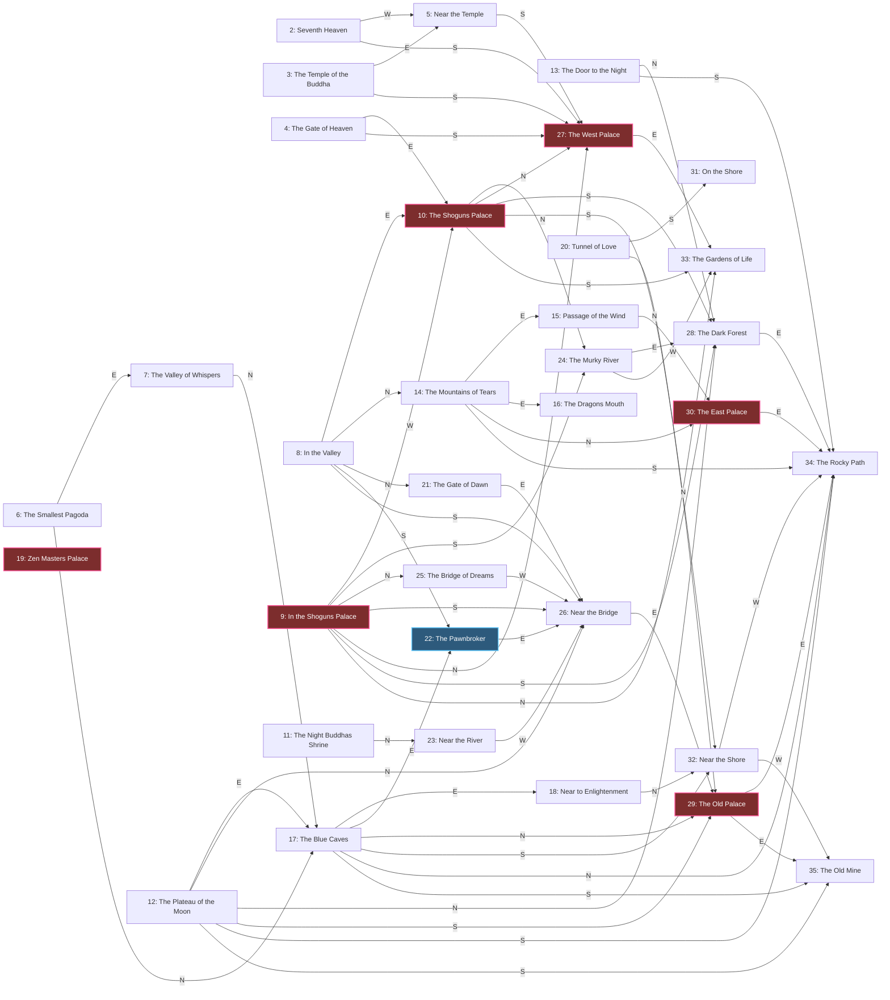

# James Clavell's *Shōgun* — Strategy Guide

*A player's guide to rising from a lone wanderer to Shōgun of all Japan.*
Mechanics here are drawn from the reverse-engineering in
[Shogun-Reverse-Engineering.md](Shogun-Reverse-Engineering.md) — so the advice
reflects how the game **actually** resolves things under the hood.

---

## The one-paragraph version

You play a single character in feudal Japan, wandering a world of ~40 other people
who all live their own lives in real time. Your goal is to **become Shōgun**. To do
that you must **gather a large personal following** and **bring the three sacred
relics — the BUDDHA, the SCROLL, and the MIRROR — to the palace** before your time
runs out. You grow your following by **befriending, bribing, or defeating** the
people you meet, and you command your followers to fetch items, guard ground, protect
you, or attack rivals. Keep yourself fed, keep out of losing fights, and **don't take
too long** — the clock is always ticking.

---

## How you win (and lose)

### Victory
Two things must come together:

1. **A large following.** Once your personal following grows past **~20 loyal
   people**, the "become Shōgun" endgame opens up and you are directed to a palace.
2. **The three relics at the palace.** Victory is scored when the **BUDDHA, SCROLL
   and MIRROR** are all present at that goal palace. Get all three there and you win:

> **"WELL DONE! SHOGUN — ALL JAPAN HONORS YOU."**

Think of the relics and the army as two halves of the same plan: the army is what
lets you *reach and hold* the palace and carry the treasures there; the relics are
the proof of your right to rule.

### Defeat
- **Running out of time.** There is a hard real-time limit — the game literally warns
  *"DON'T TAKE TOO LONG!"*. When the clock expires you get
  *"YOU HAVE FAILED! YOU MUST DIE! YOUR DEATH IS SLOW AND PAINFUL."* This is the
  failure you must respect most.
- **Dying.** If your health reaches zero you *"DIE HIDEOUSLY"*, drop everything you
  were carrying, and leave a gravestone. Death is only from **combat** — there is no
  starvation clock — so it is entirely avoidable if you pick your fights.
- **Being captured.** If you lose a fight you may be offered *"DO YOU WANT TO YIELD?
  YES / NO."* Yielding saves your life **but makes you someone else's follower** —
  effectively ending your bid for power. Avoid situations where you'd have to yield.

### "Can I just kill everyone?"
No — and it's the single worst thing you can do. **Victory requires a following of
~20+ people; with no followers the "become Shōgun" endgame never even opens.** Since
the whole game is about *amassing* people, killing them is the exact opposite of
winning. A killing spree leads to just one outcome: you wander an emptying world with
no army until the clock runs out and you lose (*"YOU HAVE FAILED! YOU MUST DIE!"*).

Along the way:

- **Every kill is a wasted recruit.** The *same* fight won by a small margin would
  have made that person **yield and join you**. Killing throws away the one resource
  that wins the game.
- **You litter the map.** Each kill leaves a **gravestone** and **drops the victim's
  goods** on the ground.
- **Cleared areas go silent.** Dead characters are skipped when you try to choose a
  person, so you just get *"THERE IS NOBODY HERE!"* — no one left to gift, befriend,
  order, or trade with.
- **The dead don't come back.** The world's ~40 characters are placed **once** at the
  start of the game; there is no respawn, so killing thins the population
  **permanently**.
- **You're risking your own neck for nothing.** Combat can turn against you, and a
  lost fight can force *you* to yield and end your run.

There is no "last one standing" victory. Fighting is a **tool for recruiting** (beat
someone *just enough* to make them yield), never an end in itself.

---

## Getting started

The launcher (`START`) first detects your machine and asks a couple of setup
questions:

- **"Are you using joystick or keyboard?"** — press **J** or **K**. (If joystick,
  centre it when asked.)
- You may be asked to **select colours** with the space bar / Enter.

Your choice is remembered, and the correct build of the game runs (an IBM/CGA build
or a Tandy build). In play, the joystick moves you and the **FIRE** button (or
Space/Enter on the keyboard) confirms actions and selects people.

---

## The core loop

Everything you do is some variation of:

1. **Move** around the world (35 named regions, ~128 screens — temples, palaces,
   valleys, rivers, forests, mines).
2. **Choose a person** near you (*"USE JOYSTICK TO CHOOSE PERSON"*). If several are
   present you cycle the highlight and press FIRE; if nobody is there you're told
   *"THERE IS NOBODY HERE!"*.
3. **Interact** — examine them, give a gift, try to befriend them, fight them, or (if
   they already follow you) give them an order.
4. **Manage** your health, your inventory (only 4 item slots — you'll be told
   *"DON'T OVERBURDEN YOURSELF!"* if you overfill), and your money.

---

## The world map

This is the game's own overview map, recovered from its data (the 15×17 region grid
at the tail of `String0.bin`). **Each cell is one screen**; the number is which of the
35 named regions that screen belongs to (blank = impassable / off‑map). North is up;
**walking west lowers your screen number by one**, east raises it, so the columns run
west→east and the rows run north→south.

```
        W  <───────────────  columns  ───────────────>  E
   N   5  2  .  .  .  .  .  .  .  .  .  .  .  .  .  .  .
   ↑  27 27 27  .  .  .  .  .  .  .  .  .  .  .  5  3  5
   |   .  .  .  .  .  .  .  .  .  . 14 16 14  .  . 27 27
   |  27  . 24  .  .  .  . 30 30 30  .  .  .  .  5  . 10
   |  10 10 10  .  .  .  . 14 15 15 15 14  . 27 27 27 33
   |  24  .  .  .  . 30 30 30  .  .  .  .  4 10 10  9  9
   |  10 10  .  .  . 14  .  .  . 14 14  . 27 27 33 24  .
 rows  .  .  . 30 30 34  .  .  .  .  8 10  9  9  9  9 10
   |   .  . 14 14  .  .  .  . 14 14  . 27 33 24 28 28 28
   |  28 28 34 34  .  .  .  .  8  8  .  .  9  . 10  . 12
   |  13  .  .  . 19  .  . 21 26 26 25 25 26 26 29 29 34
   |  34 34 32  .  .  .  8  8  .  .  9  . 12 12 12 17 17
   |  17 17 18 17 17 17 22 26 23  .  .  . 29 29 35 35 32
   ↓  32 32  .  .  6  7  .  . 11  .  .  .  .  .  .  . 20
   S   .  .  .  .  .  . 23  .  .  . 29 29 35  .  . 31 31
```

**Legend** (★ = a palace, a possible become‑Shōgun goal; ¥ = the pawnbroker):

| # | Region | | # | Region |
|---|---|---|---|---|
| 2 | Seventh Heaven | | 19 | Zen Masters Palace ★ |
| 3 | The Temple of the Buddha | | 20 | Tunnel of Love |
| 4 | The Gate of Heaven | | 21 | The Gate of Dawn |
| 5 | Near the Temple | | 22 | The Pawnbroker ¥ |
| 6 | The Smallest Pagoda | | 23 | Near the River |
| 7 | The Valley of Whispers | | 24 | The Murky River |
| 8 | In the Valley | | 25 | The Bridge of Dreams |
| 9 | In the Shoguns Palace ★ | | 26 | Near the Bridge |
| 10 | The Shoguns Palace ★ | | 27 | The West Palace ★ |
| 11 | The Night Buddhas Shrine | | 28 | The Dark Forest |
| 12 | The Plateau of the Moon | | 29 | The Old Palace ★ |
| 13 | The Door to the Night | | 30 | The East Palace ★ |
| 14 | The Mountains of Tears | | 31 | On the Shore |
| 15 | Passage of the Wind | | 32 | Near the Shore |
| 16 | The Dragons Mouth | | 33 | The Gardens of Life |
| 17 | The Blue Caves | | 34 | The Rocky Path |
| 18 | Near to Enlightenment | | 35 | The Old Mine |

(Region 1, *Heavens Above*, sits off the playable grid.) The **palaces** are your
endgame destinations — the become‑Shōgun contest sends you to one of them — so it pays
to know where they cluster. The **temples and heavens** are up north; the **shore and
the old mine** are down south.

### Region connections

The same map as a connectivity graph — two regions are linked if their screens border
on the grid, so you can trace routes at a glance. It is **not** geographic; it shows
*what connects to what*. Palaces (become‑Shōgun goals) are highlighted red, the
Pawnbroker blue. *Zen Masters Palace* stands alone — on the overview grid it has no
bordering region.

```mermaid
graph TD
  R2["2: Seventh Heaven"]
  R3["3: The Temple of the Buddha"]
  R4["4: The Gate of Heaven"]
  R5["5: Near the Temple"]
  R6["6: The Smallest Pagoda"]
  R7["7: The Valley of Whispers"]
  R8["8: In the Valley"]
  R9["9: In the Shoguns Palace"]
  R10["10: The Shoguns Palace"]
  R11["11: The Night Buddhas Shrine"]
  R12["12: The Plateau of the Moon"]
  R13["13: The Door to the Night"]
  R14["14: The Mountains of Tears"]
  R15["15: Passage of the Wind"]
  R16["16: The Dragons Mouth"]
  R17["17: The Blue Caves"]
  R18["18: Near to Enlightenment"]
  R19["19: Zen Masters Palace"]
  R20["20: Tunnel of Love"]
  R21["21: The Gate of Dawn"]
  R22["22: The Pawnbroker"]
  R23["23: Near the River"]
  R24["24: The Murky River"]
  R25["25: The Bridge of Dreams"]
  R26["26: Near the Bridge"]
  R27["27: The West Palace"]
  R28["28: The Dark Forest"]
  R29["29: The Old Palace"]
  R30["30: The East Palace"]
  R31["31: On the Shore"]
  R32["32: Near the Shore"]
  R33["33: The Gardens of Life"]
  R34["34: The Rocky Path"]
  R35["35: The Old Mine"]
  R2 --- R5
  R2 --- R27
  R3 --- R5
  R3 --- R27
  R4 --- R10
  R4 --- R27
  R5 --- R27
  R6 --- R7
  R6 --- R17
  R7 --- R17
  R8 --- R10
  R8 --- R14
  R8 --- R21
  R8 --- R22
  R8 --- R26
  R9 --- R10
  R9 --- R24
  R9 --- R25
  R9 --- R26
  R9 --- R27
  R9 --- R28
  R9 --- R33
  R10 --- R24
  R10 --- R27
  R10 --- R28
  R10 --- R29
  R10 --- R33
  R11 --- R23
  R12 --- R17
  R12 --- R26
  R12 --- R28
  R12 --- R29
  R12 --- R34
  R12 --- R35
  R13 --- R28
  R13 --- R34
  R14 --- R15
  R14 --- R16
  R14 --- R30
  R14 --- R34
  R15 --- R30
  R17 --- R18
  R17 --- R22
  R17 --- R29
  R17 --- R32
  R17 --- R34
  R17 --- R35
  R18 --- R32
  R20 --- R31
  R20 --- R32
  R21 --- R26
  R22 --- R26
  R23 --- R26
  R24 --- R28
  R24 --- R33
  R25 --- R26
  R26 --- R29
  R27 --- R33
  R28 --- R34
  R29 --- R34
  R29 --- R35
  R30 --- R34
  R32 --- R34
  R32 --- R35
  classDef palace fill:#7c2d2d,stroke:#ff5599,stroke-width:2px,color:#ffffff;
  classDef pawn fill:#2d5a7c,stroke:#66ccff,stroke-width:2px,color:#ffffff;
  class R9,R10,R19,R27,R29,R30 palace;
  class R22 pawn;
```



To reach the **Pawnbroker (22)**, note its only borders are **The Blue Caves (17)** to
the west and **Near the Bridge (26)** to the east, with **In the Valley (8)** just
north — so approach through the Blue Caves or over the Bridge.

A pre‑rendered image (for viewers that don't draw Mermaid):


### Directional map

The same graph with **arrows labelled by compass direction** — follow an edge's letter
(N/S/E/W) and that's the way you actually walk to get from one region into the next.
Where two regions share a long border, the arrow uses the dominant direction.




---

## Read people before you act (examine)

Every NPC has a personality described along six axes. Examine someone and you'll see
lines like *"HE LOOKS …"* / *"SHE SEEMS …"* built from these traits:

| Trait axis | What it means for you |
|---|---|
| **HOSTILE ↔ PLACID** | Hostile people start fights; placid ones are safer to approach. |
| **A WEAK FIGHTER ↔ A GOOD FIGHTER** | How dangerous they are in combat — and how good a soldier they'd make. |
| **UNAMBITIOUS ↔ GREEDY** | Greedy people are drawn to strong/rich leaders and to loot. |
| **POOR / WEALTHY / VERY RICH** | Worth pickpocketing/relieving of cash; rich targets fund your campaign. |
| **RESOLUTE ↔ GULLIBLE** | **The key recruiting stat.** Gullible people are easy to talk into following you; resolute ones resist. |
| **CUNNING ↔ A BIT DIM** | Cleverness — affects how easily they're deceived/robbed. |

**Rule of thumb:** the ideal early recruit is **GULLIBLE + A WEAK FIGHTER + PLACID** —
easy to persuade and no threat if it goes wrong. Save the **RESOLUTE, GOOD FIGHTER**
types for when you're strong (or soften them with gifts first).

---

## Building your army — the three ways to recruit

Your following is the engine of the whole game. There are three routes into it:

### 1. Gifts → friendliness → persuasion (the safe way)
Give someone a gift from your own pockets (food, a rose, a valuable, or cash). Each
gift a person **accepts graciously** raises their **friendliness** toward you, and
friendlier people are much easier to befriend. So the reliable recruiting recipe is:

> **Give a gift or two → then BEFRIEND.**

Watch the reaction text: *"THANK YOU," SHE CHIRPS* / *HE BEAMS* means it landed well
(friendliness up); *SHE TAKES / HE SNATCHES YOUR GIFT* is grudging; *"I'M NOT
INTERESTED!"* / *"LEAVE ME ALONE!"* is a rejection. Gullible, greedy, and already-warm
targets are the best gift/recruit candidates.

### 2. Befriend directly (persuasion)
You can try *BEFRIEND* without a gift. Success depends on the target's **RESOLUTE ↔
GULLIBLE** resolve versus your persuasiveness plus a little luck. A leaderless person
says *"I HAVE NO MASTER!"*; a successful pitch gets *"I FOLLOW YOU, GREAT ONE."* You
may be asked *"WILL YOU FOLLOW HIM/HER? Y OR N."* Persuasion is free but unreliable on
strong-willed people — that's what gifts are for.

### 3. Defeat them in combat (the hard way)
If you **win a fight**, the loser can be **conscripted** — a beaten opponent who
*yields* becomes **your** follower. This is powerful but delicate:

- Win by a **small margin → they YIELD and join you.**
- Win by a **large margin → they DIE** (no recruit, and their goods drop).

So if you're fighting *to recruit*, you want to **win, but not overwhelmingly** — beat
them just enough to make them submit. Against dangerous fighters this is risky; soften
them or bring your own soldiers.

> **Following limits:** you can only track so many people, and a very full world/party
> will tell you *"SORRY TOO CROWDED!"*; a healthy army reports *"YOU HAVE A LARGE
> FOLLOWING."* — your cue that the endgame is within reach.

---

## Commanding your followers

Select one of your followers to give an order. There are two menus:

- **What to do:** `TAKE · GUARD · ATTACK · BEFRIEND · PROTECT · END`
- **What/where:** `FOOD · WEAPONS · CASH · VALUABLES · THIS AREA`

They acknowledge with *"I OBEY."* You can queue up to two orders each (*1ST ORDER* /
*2ND ORDER*). Practical uses:

- **TAKE VALUABLES / CASH** — send followers to gather loot and money for you (this,
  not personal pickpocketing, is how you strip goods from others).
- **TAKE WEAPONS** — arm your army to make them better in fights.
- **GUARD THIS AREA** — hold a location (useful around the palace or a relic).
- **PROTECT** — keep bodyguards on you so you're not caught alone.
- **ATTACK** — throw soldiers at a rival warlord or a tough NPC you can't beat solo.
- **BEFRIEND** — have followers recruit *for* you, snowballing your numbers.

A big, well-ordered following does most of the dangerous work — fighting and fetching —
so you personally take fewer risks.

---

## Health, food & money

- **Health** is a bar that only drops in **combat** (there's no hunger timer). Eat
  **FISH** or **CHERRIES**, or drink **SAKI**, to restore it. Keep some food on hand
  before you pick a fight, and **retreat and heal** rather than trading blows to the
  death.
- **Money is YEN**, carried as a cash amount. You'll want cash to fund gifts (bribery
  is your smoothest recruiting tool). Gather cash directly or order followers to TAKE
  CASH.
- **The PAWNBROKER** turns valuables into YEN. Prices aren't fixed — an item's worth
  varies with a bit of randomness — so sell when you get a good offer. Convert
  DIAMONDS, GOLD MASKS, PRAYER WHEELS, etc. into the cash that buys loyalty.
- **Inventory is only 4 slots** — don't hoard. Carry what you need (some food, cash,
  a gift or two, and relics when you have them) and let followers hold the rest.

---

## The items you'll find

| Item | Use |
|---|---|
| **FISH, CHERRIES** | Food — restore health |
| **SAKI** | Drink — restores a stat |
| **SHIELD, HELMET, SWORD** | Combat gear — makes fighters stronger |
| **CASH** | Money (YEN) |
| **DIAMOND, PRAYER WHEEL, GOLD MASK, BOOK, ROSE** | Valuables — sell at the pawnbroker, or give as gifts (a ROSE makes a fine cheap gift) |
| **BUDDHA, SCROLL, MIRROR** | **The three relics — your victory items.** Guard them with your life. |

---

## A winning game plan

1. **Learn the ground.** Move around, examine people, and note where the **palaces**,
   the **pawnbroker**, and the **relics** are. Time is short, so map efficiently.
2. **Get rich early.** Grab cash, and sell valuables at the pawnbroker. Money funds
   the gifts that recruit people cheaply and safely.
3. **Snowball a following.** Target **gullible, placid, weak** people first: gift →
   befriend. As your numbers grow, order followers to **BEFRIEND** others and to
   **TAKE WEAPONS/CASH/VALUABLES** so your army arms and funds itself.
4. **Handle the dangerous people deliberately.** For a strong fighter you want as a
   soldier, either bribe them into following you, or beat them **just enough to make
   them yield** (not kill them). Use your own soldiers (**ATTACK**) so you're never
   the one at risk of having to yield.
5. **Secure the three relics.** Locate the **BUDDHA, SCROLL and MIRROR** and take
   control of them — carry them yourself or have trusted followers **TAKE VALUABLES**.
   Don't let a fight cost you a relic (you drop everything if you die).
6. **Trigger and finish the endgame.** Once your following is large (~20+), the path
   to the **palace** opens. **Rush the relics there before the clock runs out.**
7. **Stay alive to the finish.** Keep your health topped up, keep bodyguards on
   **PROTECT**, avoid pointless fights, and never yield. Deliver the relics — become
   Shōgun.

---

## Common mistakes

- **Dawdling.** The time limit is real and unforgiving. Every detour costs you.
- **Over-killing recruits.** Winning a fight too hard kills the person instead of
  recruiting them. Ease off to force a yield.
- **Fighting when you could bribe.** Gifts + befriend is safer and cheaper than combat
  for most targets.
- **Carrying too much / hoarding.** Four slots only — delegate carrying to followers.
- **Getting cornered alone.** Without bodyguards, a lost fight can force you to yield
  and end your run. Keep PROTECTors close.
- **Losing a relic to death.** Dying drops everything. Don't take the Buddha, Scroll,
  or Mirror into a fight you might lose.

---

*Under the hood:* recruiting hinges on an NPC's resolve stat and a friendliness value
that **gifts raise**; combat is a score-vs-threshold roll where the **winning margin**
decides yield-vs-death; the timer is a real wall-clock countdown; and victory checks
for the three relics at the chosen palace once your following is large enough. For the
exact formulas, offsets, and function traces, see
[Shogun-Reverse-Engineering.md](Shogun-Reverse-Engineering.md).
