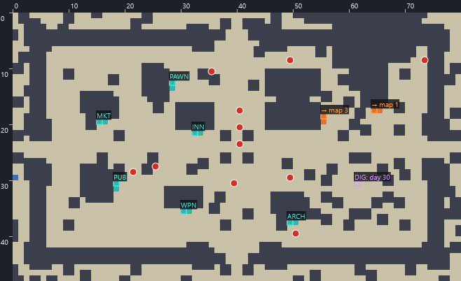
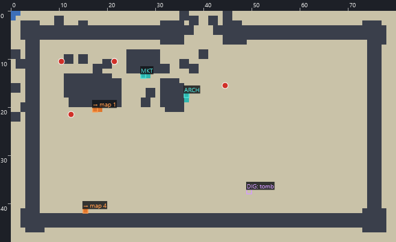
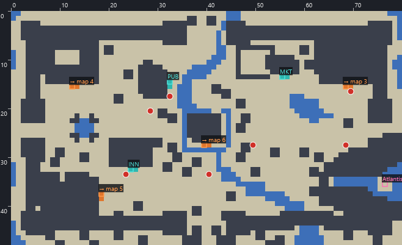
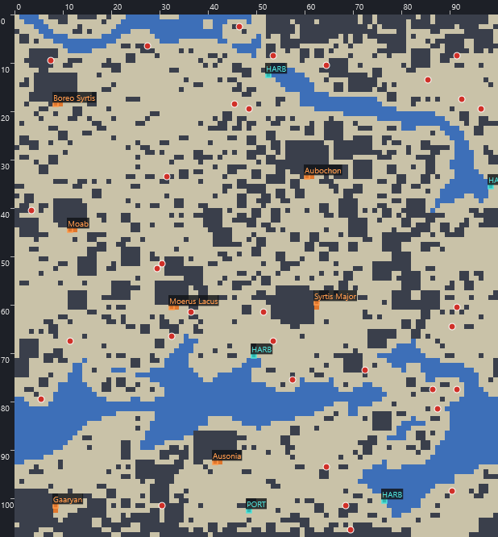
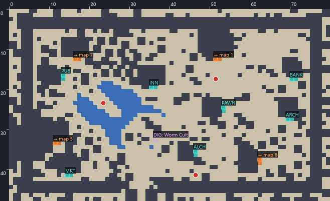

# Space: 1889 — strategy guide

*Space: 1889* (Paragon Software, 1990) is a Victorian science-fiction role-playing game based on Game Designers'
Workshop's tabletop game. The year is 1889. Ether flyers steered by liftwood and solar boilers carry the British,
German and Belgian empires to Mars, Venus, Mercury and the Moon. You lead five adventurers from a reception at the
London Museum of History to Tutankhamen's tomb, the Martian canals, the swamps of Venus and, in the end, the hidden
Saurians of Inner Earth.

This guide covers setup and controls, how the rules actually work (read out of the game's code, see
[the reverse-engineering notes](Space1889-Reverse-Engineering.md)), character creation, a complete walkthrough with
exact map positions, the side quests, and a map of every location.

**Positions** are written as *map id (row, column)*:

- A map id is *planet × 100 + area × 10 + map*: 110 is London's street map, 113 the museum, 400 the Mars planet map.
- Rows count down and columns count across from the top-left corner, starting at 0.
- Every map in [§11](#11-maps) has rulers every ten squares. The trainer's Maps tab shows the square under the mouse.

---

## Contents

1. [Getting started](#1-getting-started)
2. [Controls](#2-controls)
3. [How the game works](#3-how-the-game-works)
4. [Creating a party](#4-creating-a-party)
5. [Shops, money and equipment](#5-shops-money-and-equipment)
6. [Travel](#6-travel)
7. [Combat](#7-combat)
8. [Walkthrough](#8-walkthrough)
9. [Side quests](#9-side-quests)
10. [Tips, secrets and pitfalls](#10-tips-secrets-and-pitfalls)
11. [Maps](#11-maps)

---

## 1. Getting started

### Running it under DOSBox

Mount the folder that holds `1889.COM` and run `1889`. A configuration that works well:

```
[dosbox]
memsize=16
[cpu]
core=normal
cycles=fixed 6000
[autoexec]
mount c C:\DOSGAMES
c:
cd \S1889
1889
```

**Game time runs in real time**, and a too-fast emulator makes days fly past and food vanish. A fixed cycle count
keeps the pace sane. Use **GAME → PAUSE** whenever you step away: it is the only thing that stops the clock.

### The start-up menus

The first run asks five questions and stores the answers in `1889.CFG`:

| Question | Recommended choice |
|---|---|
| Video mode | VGA |
| Input mode | Keyboard (every screen has keyboard letters) |
| Sound | No Sound, or Covox if your emulator provides one |
| Money type | **British notation (pounds)**, or pennies if you like exact numbers (240 pennies = £1) |
| Current drive | Hard drive |

Esc walks back through the questions. Delete `1889.CFG` to be asked again.

Next comes **copy protection**: "In the manual, type in the word found on page *p*, paragraph *a*, line *l*,
word *w*." You get **one try**; a wrong word ends the game with "Your permit to own and operate an Ether Flyer has
been revoked." The full answer list is in the reverse-engineering notes (§4).

Then choose **Start New Game** or **Continue Saved Game**. For a new game:

| Option | What it does |
|---|---|
| Create Party Disk | Runs the character generator (§4) |
| Use Party Disk | Loads a party you generated earlier |
| Use Default Characters | Starts at once with Prof. Wells, Lady Marie, Elizabeth, Sydney Webb and Sir Walter |

### The default party

| Character | Class | Careers | Strengths |
|---|---|---|---|
| Prof. Wells | Gentry | Inventor | Observation 5, Engineering 5, Science 4 — your navigator and demolition expert |
| Lady Marie | Aristocracy | Dilettante Traveller | Medicine 6, Wilderness Travel 6, Riding 5, Piloting 5; £1,600 |
| Elizabeth | Wealthy Gentry | Detective | Crime 5, Marksmanship 5, Stealth 4 — lockpicks and ROB |
| Sydney Webb | Wealthy Gentry | Foreign Agent | Piloting 5, Crime 4, Marksmanship 4 |
| Sir Walter | Aristocracy | Colonial Office | Eloquence 6, Linguistics 5, Trimsman 5, Bargaining 5 — talker and haggler |

It covers every essential skill, so it is a good party for a first game.

### Saving

- **GAME → SAVE** writes `NAME.SAV` into the game folder. Save often, and keep several names: the save list shows
  your files.
- You **cannot save aboard a ship**, and you should never save in the middle of a fight.
- **GAME → LOAD** restores a save.
- **Check that nobody died before you save** after using explosives.

---

## 2. Controls

Every command is an icon with one highlighted letter: press the letter. Esc (or the right mouse button) backs out.
Arrow keys move; Home, End, PgUp and PgDn move diagonally and page through lists.

### The main screen

The status panel on the left shows:

- the day and the place;
- the leader's name and gold;
- **HEALTH: a/b**, where *a* is current health and *b* is the point at which the character falls unconscious;
- the weapon in hand;
- the six attributes.

Below the map are the commands:

| Key | Command | What it does |
|---|---|---|
| **T** | TAKE | Pick up the item (a brown bag) you are on or facing, and choose who carries it |
| **D** | DROP | Put an item down. Items stay where they fall, and a few puzzles are solved by dropping things |
| **Q** | QUERY | Talk to the NPC the leader faces, which opens the conversation menu below |
| **C** | CURE | Choose a healer, then a patient. Medicine and a doctor career decide the result; a poor healer can make things worse |
| **I** | ITEMS | Look through the leader's items |
| **U** | USE | Use or equip an item. See below |
| **V** | VIEW | Describe the square the leader faces. Use it to search coffins, altars and carvings |
| **S** | STUDY | Read an item (reports, maps and diaries hold the clues) |
| **L** | LEAD | Change the party leader. Many checks use the leader's skills |
| **P** | PARTY | Character sheets. Left and Right change character; **Down** shows weight, fatigue, food, mental state, the 21 item slots and rental days; **G** there gives an item to another member |
| **F** | FIGHT | Start ground combat |
| **R** | ROB | Pick the pocket of the NPC in front of you (Stealth and Crime). Failure starts a fight |
| **H** | HUNT | The leader tracks the nearest creature (Tracking) |
| **G** | GAME | **S**ave, **L**oad, **P**ause, s**O**und, **Q**uit |

USE covers most of the game's actions:

- equip a weapon or armour;
- light a lantern or miner's hat;
- wear clothing or a water breather;
- dig with a shovel;
- set dynamite;
- open a chest with lockpicks while facing it;
- read the scrolls at an altar.

Outside the GAME menu, **L is LEAD, not LOAD**. Open GAME first.

### Conversations

| Key | Command | Effect |
|---|---|---|
| T | TALK | Hear what the NPC has to say |
| B | BUY | **I**nfo (pay for information) or **O**bject (buy an item); then pay with **M**oney or trade an **I**tem |
| S | SELL | Sell an item the NPC wants |
| L | LEAVE | Back to the map |

When paying you choose who pays and who receives. An NPC often says more after each deal, so **talk again**. A
character with poor Linguistics hears foreign speech garbled: make someone else the leader.

### Combat, space and ship combat

| Mode | Keys |
|---|---|
| Ground combat | **N** new orders (pause), **A** attack (arrows pick the target), **R** reload, **W** change weapon (Esc = fists), **B** block, **F** flee, arrows move the character you control |
| Space | **C** plot a COURSE (the leader's Science), **L** lead, **P** party, **G** game, arrows fly |
| Ship combat | **A** assign bridge stations, **L** link to a crippled ship, **U** unlink, **B** board, arrows manoeuvre and climb or dive, **Enter** fire |

---

## 3. How the game works

These are the rules as the code implements them. They sometimes differ from the manual.

**Health.**

- Maximum health is **STR + END**.
- A character falls unconscious when health drops to **max − ⌈(STR + END) ÷ 2⌉**: the *b* of "HEALTH: a/b".
- An unconscious character cannot act and must be cured; death wipes the character.
- Outside a fight, only the leader takes damage from enemies, so a strong leader and repeated CURE will get you
  through hostile corridors.

**Fatigue.**

- Each day every conscious character rolls (END + 1) dice against a threshold; a low roll raises fatigue by 1.
- **Fatigue equal to STR, AGI or END knocks the character out.**
- These raise the threshold, making fatigue likelier:

| Cause | Change |
|---|---|
| on Mars | +1 |
| on Venus | +2 |
| Teotihuacan's catacombs | +1 |
| carrying more than your body weight | +1 per 20 lb over |
| out of food | +1 |

- These lower it:

| Cause | Change |
|---|---|
| riding a horse | −2 |
| carrying nothing | −1 |
| rough-living clothing, in use on Mars | −1 |
| foul-weather clothing, in use on Venus | −2 |

- Rest at an **inn**, or pitch a tent with a **camping outfit**; each night removes fatigue.

**Food.**

- Food is one party-wide stock. Each conscious character eats **2 a day**.
- Markets sell it at 8d a unit, up to 32,767 units, and it weighs nothing.
- Buy thousands of units the first time you see a market.

**Money.**

- Currency is pounds, shillings and pence: 12d = 1s, 20s = £1, 240d = £1.
- Each character carries their own wealth and pays for their own purchases.
- Every 30 days each character's **monthly income**, a thirtieth of their starting fortune, is paid into the
  **party account**. Draw it out at a **bank**.

**Mental state.** MENTAL is insanity. In a fight a character with MENTAL *m* misbehaves whenever a d6 rolls below
*m*. The madness potion adds 2, and nothing in the game lowers it.

**Light.**

- Some dungeon levels are dark. The map index in §11 marks them.
- To see, someone must have a MINERS HAT, LANTERN or ELECTRIC LAMP **marked in use** (USE it once).

**Water.**

- Deep water can be crossed on foot only if **every** living character wears a WATER BREATHER.
- Otherwise use a boat or zeppelin (§6).

**Items and weight.**

- Each character has 21 item slots.
- Carried weight is the sum of the items. Keep it below PERSON'S WEIGHT, which is 100 lb + 20 lb per point of STR.

**Explosives.**

- Walls fall to dynamite, gunpowder and detonite.
- The character setting the charge uses Engineering, which also sets the fuse. Put your best engineer in front and
  step well back.
- **Check that nobody died before you save.**

**Digging.** USE a shovel on the square you stand on. Most treasure is dug up on an exact square named in a clue.
Shovels cannot dig through walls.

**Chests.** There is no OPEN command. Face the chest and USE lockpicks. The chest pays out money, and the
lockpicks can break.

**No experience.** Characters never level up. The only improvements come from NPCs who teach a skill in exchange
for an item (§9).

---

## 4. Creating a party

The character generator (Create Party Disk) keeps a pool of up to 20 characters. You add five to a party, save the
party, and choose **A. USE THIS PARTY**. **Save the character pool before leaving**, because unsaved characters are
lost.

### Attributes

Six attributes are rolled from 1 to 6, and you can re-roll as often as you like:

| Attribute | Governs | Aim for |
|---|---|---|
| Strength | Health, carrying capacity, melee | 5–6 on everyone |
| Agility | Stealth, Crime, Marksmanship, Mechanics | 4+ |
| Endurance | Health, fatigue resistance | 5–6 |
| Intellect | Observation, Engineering, Science, Gunnery | 4+ (5+ for your navigator and engineer) |
| Charisma | Eloquence, Theatrics, Bargaining, Linguistics | 4+ |
| Social Level | Class, starting money, Riding, Piloting, Leadership, Medicine | 4+; 5–6 brings a large fortune and monthly income |

Social Level sets the class: 1 Working Class, 2 Tradesman, 3 Middle Class, 4 Gentry, 5 Wealthy Gentry,
6 Aristocracy.

### Skills

Each attribute has four skills. The first starts at the attribute − 1; the others start low. A career adds skill
points. You take either one career plus 6 general points, or two careers plus 2 general points. A skill may not be
bought above its attribute.

| Skill | Needed for |
|---|---|
| **Medicine** | CURE — essential; without it an unconscious character stays down |
| **Engineering** | Dynamite and other explosives |
| **Science** | Plotting a course between planets |
| **Crime** and **Stealth** | Lockpicks (Crime) and ROB (both) |
| **Linguistics** | Understanding foreign NPCs |
| **Bargaining** | Better shop prices |
| **Tracking** | HUNT |
| **Swimming** | Crossing water (with a breather) |
| **Piloting**, **Trimsman**, **Gunnery** | Boats and zeppelins; flying, steadying and shooting in ship combat |
| **Fisticuffs**, **Close Combat**, **Marksmanship**, **Throwing** | Fighting |
| Observation | STUDY and VIEW |
| Mechanics, Fieldcraft, Eloquence, Theatrics, Riding, Leadership | Little effect |

### Careers

Careers sort into six groups. Some are male or female only (a woman may try a male career in disguise), and a
criminal first career limits the second.

| Group | Careers |
|---|---|
| Government | Army, Navy, Foreign Office (Agent, Diplomat), Colonial Office |
| Exotic | Big Game Hunter, Explorer, Dilettante Traveller, Adventuress, Reporter |
| Service | Actor, Personal Servant, Tutor/Governess, Grounds Keeper |
| Mercantile | Inventor, Merchant, Mechanic, Engineer, Seaman |
| Professional | Detective, Doctor, Scientist |
| Criminal | Master Criminal (second career only), Poacher, Smuggler, Thief, Anarchist |

- **Merchant, Adventuress and every criminal career multiply the starting fortune by 10**, and Master Criminal as a
  second career multiplies it by a further 50.
- A thief or anarchist with Master Criminal starts rich enough to equip the whole party.

A balanced party:

| Character | Skills to cover |
|---|---|
| A doctor | Medicine |
| An inventor or scientist | Science and Engineering; your navigator |
| A detective or thief | Crime, Stealth, Marksmanship |
| A diplomat or colonial officer | Linguistics and Bargaining |
| A big game hunter or army officer | Tracking and fighting |

Strength and endurance matter to all of them.

---

## 5. Shops, money and equipment

Cities have these services. Their signs are labelled on the §11 maps.

| Service | What you can do |
|---|---|
| Pawn shop | Buy and sell general goods: lockpicks, shovels, rope, lanterns, dynamite, armour, instruments |
| Weapon shop | Buy weapons and ammunition; sell weapons (the ammunition is refunded) |
| Alchemist | Water breathers, antibiotics, strength elixirs, food pills, sleep gas |
| Archaeologist | Pay to have an object identified |
| Market | Food |
| Bank | Deposit, withdraw and inspect the party account |
| Pub | Bartenders and patrons trade rumours |
| Inn | Rest for the night (removes fatigue) |
| Harbor | Rent boats and zeppelins; buy horses (£15) |
| Ether port | Build, update, repair and fuel your ether flyer; take off |

**What to buy first in London:**

- a firearm and ammunition for everyone;
- armour (breastplate, helmet and shoulder scales together are strong);
- two or three LOCKPICKs;
- two SHOVELs;
- ROPE;
- a LANTERN and a MINERS HAT;
- DYNAMITE;
- a DOCTORS BAG;
- CONKLINS ATLAS and NAVIGATION EQUIPMENT (they improve course plotting);
- a CAMPING OUTFIT;
- a few thousand units of food.

USE every weapon and piece of armour to equip it. Weapons change who hits and how hard:

| Weapon | Price | Load | Damage | Range |
|---|---|---|---|---|
| LIGHT REVOLVER | 10s | 6 shots | 1 | 10 |
| HEAVY REVOLVER | £2 | 6 shots | 1 | 15 |
| BOLT ACTION RIFLE (LM) | £2 | 8 shots | 2 | 120 |
| LEVER ACTION RIFLE | £2 2s 6d | 12 shots | 1 | 75 |
| 12-GAUGE LEVER ACTION | £5 | 5 shots | 1 | 30 |

The Maxim and Gatling machine guns are expensive and heavy but devastating. Ammunition comes as SHOT, SHELL,
GRAPESHOT or SHRAPNEL, one type per weapon.

**Making money:**

- Sell **TUTS TREASURES** (§8.2) for £10,000, the price of a first ether flyer.
- Lockpick every chest in museums, palaces and headquarters.
- Take side quests: the RUBY CHALICE is worth £10,000 to the Egypt museum, and the AMULET OF SELDON £12,750.
- Shoot down pirate flyers (about £6,000 each).
- Collect the monthly income from the bank.
- In one reported play, primitive Venusian weapons sold at Ausonia's weapon shop fetched absurd sums. It is worth
  trying.

---

## 6. Travel

**On foot** you walk the planet maps between cities. Walking onto a city's square enters it; walking off a city
map's edge leaves it. On a planet map a day passes every six steps.

**Horses** are bought at a harbor for £15 each. A mounted character tires less (−2 to the fatigue threshold) and is
harder to hit. Returning the horse refunds part of the price.

**Boats and zeppelins.**

- Rent them at a harbor for a number of days: 120 pennies a day.
- A boat crosses water; a zeppelin flies over land and sea.
- Dock at any harbor to get out. Approaching a harbor diagonally, from north-west to south-east, works reliably.
- Unused days are refunded. Overdue days must be paid, and unpaid, you may only land at the harbor you rented from.
- On Mars a **travel pass** (from Zoho, §8.4) is needed to rent anything, including the **sand boats** of Syrtis
  Major.

**Ether flyers.**

- Build one at an ether port: ETHER PORT → UPDATE FLYER the first time, then USE FLYER. The design screen sets:

| Part | Options and limits |
|---|---|
| Hull size | 1 to 30 |
| Lift | Hydrogen, or Liftwood (Mars only; useless on Venus) |
| Propeller | Edison, Armstrong or Zeppelin (power 4 at most), plus power level and boiler |
| Engine size | Speed in atmospheric combat |
| Armour | Any value |
| Guns | Top and bottom |

- Earth's port offers hydrogen only; a small first flyer costs about £10,000.
- In space, fly with the arrows and stop on a planet to land.
- **COURSE** has the leader (best Science, carrying CONKLINS ATLAS and NAVIGATION EQUIPMENT) name a list of
  constellations to steer toward. The constellations stay put while the planets orbit, so re-plot often.
- The chart is 120 × 120 squares. The asteroid belt blocks the way outward until your flyer is fitted with the
  Saurian propeller and fuelled (§8.6). Jupiter, the way to Europa, sits in the top-right corner.

The Manual's Map of the Constellations, rows top to bottom:

| Row | Constellations, left to right |
|---|---|
| 1 | Pisces · Aquarius |
| 2 | Bootes · Ursa Major · Taurus · Virgo |
| 3 | Delphinus · Aries · Little Dipper · Draco · Canis Major |
| 4 | Cepheus · Cassiopeia · Capricorn · Cygnus · Leo · Canis Minor |
| 5 | Aquila · Gemini · Crater · Pegasus · Centaurus · Leo Minor |
| 6 | Perseus · Hercules · Scorpius |
| 7 | Cancer · Regulus · Lepus · Sagittarius |
| 8 | Orion · Andromeda · Libra |

---

## 7. Combat

**Ground combat.**

- The party splits into five figures.
- You control one character directly; the others follow their last orders. Everyone starts on BLOCK, so press
  **N** and give orders at once.
- Your controlled character acts far more often, so control your best fighter. A strong Fisticuffs brawler wins many
  fights bare-handed.
- Characters will not shoot through each other. Spread out, give every shooter a clear line, and stand in bushes if
  you have Fieldcraft.
- Bystanders such as police may join in.
- Ordinary enemies drop only saleable weapons and give no experience, so avoid pointless fights. Kill the **named**
  NPCs who carry keys, passes and documents.

**Venus.** Firearms in hand corrode almost at once. Carry spares **unequipped** and equip them only when a fight
starts.

**Ship combat.**

- Every take-off can meet a pirate flyer.
- ASSIGN your party to Captain, Helmsman, Trimsman (Trimsman skill), Top gunner and Low gunner (Gunnery).
- Fire with Enter when in range and at a suitable altitude; the top gun fires at equal altitude.
- Hull hits lower your ceiling, and a flyer that cannot reach orbit cannot leave the planet.
- Cripple a ship, **LINK** to it and **BOARD** it to fight on its deck. Towing a wreck to port pays scrap money.
- Ether ports repair damage for a fee.

---

## 8. Walkthrough

The main plot runs Earth → Mars ⇄ Venus → Mars → Luna → Mercury → Europa → Inner Earth. Within Earth the order is
fixed by the items each step hands on. Named NPCs wander a little from the positions given.

### 8.1 London



1. **Shop** (§5). London has a pawn shop, weapon shop, market, archaeologist, pub and inn. There is no bank.
2. **Claus von Schmelling** walks London's streets (near 110 (8, 49)). He is the German who talked at the reception.
   - Buy the **LONDON REPORT** from him for £2,000, or ROB him with Elizabeth.
   - STUDY the report: the German expedition's agent is **Hans Ogleby** at the New York inn.
3. **Doctor Maxwell Raven** is in London's inn (999 (8, 10)). Buy the **FEVER SERUM** for £50: BUY → OBJECT → MONEY.
4. Optional, in London:
   - **Jack the Ripper** (near 110 (17, 40)). Kill him and take proof to **Chief Inspector Doyle** (110 (27, 25)) for
     a reward.
   - **Heinrich Schliemann** in the museum (113 (7, 4)) will pay £1,000 for the Mycenean gold mask found in Egypt.
   - The **museum chests** open with lockpicks.
   - **James Alexander Grimes** in the pub sells ether-flyer blueprints that a Martian will buy.
   - **Silbury Hill** (London maps 1, 4 and 5; dark) and **Stonehenge** hold two treasures (§9).
5. Walk to a harbor on the Earth map (100) and rent a zeppelin or boat for New York.

### 8.2 New York, San Francisco and Egypt

6. **New York inn** (999 (9, 11)): give the report to **Hans Ogleby** for the **LETTERS OF INTRODUCTION**.
7. Travel west to **San Francisco**. In its pub, **Nathaniel Johanssan** (992 (8, 14)) takes the letters and gives
   the **MAPS OF EGYPT**. STUDY them: *"Once inside the lower level of the tomb, to burial chamber — 8 paces north
   from stairs, 1 pace west."*
8. Go to **Egypt** (150). Take the stairs down to the dark **false tomb** (maps 4 and 5).
   - Blow the walls with dynamite and fight the Germans.
   - **Ansgaar Wuenschell** (155 (4, 3)) carries a **PAPER** — *"14 paces directly south from Eye of the Desert"* —
     and a **KEY**.
9. On Egypt's map find the **Eye of the Desert**, count 14 paces south to **150 (37, 49)** and USE a shovel. The
   tomb stairs open.

   

10. Go down to the lower level (157). From the stairs go 8 north and 1 west to **157 (9, 9)** and dig. The burial
    chamber (158) opens.
11. In the burial chamber, **VIEW the sarcophagus**. The event gives the **STONE TABLET** and **TUTS TREASURES**.
    Keep the treasures to sell for your first flyer (£10,000).
12. **Egypt museum** (the building among the statues):
    - The **KEY** opens the upstairs doors (153).
    - Give **Mary Kingsley** (153 (18, 25)) the fever serum. She gives the **ALFRED C. HOBBS MESSAGE**.
    - Take the **Mycenean gold mask** for Schliemann.
    - The curator (151) buys the ruby chalice; Joseph Chamberlain (151) asks you to rescue Emilie Van Warren (§9).

### 8.3 Teotihuacan, Atlantis and Angkor

13. Back in **New York**, **Alfred C. Hobbs** is on the Crystal Palace's upper floor (124 (4, 52)). Give him Mary's
    message for **HOBBS LOCKPICKS**.
14. Go to **Teotihuacan** (160).
    - Buy a **WATER BREATHER for every character** at the alchemist.
    - **Frederick Burnaby** (160 (17, 32)) wants news of Freemerchant.
15. Hobbs's lockpicks open the doors of the pyramid, map 164. Its Inca guard says *"the two tablets must be
    returned to their sacred altars."*
16. In map 163 (the east pyramid) take the **TABLET OF MORTALS** and **TABLET OF SANCTUARY** from its corner rooms.
    **DROP** them on the two altars, at **163 (13, 17)** and **163 (13, 21)**. USE does not work. *"You hear a
    rumbling coming from a pyramid to the west."* The inner doors of the west pyramid (map 164) open, and in the
    south-east corner of the Teotihuacan map the entrance to the Atlantis caves appears at **160 (35, 76)**.

    

17. Take the map and water breather from the Inca guard's room in the west pyramid.
18. Follow the way to **Atlantis**:
    - Go to the new entrance at 160 (35, 76), dynamiting the barrier if it is blocked.
    - **Everyone USEs their water breather**, then swim through map 161 to map 167.
    - At the Red Captain's remains, **VIEW** the square. The event gives **FREEMERCHANTS ID**, **FREEMERCHANTS DIARY**
      and the **SCROLLS OF THE ANCIENTS**.
    - The Atlantians turn hostile, so fight or run.
19. STUDY the diary: *"If I can discover Atlantis, the mystery in Angkor will be solved."* Give the ID to Burnaby for
    his **Medal of Honor** (§9).
20. In **Angkor**, VIEW the great altar in map 138 with the scrolls in the party: *"...the secrets of life, wisdom
    and immortality lie hidden in the bowels of the sacred companion of the Red Cyclops"* — **Mars**.
21. **Build an ether flyer** at Earth's ether port (Earth map 100). Sell TUTS TREASURES first, and withdraw money
    from a bank into the buyer's pocket.
    - Save.
    - Make your best Science character leader, with the Atlas and navigation equipment.
    - USE FLYER, plot a COURSE and fly to Mars.

### 8.4 Mars and Venus: the German conspiracy



22. Walk north from the Mars ether port to **Ausonia** (460). In its caves (maps 4–6, dark) rescue **Zoho
    Winiimolaak** (466 (15, 2)). He gives a **travel pass**, needed to rent boats on Mars, and tells you the German
    headquarters can only be entered in **German uniforms**.
23. Fly to **Venus** and keep firearms unequipped.
    - Land near the Ganis Mountains and take a zeppelin to **Venusstadt** (520).
    - The **German warehouse** (521) is guarded. Bribe your way to **Simon O'Rourke** (521 (21, 7)) and take the
      **German uniforms**, one set per character.
24. In the **Thetis Mountains** (510), enter **Fort Bismarck** (511) with **every character wearing a uniform**
    (USE them). Kill **Oberst Hans Kurt** (511 (3, 6)) for the **GERMAN HQ PASS**.
25. Back on Mars, go to **Syrtis Major** (430).
    - With the travel pass, rent a **sand boat** at the harbor and cross the sand sea to the **German headquarters**
      (maps 434–436).
    - Wearing uniforms, climb to the third level. The HQ pass opens map 436's doors.
    - **Baron Hasso von Gruber** (436 (6, 23)) sees through the disguise and boasts of the liftwood monopoly and
      Edison's kidnapping. Kill him and his guards for the **CASTLE KEY**.
26. In **Boreo Syrtis** (470) the castle key opens King Hattabranx's palace (478). Kill **King Hattabranx** (478 (4, 35))
    for the **WORM CULT KEY**.
27. In **Moab** (420) find **Teegok Quuglaani** (near 420 (18, 17)). He gives the **WORM CULT MAP** and warns that the
    cult's god *"only speaks to those who know the language of the Ancients."*
28. In Boreo Syrtis dig at **470 (32, 36)** to open the cult's hidden entrance. The Worm Cult key opens its doors (473).

    

29. On the lowest level (474) find **Kleuht Na Vriss** (474 (19, 34)) and give him the **SCROLLS OF THE ANCIENTS**. He
    reveals himself as an alien from **Europa**, stranded when his ship crashed on Luna. **TAKE THE EMERALD** he leaves
    on the floor.

### 8.5 The Whisperdeath, Luna and Mercury

30. Take off from Mars: the pirate cloudship **Whisperdeath** attacks.
    - **Do not destroy it.** Disable it, **LINK** and **BOARD**.
    - A faster flyer (more engine and power) makes this much easier; one player needed about £62,500 of upgrades to
      catch it.
    - Fight to the cell (610) and talk to **Thomas Alva Edison** (610 (12, 4)). He explains that reaching the outer
      planets needs a propeller of an unknown alloy, **ammonia** fuel and a six-foot **glow crystal** from Mercury.
      From now on ether ports will load both fuels.
31. On **Luna**, walk from the ether port into **A Cave** (210). THE EMERALD opens its doors. Show the emerald to
    **Professor Vladimir Tereshkova** (210 (45, 33)), hostile until then. He gives the **PROPELLER** from Kleuht's
    wrecked ship.
32. On **Mercury**, search the banks of the World River for the giant **GLOW CRYSTAL**. Walk along pressing TAKE.
33. Take a zeppelin to **Princess Christiana** station (310). In the mines, dig on the lowest level (**map 314**; half
    of all digs there turn up **AMMONIA**). The mine boss is hostile.

### 8.6 Europa and the end

34. At an ether port, UPDATE FLYER and fit the **Saurian propeller**. The AMMONIA and GLOW CRYSTAL in your packs are
    loaded as fuel.
35. Plot a course outward. The belt no longer stops you. Fly to **Jupiter** in the top-right corner of the space
    chart (rows 2–4, columns 116–118). The **Europa** sequence plays: a dead Saurian city, and a message that the
    Saurians went to a **hollow Earth**, with an entrance hidden at the **North Pole**.
36. Return to Earth. The **Inner Earth** entrance has appeared at the top of the Earth map, **100 (2, 52)**. Take a
    zeppelin north.
37. In **Inner Earth** (170) the Saurians greet you. Blast your way through to **Eoger Luirv**, of Kleuht's race, for
    the ending.

### 8.7 Key items at a glance

| Item | Where | Used for |
|---|---|---|
| LONDON REPORT | Claus von Schmelling, London (£2,000 or ROB) | Hans Ogleby, New York inn |
| FEVER SERUM | Dr Maxwell Raven, London inn (£50) | Mary Kingsley, Egypt museum |
| LETTERS OF INTRODUCTION | Hans Ogleby | Nathaniel Johanssan, San Francisco pub |
| MAPS OF EGYPT | Johanssan | 8 N, 1 W of the stairs in the tomb (157 (9, 9)) |
| PAPER, KEY | Ansgaar Wuenschell, Egypt false tomb | Dig at 150 (37, 49); museum doors (153) |
| STONE TABLET, TUTS TREASURES | Sarcophagus, 158 | Clue; £10,000 |
| ALFRED C. HOBBS MESSAGE | Mary Kingsley | Alfred C. Hobbs, New York Crystal Palace |
| HOBBS LOCKPICKS | Hobbs | Pyramid doors, 164 |
| TABLET OF MORTALS / OF SANCTUARY | Teotihuacan map 163 | DROP on the altars, 163 (13, 17) and (13, 21) |
| WATER BREATHER × 5 | Alchemist | Swimming to Atlantis |
| SCROLLS OF THE ANCIENTS, DIARY, ID | Red Captain, Atlantis (167) | Angkor altar; Kleuht; Burnaby |
| Ether flyer | Ether port, Earth map | Space travel |
| Travel pass | Zoho, Ausonia caves (466) | Renting boats on Mars |
| German uniforms | Venusstadt warehouse (521) | Fort Bismarck and the German HQ |
| GERMAN HQ PASS | Oberst Hans Kurt (511) | Von Gruber's floor (436) |
| CASTLE KEY | Baron von Gruber (436) | Hattabranx's palace (478) |
| WORM CULT KEY | King Hattabranx (478) | Worm Cult doors (473) |
| WORM CULT MAP | Teegok Quuglaani, Moab | Dig at 470 (32, 36) |
| THE EMERALD | Kleuht Na Vriss (474) | Luna cave doors; Tereshkova |
| PROPELLER | Tereshkova, Luna (210) | Saurian propeller |
| GLOW CRYSTAL | Mercury, World River | Fuel |
| AMMONIA | Princess Christiana mine (314) | Fuel |

---

## 9. Side quests

| Quest | Where | What to do | Reward |
|---|---|---|---|
| Jack the Ripper | London streets; Chief Inspector Doyle 110 (27, 25) | Kill the Ripper, bring proof to Doyle | About £2,000 |
| Mycenean gold mask | Egypt museum → Heinrich Schliemann 113 (7, 4) | Take the mask from the museum | £1,000 |
| Ruby chalice | Silbury Hill, London maps 1, 4, 5 (dark) | Dynamite through to the lowest catacomb and dig **5 paces east of the Prophet's tomb, 115 (15, 11)**; sell to the Egypt museum curator. Herr Franz Wortmann (Thetis inn) reveals the spot for Burnaby's medal | £10,000 |
| Stonehenge | London 110 (30, 61) | On a day divisible by 30, dig where the sun shines (Sir Norman Lockyer, Ganis Mountains 530 (30, 38), tells of it) | GOLD SHIELD (armour 3) |
| Burnaby's medal | Frederick Burnaby, Teotihuacan 160 (17, 32) | Give him FREEMERCHANTS ID | Medal of Honor |
| Emilie Van Warren | Joseph Chamberlain, Egypt museum 151 | She is held in the Lurkers' lair: dig at **431 (18, 23)** (the directions from the Syrtis Major cave entrance) and rescue her at 433 | Reward |
| Canal Keepers | Mars: Volaace Zeenkeer 467, Glaar Skuguu 453, Eakijiss Grouvir 454 | Kill Volaace for his bible; trade it to Glaar for PRIEST ROBES (open 454); get the AMULET OF SELDON (opens 446 and 453) | Miskiita Chkya (456) pays £12,750; Carl Hoffman (Venus) £10,000 |
| Martian unification | Kai Urukta 438 → Lopkan 443 → Karkem Kubla 413 → Ucuz Yuni 426 → Photho Nhe 476 | Carry the bajuys along the chain; beware Tycuss Nhe (455) | +Observation |
| Toruk's son | Toruk the Loyal (Mars map), Zaturo 410, Fazuck the Healer 444, Mynosii Aalum 477, Zardan 417 | Carry the bajuy, fetch incense, kill the legendary Sandwing for its venom | Healing necklace |
| Prince Aubochon's cane | Witch Doctor Kur, Moerus Lacus 447 | The She-Devil of the Desert (Mars map (77, 91)) gives the TALISMAN OF MANGLI DESH, which opens the palace (414); take the STEPPE TIGER BONE CANE | Reward |
| Prince Jharmook's crown | Ausonia 461 | Recover the crown from the centre of the Skrill Arena (Syrtis Major 437; needs the SKRILL PASS from Moab) | Reward |
| Liftwood poachers | Jekuyaz, Aubochon 416 | Stop the German poachers | Reward |
| Jules Verne's manuscripts | Jules Verne, Moab 427 | Steal the Shakespeare manuscripts from Venusstadt's governor's mansion; take them to the London museum curator | Reward |
| Life under the sands | Dr Gregory Fairbanks, Moab 420 (6, 72) | Bring proof from the lost city of the Moab (dig at 420 (16, 29)) | About £500 |
| Angkor treasures | Jonathan Wilson, Princess Christiana 318 | Arrow of Kaundinya and Garuda statue from Angkor's temples; sword of Uriah Tu (Aubochon 418) | About £5,000 and £7,500 |
| Glowing fungus | Cyrus Grant, Angkor 131 | Bring the yellow fungus from Luna's cave | Reward |
| Transparent aluminum | Captain Cooper, New York | Collect bids from Kaaraahn Kaashneek (Boreo Syrtis) and Ralax (Thetis Mountains), or steal the formula | Up to £12,750 |
| Bogweed, shell glands | Frank Chadwick (New York inn), Giorgio Polo (New York 123) | Bogweed from a cave west of Venusstadt; shell glands from Mercury's river crabs | Money |
| Tin conspiracy | Claude Brumford, San Francisco pub | Retrieve the Tin Juggernaut blueprints (Princess Christiana) | Reward |
| Garuda statue | Hirakaya Nakimatura, Princess Christiana 318 | Bring the statue from Angkor | Japanese cipher book |
| Galileo's telescope | Sir Norman Lockyer → Sir Alec Lifeson (318) | Carry the telescope — it is a fake | A joke |
| Skill teachers | Dr Vincent Buembats (New York 128), Guglielmo Marconi (Ganis pub), Buffalo Bill Cody (Venusstadt 526), P. T. Barnum (Venusstadt 524), Robert Edwin Perry (Thetis pub), Grigori Rasputin (Thetis 517) | Bring a DOCTORS BAG, a mineral detector, a Winchester, lockpicks, a Remington rolling block, a Lebel rifle | +1 Medicine, Engineering, Marksmanship, Theatrics, Leadership, Stealth |
| San Francisco gold rush | San Francisco mines (maps 1, 3, 4, 6, 7; dark) | Dig for gold | Money |

**Locked doors** open only while someone carries the right item:

| Map | Door opens with |
|---|---|
| Egypt museum (153) | KEY |
| Teotihuacan pyramid (164) | HOBBS LOCKPICKS |
| Luna's cave (210) | THE EMERALD or PROPELLER |
| Aubochon palace (414) | TALISMAN OF MANGLI DESH |
| German HQ (436) | GERMAN HQ PASS |
| Skrill Arena (437) | SKRILL PASS |
| Moerus Lacus map 6 (446) and Gaaryan map 3 (453) | AMULET OF SELDON |
| Gaaryan map 4 (454) | PRIEST ROBES |
| Worm Cult (473) | WORM CULT KEY |
| Hattabranx's palace (478) | CASTLE KEY |
| Venusstadt prison (523) | KEY |

---

## 10. Tips, secrets and pitfalls

- **Pause the game** (GAME → PAUSE) whenever you stop playing; days keep passing otherwise.
- **Buy food in thousands.** It is weightless and cheap, and hunger speeds up fatigue.
- **Talk twice.** NPCs reveal more after each purchase or trade.
- **Linguistics:** if an NPC's speech is gibberish, change the leader.
- **L is LEAD** on the main screen; to load a game press G first.
- **Clues are exact.** "14 paces south" means count squares. Dig on the precise square, and use the map rulers in
  §11.
- **DROP, don't USE,** the Teotihuacan tablets.
- **Wear the uniforms** — every character, every uniform in the pack — before entering German buildings.
- **Don't shoot down the Whisperdeath.** Link and board it.
- **Take THE EMERALD** from the floor after Kleuht's speech. It is easy to leave behind.
- **Watch out after explosions.** A character standing too close dies silently; check before saving.
- **Keep spare firearms unequipped on Venus.**
- **Carry lights.** The dark levels (London's Silbury Hill, Egypt's tombs, Ausonia's caves, the Mercury mines, San
  Francisco's mines) need a lamp in use.
- **Water breathers must be in use,** worn by everyone, before the party can swim.
- **Save before every take-off.** Pirates attack at every launch.

### Using the trainer

The Space 1889 trainer in this repository attaches to DOSBox and edits the running game:

- money, health, fatigue, mental state, attributes and skills;
- the 21 item slots (add any item, ammunition counts, equip);
- food, day and the party account;
- the ether flyer's design, fuel and damage;
- the story flags.

It also has these tools:

- **Maps tab:** shows every map, follows the party, and **teleports** the party to any walkable square of its
  current map with a click.
- **Save Editor:** edits `.SAV` files offline.
- **Cluebook:** writes this guide's essentials as an HTML page with maps.

---

## 11. Maps

Every map is drawn from the game's own map files as a schematic:

| Colour | Meaning |
|---|---|
| pale | walkable |
| dark | walls, buildings, trees and rock |
| blue | water |
| brown | doors |
| gold | exits |
| teal | shops and services |
| orange | stairs and entrances |
| purple | scripted dig and drop squares |
| pink | entrances a story event reveals (Inner Earth on the Earth map, Atlantis on the Teotihuacan map) |
| red dots | NPCs (their positions when the map loads; many wander) |

Rulers mark every tenth row and column.

City maps (map 0 of an area) are left by walking off the edge. Other maps are left through an EXIT sign or the
stairs. The pub (992) and inn (999) interiors are the same in every city, but their NPCs belong to the city you are
in.

| Map | Place | Size (columns × rows) | NPCs | Light | Signs and entrances |
|---|---|---|---:|---|---|
| [100](maps/map-100.png) | Earth (planet map) | 100 × 108 | 25 |  | HARB, PAWN, BANK, MKT, WPN, ALCH, San Francisco, ARCH, New York, London, PORT, Teotihuacan, Angkor, Egypt |
| [110](maps/map-110.png) | Earth › London | 80 × 48 | 12 |  | PAWN, → map 1, → map 3, MKT, INN, PUB, WPN, ARCH, DIG: day 30 |
| [111](maps/map-111.png) | Earth › London › map 1 (Silbury Hill) | 20 × 48 | 2 | dark | → map 4 |
| [113](maps/map-113.png) | Earth › London › map 3 (museum) | 40 × 36 | 2 |  |  |
| [114](maps/map-114.png) | Earth › London › map 4 (Silbury Hill) | 20 × 48 | 2 | dark | → map 1, → map 5 |
| [115](maps/map-115.png) | Earth › London › map 5 (Silbury Hill) | 20 × 48 | 2 | dark | → map 4, DIG: chalice |
| [120](maps/map-120.png) | Earth › New York | 80 × 48 | 9 |  | ALCH, BANK, MKT, INN, → map 1, PUB, WPN, → map 3, PAWN |
| [121](maps/map-121.png) | Earth › New York › map 1 | 40 × 24 | 6 |  | → map 8 |
| [123](maps/map-123.png) | Earth › New York › map 3 (Crystal Palace) | 60 × 24 | 6 |  | → map 4 |
| [124](maps/map-124.png) | Earth › New York › map 4 (Crystal Palace) | 60 × 24 | 4 |  | → map 3 |
| [128](maps/map-128.png) | Earth › New York › map 8 (Army HQ) | 40 × 24 | 5 |  | → map 1 |
| [130](maps/map-130.png) | Earth › Angkor | 80 × 48 | 6 |  | → map 4, → map 5, → map 3, ARCH, → map 1 |
| [131](maps/map-131.png) | Earth › Angkor › map 1 | 40 × 24 | 1 |  | → map 6 |
| [133](maps/map-133.png) | Earth › Angkor › map 3 | 40 × 24 | 6 |  | → map 8 |
| [134](maps/map-134.png) | Earth › Angkor › map 4 | 40 × 24 | 5 |  |  |
| [135](maps/map-135.png) | Earth › Angkor › map 5 | 40 × 24 | 6 |  |  |
| [136](maps/map-136.png) | Earth › Angkor › map 6 | 40 × 24 | 6 |  | → map 1, → map 7 |
| [137](maps/map-137.png) | Earth › Angkor › map 7 | 40 × 24 | 4 |  | → map 6 |
| [138](maps/map-138.png) | Earth › Angkor › map 8 (the altar) | 40 × 24 | 4 |  | → map 3 |
| [140](maps/map-140.png) | Earth › San Francisco | 80 × 48 | 9 |  | → map 1, INN, WPN, → map 4, ALCH, MKT, PUB, PAWN, ARCH, → map 3 |
| [141](maps/map-141.png) | Earth › San Francisco › map 1 | 40 × 24 | 4 | dark |  |
| [143](maps/map-143.png) | Earth › San Francisco › map 3 | 40 × 24 | 3 | dark | → map 7 |
| [144](maps/map-144.png) | Earth › San Francisco › map 4 | 40 × 24 | 5 | dark |  |
| [146](maps/map-146.png) | Earth › San Francisco › map 6 | 40 × 24 | 4 | dark | → map 7 |
| [147](maps/map-147.png) | Earth › San Francisco › map 7 | 40 × 24 | 4 | dark | → map 3, → map 6 |
| [150](maps/map-150.png) | Earth › Egypt | 80 × 48 | 5 |  | MKT, ARCH, → map 1, → map 4, DIG: tomb |
| [151](maps/map-151.png) | Earth › Egypt › map 1 (museum) | 40 × 24 | 5 |  | → map 3 |
| [153](maps/map-153.png) | Earth › Egypt › map 3 (museum, upstairs) | 40 × 24 | 4 |  | → map 1 |
| [154](maps/map-154.png) | Earth › Egypt › map 4 (false tomb) | 40 × 12 | 2 | dark | → map 5 |
| [155](maps/map-155.png) | Earth › Egypt › map 5 (false tomb) | 40 × 12 | 4 | dark | → map 4 |
| [156](maps/map-156.png) | Earth › Egypt › map 6 (Tutankhamen's tomb) | 20 × 24 | 0 | dark | → map 7 |
| [157](maps/map-157.png) | Earth › Egypt › map 7 (lower level) | 20 × 24 | 0 |  | → map 6, DIG: chamber |
| [158](maps/map-158.png) | Earth › Egypt › map 8 (burial chamber) | 20 × 24 | 0 |  | → map 7 |
| [160](maps/map-160.png) | Earth › Teotihuacan | 80 × 48 | 7 |  | MKT, PUB, → map 4, → map 3, → map 6, INN, → map 5 |
| [161](maps/map-161.png) | Earth › Teotihuacan › map 1 (Atlantis) | 60 × 24 | 7 |  | → map 7 |
| [163](maps/map-163.png) | Earth › Teotihuacan › map 3 (east pyramid) | 40 × 24 | 6 |  | DROP tablet |
| [164](maps/map-164.png) | Earth › Teotihuacan › map 4 (pyramid) | 40 × 24 | 5 |  |  |
| [165](maps/map-165.png) | Earth › Teotihuacan › map 5 | 40 × 24 | 4 |  |  |
| [166](maps/map-166.png) | Earth › Teotihuacan › map 6 | 40 × 24 | 0 |  |  |
| [167](maps/map-167.png) | Earth › Teotihuacan › map 7 (Atlantis) | 60 × 24 | 9 |  | → map 1 |
| [170](maps/map-170.png) | Earth › Inner Earth | 100 × 84 | 23 |  |  |
| [200](maps/map-200.png) | Luna (planet map) | 20 × 12 | 0 |  | PORT, A Cave |
| [210](maps/map-210.png) | Luna › A Cave | 80 × 48 | 18 |  |  |
| [300](maps/map-300.png) | Mercury (planet map) | 100 × 48 | 16 |  | PORT, HARB, Princess Christiana |
| [310](maps/map-310.png) | Mercury › Princess Christiana | 80 × 48 | 4 |  | → map 7, ARCH, WPN, → map 5, ALCH, → map 1, PUB, INN, → map 8, PAWN, BANK, MKT |
| [311](maps/map-311.png) | Mercury › Princess Christiana › map 1 (mine) | 40 × 36 | 5 | dark | → map 3 |
| [313](maps/map-313.png) | Mercury › Princess Christiana › map 3 (mine) | 40 × 36 | 4 | dark | → map 1, → map 4 |
| [314](maps/map-314.png) | Mercury › Princess Christiana › map 4 (lowest mine; ammonia) | 40 × 36 | 5 | dark | → map 3 |
| [315](maps/map-315.png) | Mercury › Princess Christiana › map 5 | 20 × 24 | 2 | dark | → map 6 |
| [316](maps/map-316.png) | Mercury › Princess Christiana › map 6 | 20 × 24 | 2 | dark | → map 5 |
| [317](maps/map-317.png) | Mercury › Princess Christiana › map 7 | 20 × 48 | 3 | dark |  |
| [318](maps/map-318.png) | Mercury › Princess Christiana › map 8 (museum) | 40 × 24 | 3 |  |  |
| [400](maps/map-400.png) | Mars (planet map) | 100 × 108 | 33 |  | HARB, Boreo Syrtis, Aubochon, Moab, Syrtis Major, Moerus Lacus, Ausonia, Gaaryan, PORT |
| [410](maps/map-410.png) | Mars › Aubochon | 80 × 48 | 5 |  | → map 3, → map 6, WPN, PUB, MKT, → map 1, → map 7, PAWN, → map 8 |
| [411](maps/map-411.png) | Mars › Aubochon › map 1 (palace) | 40 × 24 | 8 |  | → map 4 |
| [413](maps/map-413.png) | Mars › Aubochon › map 3 | 20 × 36 | 8 |  |  |
| [414](maps/map-414.png) | Mars › Aubochon › map 4 (palace) | 40 × 24 | 5 |  | → map 5, → map 1 |
| [415](maps/map-415.png) | Mars › Aubochon › map 5 (palace) | 40 × 24 | 6 |  | → map 4 |
| [416](maps/map-416.png) | Mars › Aubochon › map 6 | 40 × 12 | 1 |  |  |
| [417](maps/map-417.png) | Mars › Aubochon › map 7 | 40 × 12 | 1 |  |  |
| [418](maps/map-418.png) | Mars › Aubochon › map 8 (Uriah Tu's tomb) | 20 × 48 | 2 |  |  |
| [420](maps/map-420.png) | Mars › Moab | 80 × 48 | 4 |  | → map 6, → map 7, ARCH, PUB, → map 5, → map 8, DIG: lost city |
| [421](maps/map-421.png) | Mars › Moab › map 1 (lost city) | 40 × 24 | 6 |  | → map 3 |
| [423](maps/map-423.png) | Mars › Moab › map 3 (lost city) | 40 × 24 | 4 |  | → map 4, → map 1 |
| [424](maps/map-424.png) | Mars › Moab › map 4 (lost city) | 40 × 24 | 5 |  | → map 3 |
| [425](maps/map-425.png) | Mars › Moab › map 5 | 40 × 24 | 1 |  |  |
| [426](maps/map-426.png) | Mars › Moab › map 6 | 40 × 12 | 7 |  |  |
| [427](maps/map-427.png) | Mars › Moab › map 7 | 40 × 12 | 1 |  |  |
| [428](maps/map-428.png) | Mars › Moab › map 8 | 40 × 12 | 1 |  |  |
| [430](maps/map-430.png) | Mars › Syrtis Major | 80 × 48 | 9 |  | → map 1, PAWN, INN, → map 4, HARB, WPN, PUB, → map 7, → map 8, BANK |
| [431](maps/map-431.png) | Mars › Syrtis Major › map 1 (the moor) | 60 × 24 | 5 |  | DIG: lair |
| [433](maps/map-433.png) | Mars › Syrtis Major › map 3 (Lurkers' lair) | 20 × 12 | 5 |  | → map 1 |
| [434](maps/map-434.png) | Mars › Syrtis Major › map 4 (German HQ) | 40 × 24 | 6 |  | → map 5 |
| [435](maps/map-435.png) | Mars › Syrtis Major › map 5 (German HQ) | 40 × 24 | 6 |  | → map 6, → map 4 |
| [436](maps/map-436.png) | Mars › Syrtis Major › map 6 (German HQ, von Gruber) | 40 × 24 | 9 |  | → map 5 |
| [437](maps/map-437.png) | Mars › Syrtis Major › map 7 (Skrill Arena) | 20 × 12 | 7 |  |  |
| [438](maps/map-438.png) | Mars › Syrtis Major › map 8 | 40 × 12 | 8 |  |  |
| [440](maps/map-440.png) | Mars › Moerus Lacus | 80 × 48 | 3 |  | → map 6, → map 1, → map 3, ARCH, → map 8, ALCH, → map 4, → map 7 |
| [441](maps/map-441.png) | Mars › Moerus Lacus › map 1 | 20 × 24 | 3 |  |  |
| [443](maps/map-443.png) | Mars › Moerus Lacus › map 3 | 20 × 24 | 6 |  |  |
| [444](maps/map-444.png) | Mars › Moerus Lacus › map 4 | 40 × 12 | 2 |  | → map 5 |
| [445](maps/map-445.png) | Mars › Moerus Lacus › map 5 | 40 × 12 | 2 |  | → map 4 |
| [446](maps/map-446.png) | Mars › Moerus Lacus › map 6 | 40 × 36 | 8 |  |  |
| [447](maps/map-447.png) | Mars › Moerus Lacus › map 7 | 20 × 24 | 4 |  |  |
| [448](maps/map-448.png) | Mars › Moerus Lacus › map 8 | 20 × 24 | 4 |  |  |
| [450](maps/map-450.png) | Mars › Gaaryan | 80 × 48 | 8 |  | BANK, WPN, → map 3, PAWN, → map 4, INN, ALCH, MKT, → map 6, → map 5, → map 7 |
| [451](maps/map-451.png) | Mars › Gaaryan › map 1 | 40 × 24 | 5 |  | → map 3 |
| [453](maps/map-453.png) | Mars › Gaaryan › map 3 | 40 × 24 | 5 |  | → map 1 |
| [454](maps/map-454.png) | Mars › Gaaryan › map 4 | 40 × 24 | 1 |  |  |
| [455](maps/map-455.png) | Mars › Gaaryan › map 5 | 40 × 12 | 5 |  |  |
| [456](maps/map-456.png) | Mars › Gaaryan › map 6 | 20 × 12 | 1 |  |  |
| [457](maps/map-457.png) | Mars › Gaaryan › map 7 | 40 × 12 | 0 |  | → map 8 |
| [458](maps/map-458.png) | Mars › Gaaryan › map 8 | 40 × 12 | 1 |  | → map 7 |
| [460](maps/map-460.png) | Mars › Ausonia | 80 × 48 | 2 |  | → map 7, PAWN, ARCH, → map 4, ALCH, WPN, → map 3, PUB, BANK, → map 8, INN, MKT |
| [461](maps/map-461.png) | Mars › Ausonia › map 1 | 40 × 36 | 4 |  | → map 3 |
| [463](maps/map-463.png) | Mars › Ausonia › map 3 | 40 × 36 | 3 |  | → map 1 |
| [464](maps/map-464.png) | Mars › Ausonia › map 4 (caves) | 20 × 24 | 2 | dark | → map 5 |
| [465](maps/map-465.png) | Mars › Ausonia › map 5 (caves) | 20 × 24 | 2 | dark | → map 6, → map 4 |
| [466](maps/map-466.png) | Mars › Ausonia › map 6 (caves, Zoho) | 20 × 24 | 3 | dark | → map 5 |
| [467](maps/map-467.png) | Mars › Ausonia › map 7 | 20 × 12 | 1 |  |  |
| [468](maps/map-468.png) | Mars › Ausonia › map 8 | 20 × 12 | 1 |  |  |
| [470](maps/map-470.png) | Mars › Boreo Syrtis | 80 × 48 | 3 |  | → map 7, → map 1, PUB, BANK, INN, PAWN, ARCH, → map 5, ALCH, → map 6, MKT, DIG: Worm Cult |
| [471](maps/map-471.png) | Mars › Boreo Syrtis › map 1 (palace) | 40 × 36 | 4 |  | → map 8 |
| [473](maps/map-473.png) | Mars › Boreo Syrtis › map 3 (Worm Cult) | 40 × 24 | 5 |  | → map 4 |
| [474](maps/map-474.png) | Mars › Boreo Syrtis › map 4 (Worm Cult, Kleuht) | 40 × 24 | 10 |  | → map 3 |
| [475](maps/map-475.png) | Mars › Boreo Syrtis › map 5 | 40 × 12 | 4 |  |  |
| [476](maps/map-476.png) | Mars › Boreo Syrtis › map 6 | 20 × 24 | 11 |  |  |
| [477](maps/map-477.png) | Mars › Boreo Syrtis › map 7 | 20 × 12 | 1 |  |  |
| [478](maps/map-478.png) | Mars › Boreo Syrtis › map 8 (Hattabranx) | 40 × 36 | 6 |  | → map 1 |
| [500](maps/map-500.png) | Venus (planet map) | 100 × 96 | 24 |  | Venusstadt, HARB, PORT, Thetis Mountains, Ganis Mountains |
| [510](maps/map-510.png) | Venus › Thetis Mountains | 80 × 48 | 5 |  | PAWN, INN, MKT, → map 1, → map 4, ALCH, PUB, → map 5, WPN, → map 8, → map 3 |
| [511](maps/map-511.png) | Venus › Thetis Mountains › map 1 (Fort Bismarck) | 40 × 24 | 2 |  |  |
| [513](maps/map-513.png) | Venus › Thetis Mountains › map 3 | 20 × 24 | 1 |  |  |
| [514](maps/map-514.png) | Venus › Thetis Mountains › map 4 | 40 × 12 | 1 |  |  |
| [515](maps/map-515.png) | Venus › Thetis Mountains › map 5 | 20 × 12 | 3 |  | → map 6 |
| [516](maps/map-516.png) | Venus › Thetis Mountains › map 6 | 20 × 12 | 3 |  | → map 5, → map 7 |
| [517](maps/map-517.png) | Venus › Thetis Mountains › map 7 | 20 × 12 | 1 |  | → map 6 |
| [518](maps/map-518.png) | Venus › Thetis Mountains › map 8 | 20 × 24 | 2 |  |  |
| [520](maps/map-520.png) | Venus › Venusstadt | 80 × 48 | 5 |  | → map 7, → map 8, MKT, → map 1, PUB, → map 3, ALCH, INN, BANK, → map 6, → map 5, → map 4 |
| [521](maps/map-521.png) | Venus › Venusstadt › map 1 (German warehouse) | 40 × 24 | 8 |  |  |
| [523](maps/map-523.png) | Venus › Venusstadt › map 3 (prison) | 20 × 24 | 7 |  |  |
| [524](maps/map-524.png) | Venus › Venusstadt › map 4 | 20 × 12 | 1 |  |  |
| [525](maps/map-525.png) | Venus › Venusstadt › map 5 | 40 × 12 | 3 |  |  |
| [526](maps/map-526.png) | Venus › Venusstadt › map 6 | 20 × 12 | 1 |  |  |
| [527](maps/map-527.png) | Venus › Venusstadt › map 7 | 60 × 24 | 0 |  |  |
| [528](maps/map-528.png) | Venus › Venusstadt › map 8 | 20 × 48 | 0 |  |  |
| [530](maps/map-530.png) | Venus › Ganis Mountains | 80 × 48 | 6 |  | MKT, → map 5, → map 6, WPN, → map 4, → map 1, PUB, ALCH, INN, PAWN, → map 7, → map 3 |
| [531](maps/map-531.png) | Venus › Ganis Mountains › map 1 | 20 × 24 | 3 |  |  |
| [533](maps/map-533.png) | Venus › Ganis Mountains › map 3 | 40 × 12 | 3 |  |  |
| [534](maps/map-534.png) | Venus › Ganis Mountains › map 4 | 60 × 12 | 0 |  |  |
| [535](maps/map-535.png) | Venus › Ganis Mountains › map 5 | 20 × 36 | 3 |  |  |
| [536](maps/map-536.png) | Venus › Ganis Mountains › map 6 | 20 × 12 | 1 |  |  |
| [537](maps/map-537.png) | Venus › Ganis Mountains › map 7 | 40 × 12 | 4 |  | → map 8 |
| [538](maps/map-538.png) | Venus › Ganis Mountains › map 8 | 40 × 12 | 3 |  | → map 7 |
| [610](maps/map-610.png) | Ship › Whisperdeath | 40 × 24 | 8 |  |  |
| [620](maps/map-620.png) | Ship › Bloodrunner | 40 × 12 | 6 |  |  |
| [630](maps/map-630.png) | Ship › Aphid | 40 × 12 | 5 |  |  |
| [640](maps/map-640.png) | Ship › Hullcutter | 60 × 24 | 6 |  |  |
| [650](maps/map-650.png) | Ship › Dauntless | 40 × 12 | 4 |  |  |
| [660](maps/map-660.png) | Ship › Hamburg | 40 × 12 | 4 |  |  |
| [670](maps/map-670.png) | Ship › Smallbird | 40 × 12 | 4 |  |  |
| [992](maps/map-992.png) | Pub interior (every city) | 20 × 12 | per city |  |  |
| [999](maps/map-999.png) | Inn interior (every city) | 20 × 12 | per city |  |  |

The **space chart** (`0.SYS`, 120 × 120) is not drawn here. Its planets orbit, and their positions are computed in
flight. Jupiter's Europa trigger is fixed at rows 2–4, columns 116–118.

---

*Sources: the game's data files and executables (see the reverse-engineering notes); the Space: 1889 manual,
reference card and official cluebook (Paragon Software, 1990); the CRPG Addict's play-through (2015); the RPGCodex
Let's Play; Computer Gaming World (March 1991).*
