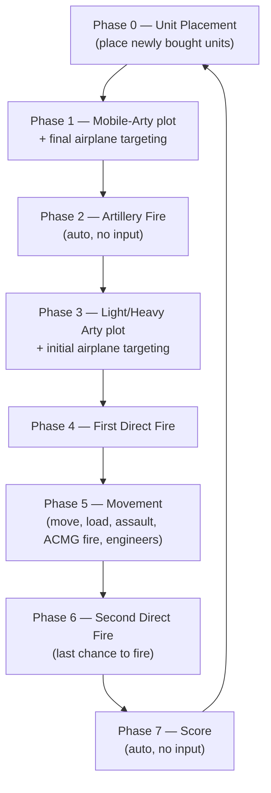
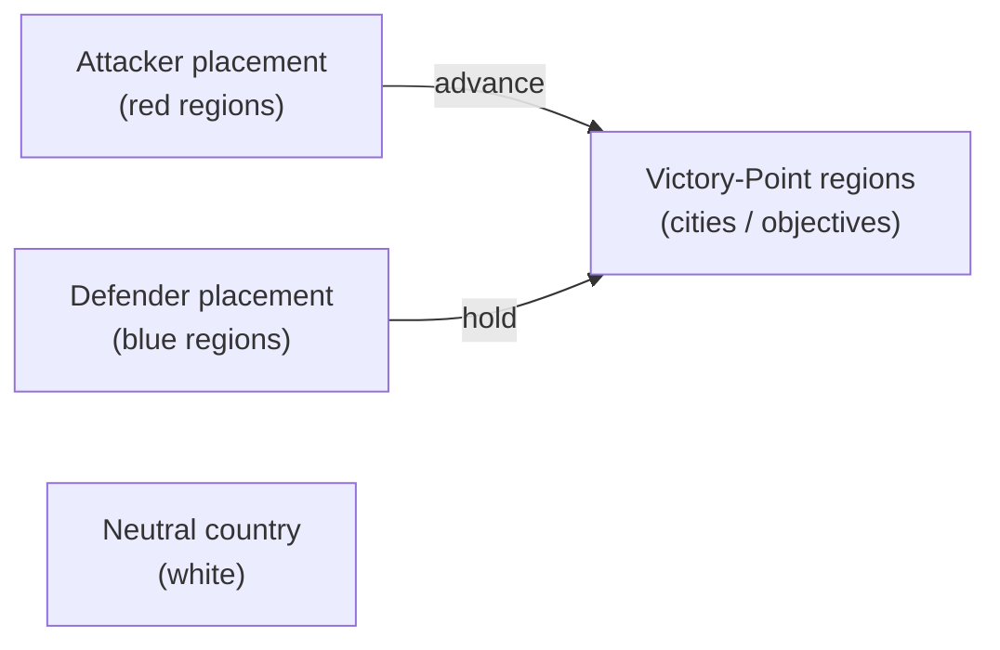

# The Perfect General II — Strategy Guide

A player's guide to *The Perfect General II* (Quantum Quality Productions, 1994): how the turn works,
every control, how to win, the units, and the shipped scenarios. Rules and controls below are transcribed
from the game's own help data (`PG2HELP.DAT`) and unit reference (`UNITINFO.DOC`); see
`ReverseEngineering.md` for the extraction provenance.

---

## 1. The game in one paragraph

*The Perfect General II* is a turn-based, hex-grid tactical wargame for two sides — an **attacker** and a
**defender**. You spend a fixed pool of **Buy Points** on a custom army, place it in your allowed regions,
then fight for control of **Victory Point (VP) regions** on the map. Turns are broken into eight strictly
ordered **phases**; both sides plot and resolve within each phase before the next begins. Whoever holds the
most victory points (or annihilates the enemy) when the scenario's turn limit expires wins.

---

## 2. How to win

- **Victory Points decide the game.** Each VP region on the map is worth a printed number of points (toggle
  *Victory Points* on the Recon Map to see them). At the scoring phase you earn the points of every VP region
  you currently control. Control means having the last/only unit in or adjacent to it per the scenario rules.
- **Destroying the enemy army** also wins — if your opponent has no units left, the battle ends.
- **Balanced play** (the default competitive mode) plays the scenario **twice**, swapping who attacks; the
  aggregate score across both halves determines the overall winner. This neutralizes any attacker/defender
  imbalance in a given map.
- **The clock matters.** Scenarios have a **Short** or **Long** turn limit (campaigns always use Short). The
  attacker must usually seize ground before time runs out; the defender can win by simply holding.

### Winning principles

1. **Buy a combined-arms force, not one super-unit.** Tanks take ground, artillery softens defenders before
   the assault, infantry/engineers hold terrain and clear mines, machine-guns and AA cover against planes.
2. **Artillery first, armor second.** Plot artillery (phases 1 & 3) onto the hex you intend to assault, then
   move armor in during the movement phase (5) and finish with direct fire (6).
3. **Use terrain.** Fortifying (dig-in) a unit that will not move grants a defensive bonus; cities repair
   vehicles (if that rule is on) and are usually VP regions worth defending.
4. **Respect line-of-sight.** Under *Limit to LOS* you only see what your units can see — scout with cheap,
   fast Armored Cars before committing expensive armor.
5. **Assault to overrun.** Only mobile units (AC, LTANK, MTANK, HTANK, ETANK) can assault by moving onto an
   enemy; the odds are excellent versus soft targets and poor versus heavy armor (see §7.3).

---

## 3. The turn: eight phases

Every turn runs these phases in order. Phases 2 (artillery fire) and 7 (score) resolve automatically with
no input.



| # | Phase | What you do |
|--:|-------|-------------|
| 0 | **Placement** | Place any newly purchased units (and units into new forts) in your legal hexes. |
| 1 | **Mobile-Arty plot** | Plot targets for Mobile Artillery and off-shore artillery; set the *final* hex (within 2 of the initial target) for any airplane already inbound. |
| 2 | **Artillery Fire** | Plotted artillery resolves. No input. |
| 3 | **Other-Arty plot** | Plot Light/Heavy Artillery for **next** turn; set **initial** airplane targets. Un-plotted artillery may direct-fire later this turn instead. |
| 4 | **Direct Fire 1** | Any eligible unit fires at a visible enemy. |
| 5 | **Movement** | Move units; load/unload cargo; fortify; issue engineer orders; fire an unfired ACMG; assault by moving onto a target. |
| 6 | **Direct Fire 2** | Final firing opportunity — always fire everything you can; there is no reason to hold. |
| 7 | **Score** | VP control is tallied. No input. |

**Barrage decision (during arty plotting):** when you plot Light/Heavy Artillery you choose **Barrage**
(area is shelled for the full turn — units moving through can die, and it blocks line-of-sight) or
**Non-Barrage** (damage only during the artillery-fire phase).

---

## 4. Controls

The game is mouse-driven with keyboard shortcuts. Two cursors matter: the **yellow** cursor marks the
*current unit* the engine has selected for you; the **white** *target cursor* is what you move to pick a hex,
target, or destination.

### 4.1 Pointer & cursor basics

| Action | Control |
|--------|---------|
| Move the white target cursor | Arrow keys, or move the mouse |
| Confirm a hex / target / destination | **Enter** or **Left mouse button** |
| Select the unit under the cursor as current | **Right mouse button**, or **Ctrl+S** ("Select Unit") |
| Remove a just-placed unit (placement phase) | **Right mouse button** or **Space bar** on it |
| Passing/return fire on a moving enemy (when offered) | **F**, or click the *Fire* button |

### 4.2 Per-phase command keys

Commands are also on the button strip at the right edge of the screen and in the *Orders* menu.

| Key | Command | Where |
|-----|---------|-------|
| **N** | Next Unit / Next Unit Type | All plot, fire, move & placement phases |
| **Space** | Next Target | Direct-fire phases (4, 6) |
| **I** | Ignore Unit (skip this phase) | Plot, fire, move phases |
| **Ctrl+S** | Select Unit under target cursor | Plot, fire, move phases |
| **Ctrl+P** | Phase Complete (advance) | All interactive phases |
| **Y** | Sentry Unit (permanently ignore, still selectable) | Movement (5) |
| **Ctrl+F** | Fortify / dig in for a defensive bonus | Movement (5) |
| **Ctrl+E** | Give Engineer Orders (engineers only) | Movement (5) |
| **T** | Load / Unload transported (cargo) unit | Movement (5) |
| **A** | Fire Armored-Car-with-MG during movement | Movement (5) |

### 4.3 Menus & global

| Control | Effect |
|---------|--------|
| **Game menu** | Save, load, quit, and other game-control commands. |
| **Display menu** | Toggle map display layers and the Recon Map. |
| **Alt+O** | Toggle music on/off. |
| **Alt+S** | Toggle sound effects on/off. |

### 4.4 Recon (Consultation) Map layers

Reachable from the purchase screen, region-selection screen, and scenario list via *Recon Map* / *Show Recon
Map*. Toggle buttons overlay information on the map:

- **Placement Locations** — attacker areas shaded **red**, defender areas **blue**.
- **Neutral Countries** — shaded **white**.
- **Victory Points** — prints each VP region's point value.
- **Map Labels** — named map features.
- **Unit Display** — colored blocks for units (red attacker / blue defender), subject to the sighting rule.

---

## 5. Setting up a game (menus)

1. **Main Menu:** *New Game – One Computer* (1–2 players), *Play by Modem*, *Reload a Saved Game*, or *Study
   Battle Record*.
2. **Scenario Selection:** pick a battle (see §8). *View Description* reads its briefing; *Show Recon Map*
   previews the terrain and VP layout.
3. **Rule Options** — set before play (and savable as defaults):
   - **Game type:** *Balanced* (played twice, sides swapped) or *Player 1 is Attacker/Defender* (single play).
   - **Game length:** *Short* or *Long* (campaigns force Short).
   - **Kill style:** *Full kill* (any hit destroys) or *Partial kill* (damage accumulates to the unit's limit).
   - **Hit style:** *Always hit* or *Random hit* (probability from unit types + terrain — see §7.2).
   - **Sighting style:** *Full view* or *Limit to LOS* (two humans on one PC always use full view).
   - **Mines:** *Hidden until found* or *Always visible*.
   - **Environment effects:** *Variable* (chance-based) or *Predetermined* (always fires).
   - **Units in friendly cities:** *Not repaired* or *Repaired* (1 point/turn in a VP city).
   - **Players 1 & 2:** human or computer.
   - **Delays:** response / message / movement timing (lower = faster, but easier to miss a fire chance).
4. **Region Selection** (some scenarios): choose the required number of shaded regions where you may place
   and reinforce.
5. **Unit Purchase:** spend Buy Points (see §6), then **Done** to place.

---

## 6. Buying an army

On the purchase screen the top line shows **Buy Points Remaining**, **points used**, and **units purchased**;
the bottom shows how many **placement hexes** and **airfields** you have. Arrow buttons raise/lower the count
of each unit type. Spend with the cost table in §7.1 in mind:

- **Backbone:** Light/Medium Tanks are the cost-efficient workhorses for taking ground.
- **Punch:** a Heavy or Elephant Tank spearheads assaults and soaks hits (ETANK: 21 HP).
- **Reach:** at least one Heavy Artillery (range 26) or Mobile Artillery (mobile, range 11) to shell VP hexes.
- **Screen & hold:** Infantry (cheap, 1 pt) and Engineers (clear/lay mines, build) to occupy terrain; a
  Machine Gun or two for anti-air and anti-infantry.
- **Recon:** an Armored Car (move 11) to scout LOS cheaply.
- **Denial:** Mines (3 pts) and Fortifications (2 pts) to shape where the enemy can go.

The trainer's **Buy Points** helper and the purchased-count array (see the RE doc) target exactly this screen.

---

## 7. Unit reference

### 7.1 Unit statistics

| Unit | Cost | Move | Bombard | HP | Damage | Repairable | AA | Attack | Defense |
|------|-----:|-----:|:-------:|---:|:------:|:----------:|:--:|:------:|:-------:|
| INF (Infantry)          |  1 | 1 | — | 3 | 2 | | | Inf | Inf |
| MGUN (Machine Gun)      |  3 | 1 | — | 3 | 4 | | Yes | MG | Inf |
| ENG (Engineer)          |  5 | 2 | — | 4 | 6 | | | Eng | Inf |
| BAZ (Bazooka)           |  3 | 1 | — | 3 | 4 | | | Armor | Inf |
| AC w/MG                 |  6 | 11 | — | 3 | 4 | Yes | Yes | MG | AC |
| AC (Armored Car)        |  5 | 11 | — | 3 | 2 | Yes | | Armor | AC |
| LTANK (Light Tank)      |  6 | 7 | — | 6 | 3 | Yes | | Armor | Armor |
| MTANK (Medium Tank)     |  8 | 6 | — | 8 | 4 | Yes | | Armor | Armor |
| HTANK (Heavy Tank)      | 12 | 5 | — | 15 | 6 | Yes | Yes | Armor | Armor |
| MobART (Mobile Arty)    | 14 | 5 | 11 | 6 | 6 | Yes | | Armor | Armor |
| LART (Light Artillery)  |  9 | 0 | 13 | 1 | 6 | | | Armor | Inf |
| HART (Heavy Artillery)  | 20 | 0 | 26 | 1 | 6 | | | Armor | Inf |
| PLANE                   | 15 | 40–60 (round trip) | 20–30 | 1 | 66% kill (ET 50%) | | | Plane | Plane |
| MINE                    |  3 | — | — | — | — | | | — | — |
| FORTIFICATION           |  2 | — | — | — | — | | | — | — |
| ETANK (Elephant Tank)   | 15 | 3 | — | 21 | 9 | Yes | Yes | Armor | Armor |

### 7.2 Maximum firing range vs. each defender

Defender columns: IN MG EN BZ AM AC LT MT HT MA LA HA PL ET

```
INF     5  5  5  5  1  1  1  1  1  1  5  5  0  1
MGUN    5  5  5  5  2  2  2  0  0  2  5  5  0  0
ENG     5  5  5  5  1  1  1  1  1  1  5  5  0  1
BAZ     8  8  8  8  8  8  6  4  2  6  8  8  0  1
ACw/MG  5  5  5  5  2  2  2  0  0  2  5  5  0  0
AC      6  6  6  6  6  6  3  1  0  3  6  6  0  0
LTANK   8  8  8  8  8  8  6  4  2  6  8  8  0  1
MTANK  10 10 10 10 10 10  8  6  5  8 10 10  0  3
HTANK  13 13 13 13 13 13 11  8  6 11 13 13  0  4
MobART 13 13 13 13 13 13 11  8  6 11 13 13  0  4
LART   13 13 13 13 13 13 11  8  6 11 13 13  0  4
HART   13 13 13 13 13 13 11  8  6 11 13 13  0  4
PLANE   0  0  0  0  0  0  0  0  0  0  0  0  0  0
ETANK  16 16 16 16 16 16 13 10  8 13 16 16  0  5
```

### 7.3 Assault probabilities (%) — attacker rows vs. defender columns

Only mobile "overrun"-capable units can assault; all other rows are 0.

```
        IN MG EN BZ AM AC LT MT HT MA LA HA PL ET
AC      80 80 80 60 45 40 30 20 10 30 80 80  0  5
LTANK   85 85 85 70 55 50 40 30 20 40 85 85  0 10
MTANK   90 90 90 80 65 60 50 40 30 40 90 90  0 20
HTANK   95 95 95 90 75 70 60 50 40 50 95 95  0 30
ETANK   97 97 97 95 85 80 70 60 50 60 97 97  0 40
```

*Read it as: heavier attackers overrun soft units almost automatically, but assaulting enemy heavy armor is
a coin-flip at best — soften it with artillery/direct fire first.*

### 7.4 Hit probability by range

Full range→probability tables (per gun class vs. defense style, including altitude/passing-fire bonus rows)
are transcribed in `ReverseEngineering.md` §5.3. Key takeaways:

- **Armor/Artillery guns** hit hard and far (90% at range 1, still ~22% at range 13).
- **Infantry & Engineer guns** are short-ranged and weak vs. armor (20% or less) but decent vs. infantry.
- **Machine guns** are flat ~75% vs. infantry at every range but nearly useless vs. armor.

---

## 8. Scenarios & maps

### 8.1 Reading the battlefield

The map is a grid of **hexes**. Terrain (open, rough, woods, hills, water, roads, cities) modifies movement
cost, line-of-sight, and defensive value. Cities are usually **VP regions** and can repair vehicles. Always
open the **Recon Map** first and toggle **Victory Points**, **Placement Locations**, and **Map Labels** to
read the objectives before you spend a point.



### 8.2 Shipped scenarios

Each scenario ships as a `SCEN\<NAME>.SCN` battle file plus a `SCEN\<NAME>.RCN` recon-map file:

| Scenario file | Suggested read |
|---------------|-----------------|
| `QUICK`   | Smallest/fastest battle — best first game and for learning the phase flow. |
| `POINT`   | Straightforward single-objective VP fight. |
| `HILLS`   | Elevation-driven map — altitude boosts firing range/LOS; hold the high ground. |
| `DELTA`   | River/water terrain constraining crossings and armor lanes. |
| `AIR`     | Airfield-centric — planes and AA (MGUN/HTANK/ETANK) matter; overrun airfields to capture them. |
| `STORMY`  | Environment-effects showcase (set *Variable* vs *Predetermined* in rules). |
| `PERSON`  | Personnel/infantry-weighted engagement. |
| `JEWEL2`  | Multi-VP contested map. |
| `SURR2`   | Encirclement / surrounded-force scenario. |
| `DUALINV` | Dual-invasion — objectives/placement on two fronts. |

> The exact hex layouts and VP values live inside each `.SCN`/`.RCN`; use the in-game Recon Map for the
> authoritative picture. A printable overview map ships as `.game/28339_MapB.pdf`. (Scenario-file parsing is
> a documented future RE lead — see `ReverseEngineering.md` §6.)

---

## 9. Quick-start checklist

1. **Main Menu → New Game – One Computer.**
2. Pick **`QUICK`**; *Show Recon Map* → toggle **Victory Points** to see objectives.
3. **Rule Options:** for a gentle start try *Full view*, *Random hit*, *Partial kill*, *Mines always visible*.
4. **Buy** a combined-arms force (§6): a couple of Medium Tanks, one Heavy Artillery, Infantry to hold, an
   Armored Car to scout, a few Mines.
5. **Place** on your side's shaded hexes; fortify anything that will sit still.
6. Each turn: **plot artillery onto the next VP hex → direct-fire → move armor up → direct-fire again.**
7. Hold the most **Victory Points** when the turn limit hits.
